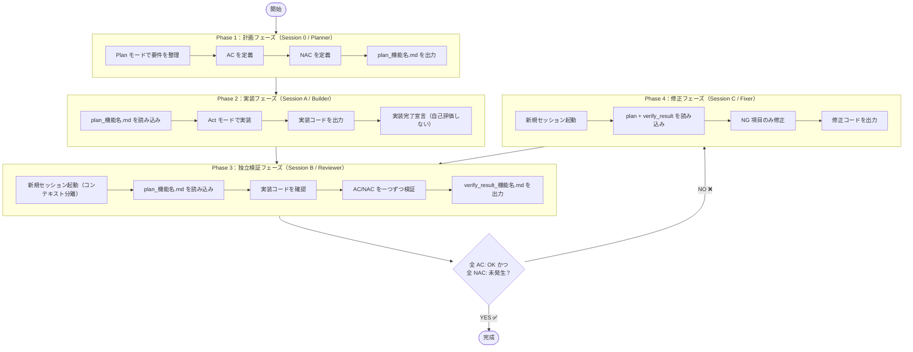
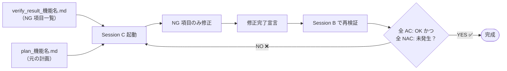

# AC/NAC 駆動開発ワークフロー

> **Cline を使った「受け入れ基準（AC）／非受け入れ基準（NAC）駆動」の開発・検証フロー**

---

## 1. 概要・目的

### 1.1 このドキュメントの目的

Cline（AI コーディングアシスタント）を使用した開発において、  
**「何をもって完成とみなすか」を事前に明確化し、実装と検証を独立したセッションで行う**ことで、  
AI の自己評価バイアスを排除した高品質な開発ワークフローを実現します。

### 1.2 AC/NAC とは

| 用語 | 英語名 | 意味 |
|------|--------|------|
| **AC** | Acceptance Criteria（受け入れ基準） | 「これが満たされていれば完成」という条件 |
| **NAC** | Negative Acceptance Criteria（非受け入れ基準） | 「これが発生したら NG」という条件 |

### 1.3 なぜ独立セッションが必要か

Cline（AI）は同一セッション内でコードを書いた後に自己評価すると、  
**実装した内容を「正しい」と思い込む認知バイアス**が発生しやすいです。

```
❌ 悪いパターン（同一セッション）
  Session A: コード実装 → 「実装しました！」
           ↓
  Session A: 検証     → 「問題ありません✅」← 自己評価バイアス

✅ 良いパターン（独立セッション）
  Session A: コード実装のみ
           ↓
  Session B: 独立した目線で AC/NAC を検証 → 客観的な評価
```

### 1.4 このワークフローのメリット

- ✅ 実装前に完成基準が明確になる
- ✅ AI の自己評価バイアスを排除できる
- ✅ 検証結果がドキュメントとして残る
- ✅ NG 時の修正ループが体系化される
- ✅ 複数人チームでの共有・引き継ぎが容易になる

---

## 2. ワークフロー全体図



---

## 3. Phase 1：計画フェーズ（Session 0 / Planner）

### 3.1 このフェーズの役割

| 項目 | 内容 |
|------|------|
| **セッション名** | Session 0（Planner） |
| **Cline モード** | **Plan モード**（必須） |
| **担当者** | 開発者 + Cline（Plan モード） |
| **主な作業** | AC/NAC の定義、Plan ファイルの作成 |
| **出力物** | `plan_[機能名].md` |

### 3.2 AC（受け入れ基準）の定義方法

AC は **「ユーザー視点で動作が確認できる条件」** として定義します。

#### 良い AC の書き方

```markdown
## AC（受け入れ基準）

- [ ] AC-01: 検索フォームに商品コードを入力して「検索」ボタンを押すと、該当商品が一覧に表示される
- [ ] AC-02: 検索結果が0件の場合、「データが見つかりません」というメッセージが表示される
- [ ] AC-03: ページング機能が動作し、2ページ目に遷移できる
- [ ] AC-04: 一覧の「詳細」リンクをクリックすると、詳細画面に遷移する
- [ ] AC-05: 画面リロード後も検索条件が保持される
```

#### 悪い AC の書き方（避けること）

```markdown
# ❌ 避けるべき AC の例
- [ ] 実装が完了している        ← 曖昧すぎる
- [ ] バグがない                ← 検証不可能
- [ ] StockListService を実装する ← 実装詳細を指定している（動作基準ではない）
```

#### AC 定義のチェックポイント

- [ ] ユーザー視点で記述されているか（「〜できる」「〜が表示される」形式）
- [ ] 1つの AC が1つの検証可能な動作を表しているか
- [ ] 実装方法ではなく、動作結果を記述しているか
- [ ] 検証者が明確に判定（OK / NG）できる内容か

### 3.3 NAC（非受け入れ基準）の定義方法

NAC は **「発生したら即 NG となる問題」** を定義します。

#### 良い NAC の書き方

```markdown
## NAC（非受け入れ基準）

- [ ] NAC-01: コンソールにエラーが出力される
- [ ] NAC-02: API 呼び出しが 5 秒以上かかる
- [ ] NAC-03: ページ遷移後に画面が真っ白になる
- [ ] NAC-04: 入力値が保存されずに消える
- [ ] NAC-05: 他の既存機能が動作しなくなる（デグレード）
- [ ] NAC-06: 未ログインユーザーが認証なしでアクセスできる
```

#### NAC 定義のカテゴリ

| カテゴリ | 例 |
|----------|-----|
| **エラー** | コンソールエラー、例外発生、API エラー |
| **パフォーマンス** | レスポンス時間超過、タイムアウト |
| **デグレード** | 既存機能の破壊 |
| **セキュリティ** | 権限バイパス、不正アクセス |
| **データ整合性** | データ消失、重複登録 |
| **UI/UX** | 画面崩れ、操作不能 |

### 3.4 Plan ファイルの出力形式

計画フェーズで作成する Plan ファイルのフォーマット（Section 8 のテンプレート参照）：

```markdown
# Plan: [機能名]

## 基本情報

| 項目 | 内容 |
|------|------|
| 機能名 | [機能名] |
| 作成日 | YYYY-MM-DD |
| 作成者 | [名前] |
| バージョン | v1.0 |

## 要件概要

[機能の目的と概要を記述]

## 実装スコープ

### 対象ファイル

- `[ファイルパス1]` - [説明]
- `[ファイルパス2]` - [説明]

### 対象外（スコープ外）

- [対象外の内容]

## AC（受け入れ基準）

- [ ] AC-01: [条件]
- [ ] AC-02: [条件]

## NAC（非受け入れ基準）

- [ ] NAC-01: [NG条件]
- [ ] NAC-02: [NG条件]

## 技術仕様

### API 仕様

| メソッド | エンドポイント | 説明 |
|----------|--------------|------|
| GET | /api/xxx | [説明] |

### データ仕様

[必要に応じてデータ構造を記述]

## 実装上の注意点

- [注意点1]
- [注意点2]

## 参考資料

- [関連ドキュメントへのリンク]
```

---

## 4. Phase 2：実装フェーズ（Session A / Builder）

### 4.1 このフェーズの役割

| 項目 | 内容 |
|------|------|
| **セッション名** | Session A（Builder） |
| **Cline モード** | **Act モード** |
| **主な作業** | Plan に従ったコード実装 |
| **出力物** | 実装コード |
| **禁止事項** | 自己評価・自己検証 |

### 4.2 Session A の起動プロンプト例

```
以下の Plan ファイルに従って実装してください。

[plan_[機能名].md の内容をここに貼り付け]

## 重要な制約事項

- Plan に記載されたスコープ外の変更を行わないこと
- 実装完了後、自己評価・動作確認は行わないこと（検証は別セッションで実施する）
- 不明な点は実装前に質問すること
```

### 4.3 実装ルール

#### ✅ やるべきこと

- Plan ファイルの「実装スコープ」に記載されたファイルのみを変更する
- 既存コードのスタイル・命名規則に従う
- コーディングルール（`.clinerules/`）を遵守する
- 実装が完了したら「実装完了」と宣言する

#### ❌ やってはいけないこと

- スコープ外のファイルを変更する
- 「動作確認しました」「問題ありません」などの自己評価を行う
- Plan に記載されていない機能を独自に追加する
- 実装中に AC/NAC を変更する（変更が必要な場合は Session 0 に戻る）

### 4.4 実装完了の宣言形式

Session A は以下の形式で実装完了を宣言します：

```
## 実装完了報告

### 変更したファイル

| ファイル | 変更内容 |
|---------|---------|
| `src/xxx/XxxController.java` | 検索エンドポイントを追加 |
| `src/xxx/XxxService.java` | 検索ロジックを実装 |

### 未実装・保留事項

- なし（または保留内容を記載）

### 備考

- [実装上で注意した点など]

**検証は Session B（Reviewer）で実施してください。**
```

---

## 5. Phase 3：独立検証フェーズ（Session B / Reviewer）

### 5.1 このフェーズの役割

| 項目 | 内容 |
|------|------|
| **セッション名** | Session B（Reviewer） |
| **Cline モード** | **Act モード** または Plan モード |
| **主な作業** | AC/NAC の独立検証 |
| **出力物** | `verify_result_[機能名].md` |
| **必須条件** | **Session A とは別の新規セッションで起動すること** |

### 5.2 コンテキスト分離の重要性

```
❌ NG: Session A の続きで検証する
  → Session A が「実装した」という記憶を持ったまま検証するため、
    自己評価バイアスが発生しやすい

✅ OK: Session B として新規セッションを起動する
  → 実装の記憶がない白紙の状態で、純粋に AC/NAC を検証できる
```

### 5.3 Session B の起動プロンプト例

```
あなたは独立したコードレビュアーです。

以下の Plan ファイルと実装コードを確認し、AC/NAC の検証を行ってください。

## Plan ファイル

[plan_[機能名].md の内容]

## 検証対象ファイル

[変更されたファイルの一覧]

## 検証方法

以下の順序で検証してください：

1. 実装コードを読み、AC を一つずつ確認する
2. 実装コードを読み、NAC が発生していないか確認する
3. 必要に応じて Playwright CLI / MCP でブラウザ動作確認を行う
4. verify_result_[機能名].md に結果をまとめる
```

### 5.4 検証方法

#### コード静的検証

```bash
# ファイルの内容確認
cat src/xxx/XxxService.java

# 変更差分の確認
git diff HEAD~1 HEAD -- src/xxx/
```

#### Playwright MCP を使ったブラウザ検証

```
# Playwright MCP の使用例（Session B からブラウザを操作）
1. http://localhost:8080/xxx にアクセスする
2. 検索フォームに「テスト商品」と入力する
3. 「検索」ボタンをクリックする
4. 一覧に「テスト商品」が表示されることを確認する → AC-01 の検証
```

#### API 検証

```bash
# curl で API を直接検証
curl -X GET "http://localhost:8080/api/stocks?itemCode=TEST001" \
     -H "Content-Type: application/json"
```

### 5.5 検証結果ファイルの出力形式

詳細なテンプレートは Section 8 を参照。概要は以下の通り：

```markdown
# 検証結果レポート: [機能名]

## 基本情報
| 項目 | 内容 |
|------|------|
| 総合判定 | ✅ OK / ❌ NG |

## AC（受け入れ基準）検証結果
| ID | 条件 | 結果 | 備考 |
|----|------|------|------|
| AC-01 | ... | ✅ OK / ❌ NG | ... |

## NAC（非受け入れ基準）検証結果
| ID | NG条件 | 発生有無 | 備考 |
|----|--------|---------|------|
| NAC-01 | ... | 未発生 ✅ / 発生 ❌ | ... |
```

---

## 6. Phase 4：NG 時の修正ループ

### 6.1 修正フェーズの役割

| 項目 | 内容 |
|------|------|
| **セッション名** | Session C（Fixer） |
| **Cline モード** | **Act モード** |
| **主な作業** | NG 項目の修正 |
| **出力物** | 修正コード |
| **必須条件** | **新規セッションで起動すること** |

### 6.2 新 Session での修正フロー



### 6.3 Session C の起動プロンプト例

```
あなたはバグ修正担当者です。

以下の Plan ファイルと検証結果レポートを確認し、NG 項目のみを修正してください。

## Plan ファイル

[plan_[機能名].md の内容]

## 検証結果レポート（NG 項目）

[verify_result_[機能名].md の NG 部分]

## 修正の制約

- NG 項目として記載された問題のみを修正すること
- OK の AC に影響を与えないこと
- スコープ外のコード変更を行わないこと
- 修正完了後は自己評価を行わないこと
```

### 6.4 Plan と評価結果の引き継ぎ方

修正ループでは以下のファイルを次のセッションに引き継ぎます：

```
Session C に渡すべき情報：

1. plan_[機能名].md          ← 元の計画（変更しない）
2. verify_result_[機能名].md ← 最新の検証結果（NG 項目が含まれる）
3. 変更対象ファイルの一覧     ← Session A / C が変更したファイル
```

### 6.5 修正ループ回数の管理

```markdown
# 修正ループ管理

| ループ | 実装セッション | 検証セッション | 判定 | 日時 |
|--------|--------------|--------------|------|------|
| 1回目  | Session A    | Session B    | ❌ NG | YYYY-MM-DD |
| 2回目  | Session C-1  | Session B-2  | ❌ NG | YYYY-MM-DD |
| 3回目  | Session C-2  | Session B-3  | ✅ OK | YYYY-MM-DD |
```

> ⚠️ **3回以上修正ループが発生する場合は、Plan の見直しを検討してください。**

---

## 7. ファイル管理規約

### 7.1 命名規則

| ファイル種別 | 命名規則 | 例 |
|------------|---------|-----|
| Plan ファイル | `plan_[機能名].md` | `plan_StockList.md` |
| 検証結果（最新） | `verify_result_[機能名].md` | `verify_result_StockList.md` |
| 検証結果（ループN回目） | `verify_result_[機能名]_v[N].md` | `verify_result_StockList_v2.md` |

#### 機能名の書き方

- 英語でキャメルケース（例: `StockList`, `ReceivingEntry`）
- または日本語をアンダースコア区切り（例: `在庫一覧`, `入荷登録`）
- スペースは使用しない

### 7.2 ディレクトリ構成

```
project_root/
├── docs/
│   └── ac_nac/
│       ├── plan_StockList.md                 # 在庫一覧 Plan
│       ├── verify_result_StockList.md        # 在庫一覧 検証結果（最新）
│       ├── verify_result_StockList_v1.md     # 在庫一覧 検証結果（1回目）
│       ├── verify_result_StockList_v2.md     # 在庫一覧 検証結果（2回目）
│       ├── plan_ReceivingEntry.md            # 入荷登録 Plan
│       └── verify_result_ReceivingEntry.md   # 入荷登録 検証結果
└── src/
    └── ...（実装コード）
```

### 7.3 バージョン管理

- Plan ファイルは基本的に上書き更新しない（変更が必要な場合は `v1.0` → `v2.0` と明記する）
- 検証結果は各ループごとにバージョン番号付きで保存する（最新は番号なし）
- Git で全ファイルをコミットし、変更履歴を追跡できるようにする

---

## 8. テンプレート集

### 8.1 Plan ファイルテンプレート

```markdown
# Plan: [機能名]

## 基本情報

| 項目 | 内容 |
|------|------|
| 機能名 | [機能名] |
| 作成日 | YYYY-MM-DD |
| 作成者 | [名前] |
| バージョン | v1.0 |

## 要件概要

[機能の目的と概要を記述]

## 実装スコープ

### 対象ファイル

- `[ファイルパス1]` - [説明]
- `[ファイルパス2]` - [説明]

### 対象外（スコープ外）

- [対象外の内容]

## AC（受け入れ基準）

- [ ] AC-01: [条件]
- [ ] AC-02: [条件]
- [ ] AC-03: [条件]

## NAC（非受け入れ基準）

- [ ] NAC-01: [NG条件]
- [ ] NAC-02: [NG条件]
- [ ] NAC-03: [NG条件]

## 技術仕様

### API 仕様

| メソッド | エンドポイント | 説明 |
|----------|--------------|------|
| GET | /api/xxx | [説明] |
| POST | /api/xxx | [説明] |

### データ仕様

[必要に応じてデータ構造・DB テーブル等を記述]

## 実装上の注意点

- [注意点1]
- [注意点2]

## 参考資料

- [関連ドキュメントへのリンク]
```

---

### 8.2 AC/NAC テンプレート

以下を Plan ファイルの AC/NAC セクションにコピーして使用してください。

#### フロントエンド向け AC テンプレート

```markdown
## AC（受け入れ基準）- フロントエンド

### 画面表示
- [ ] AC-01: 画面が正常に表示される（エラーなし）
- [ ] AC-02: 必須項目にラベルまたは「*」マークが表示される

### 検索・一覧
- [ ] AC-03: 条件を入力して検索すると、該当データが一覧に表示される
- [ ] AC-04: 検索結果が0件の場合、「データが見つかりません」が表示される
- [ ] AC-05: ページングが正常に動作する

### 入力・登録
- [ ] AC-06: 必須項目を未入力で登録しようとするとバリデーションエラーが表示される
- [ ] AC-07: 正常に入力して登録すると、完了メッセージが表示される

### ナビゲーション
- [ ] AC-08: 詳細リンクをクリックすると詳細画面に遷移する
- [ ] AC-09: 戻るボタンで前の画面に戻れる
```

#### バックエンド向け AC テンプレート

```markdown
## AC（受け入れ基準）- バックエンド

### API レスポンス
- [ ] AC-01: 正常リクエスト時に HTTP 200 と期待するデータが返る
- [ ] AC-02: 該当データなし時に HTTP 200 と空リストが返る
- [ ] AC-03: 不正リクエスト時に HTTP 400 とエラーメッセージが返る

### データ操作
- [ ] AC-04: 登録 API でデータが DB に保存される
- [ ] AC-05: 更新 API でデータが DB に反映される
- [ ] AC-06: 削除 API でデータが DB から削除される（または論理削除フラグが更新される）

### 認証・認可
- [ ] AC-07: 未認証ユーザーは HTTP 401 が返る
- [ ] AC-08: 権限のないユーザーは HTTP 403 が返る
```

#### 共通 NAC テンプレート

```markdown
## NAC（非受け入れ基準）- 共通

### エラー・例外
- [ ] NAC-01: ブラウザコンソールに JavaScript エラーが出力される
- [ ] NAC-02: サーバログに ERROR レベルのログが出力される
- [ ] NAC-03: HTTP 500 エラーが返る

### パフォーマンス
- [ ] NAC-04: 画面の初期表示に 3 秒以上かかる
- [ ] NAC-05: API のレスポンスに 5 秒以上かかる

### デグレード
- [ ] NAC-06: 既存の他機能が動作しなくなる
- [ ] NAC-07: 既存テストが失敗する

### セキュリティ
- [ ] NAC-08: 認証なしで保護されたリソースにアクセスできる
- [ ] NAC-09: 他ユーザーのデータが参照・変更できる

### データ整合性
- [ ] NAC-10: データが意図せず消失する
- [ ] NAC-11: 同一データが重複して登録される
```

---

### 8.3 検証結果レポートテンプレート

```markdown
# 検証結果レポート: [機能名]

## 基本情報

| 項目 | 内容 |
|------|------|
| 機能名 | [機能名] |
| 検証日時 | YYYY-MM-DD HH:mm |
| 検証者 | Session B（Reviewer） |
| 参照 Plan | `plan_[機能名].md` |
| 検証バージョン | v1 |
| **総合判定** | **✅ OK / ❌ NG** |

---

## AC（受け入れ基準）検証結果

| ID | 条件 | 結果 | 検証方法 | 備考 |
|----|------|------|---------|------|
| AC-01 | [条件] | ✅ OK / ❌ NG | コードレビュー/ブラウザ/API | [詳細] |
| AC-02 | [条件] | ✅ OK / ❌ NG | コードレビュー/ブラウザ/API | [詳細] |

---

## NAC（非受け入れ基準）検証結果

| ID | NG条件 | 発生有無 | 検証方法 | 備考 |
|----|--------|---------|---------|------|
| NAC-01 | [NG条件] | 未発生 ✅ / 発生 ❌ | コードレビュー/ブラウザ/API | [詳細] |
| NAC-02 | [NG条件] | 未発生 ✅ / 発生 ❌ | コードレビュー/ブラウザ/API | [詳細] |

---

## 総合判定

<!-- ✅ OK の場合 -->
全ての AC が満たされており、NAC も発生していません。実装を完了とみなします。

<!-- ❌ NG の場合 -->
以下の項目が未達成または問題が発生しています。Session C（Fixer）は下記 NG 項目のみを修正してください。

### NG 項目一覧

| ID | 種別 | 問題内容 | 修正の方向性 | 優先度 |
|----|------|---------|------------|--------|
| AC-03 | AC | [問題の詳細] | [修正の方向性] | 高/中/低 |
| NAC-01 | NAC | [問題の詳細] | [修正の方向性] | 高/中/低 |

---

## 検証詳細ログ

### コードレビューメモ

[静的解析・コード確認で気づいた点]

### ブラウザ操作ログ

操作手順:
1. http://localhost:8080/xxx にアクセス
2. [操作内容]
3. [確認内容] → [結果]

### API レスポンスログ

リクエスト: GET /api/xxx?param=value
レスポンス: HTTP 200 / { "data": [...] }
```

---

## 9. チェックリスト

### 9.1 Phase 1（計画）完了チェック

- [ ] 機能の要件が明確に記述されている
- [ ] 実装スコープ（対象ファイル）が定義されている
- [ ] AC が「ユーザー視点の動作」として記述されている
- [ ] AC が1項目1動作になっている（複合条件になっていない）
- [ ] NAC が「発生したら即 NG」の条件として記述されている
- [ ] NAC にデグレード・セキュリティ項目が含まれている
- [ ] Plan ファイルが `docs/ac_nac/plan_[機能名].md` として保存されている

### 9.2 Phase 2（実装）完了チェック

- [ ] Plan に記載されたファイルのみを変更した
- [ ] スコープ外のファイルを変更していない
- [ ] コーディングルール（`.clinerules/`）を遵守している
- [ ] 実装完了宣言を行った（自己評価は含めていない）
- [ ] 変更ファイルの一覧を実装完了報告に記載した

### 9.3 Phase 3（検証）完了チェック

- [ ] **新規セッション**（Session B）で検証を実施した
- [ ] AC を一つずつ検証した（まとめて OK としていない）
- [ ] NAC を一つずつ確認した（まとめて「発生なし」としていない）
- [ ] 検証方法（コードレビュー / ブラウザ / API）を明記した
- [ ] 検証結果ファイルを `docs/ac_nac/verify_result_[機能名].md` として保存した
- [ ] NG の場合、修正の方向性を記載した

### 9.4 Phase 4（修正）完了チェック

- [ ] **新規セッション**（Session C）で修正を実施した
- [ ] NG 項目のみを修正した（OK 項目には手を加えていない）
- [ ] スコープ外のコードを変更していない
- [ ] 修正完了後に **再度 Phase 3（Session B）で検証**した
- [ ] 修正ループ回数を記録した

### 9.5 最終完了チェック

- [ ] 全 AC が ✅ OK である
- [ ] 全 NAC が「未発生 ✅」である
- [ ] 最終の検証結果ファイルが保存されている
- [ ] Git にすべての変更がコミットされている

---

## 付録：よくある問題と対処法

### Q1. AC が多すぎて検証に時間がかかる

**対処**: AC は「重要な動作」に絞り込む。目安は1機能あたり5〜10項目程度。  
細かすぎる AC は NAC に移動するか、削除を検討する。

### Q2. Session B が「コードを見ただけでは判定できない」と言う

**対処**: Playwright MCP でブラウザを実際に操作して確認するよう指示する。  
または curl で API を直接叩いて確認する。

### Q3. 修正ループが3回以上続く

**対処**: Plan の AC/NAC を見直す。問題が複雑すぎる場合は機能を分割し、  
より小さな単位で Plan → 実装 → 検証のサイクルを回す。

### Q4. Session C が OK 項目まで変更してしまった

**対処**: Session C の起動プロンプトに「変更禁止ファイルのリスト」を明記する。  
または「この AC は OK だったため、関連コードは変更しないこと」と注記する。

### Q5. Plan の AC/NAC を途中で変更したい

**対処**: Session 0 に戻り、Plan ファイルのバージョンを更新する（v1.0 → v2.0）。  
現在進行中の Session A / B / C には変更を知らせ、最新 Plan を参照させる。
