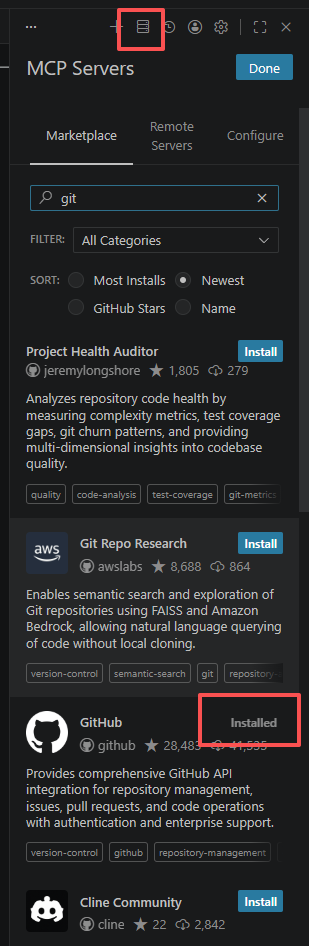
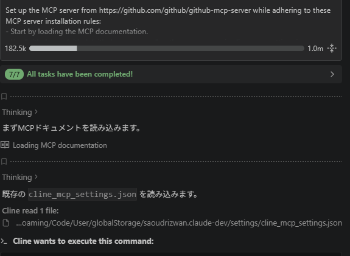
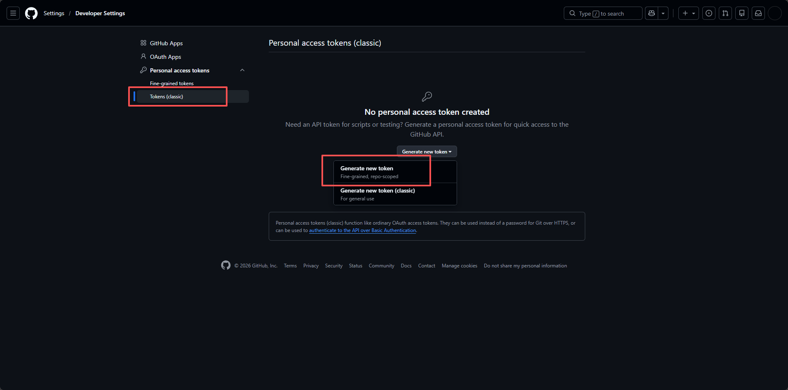
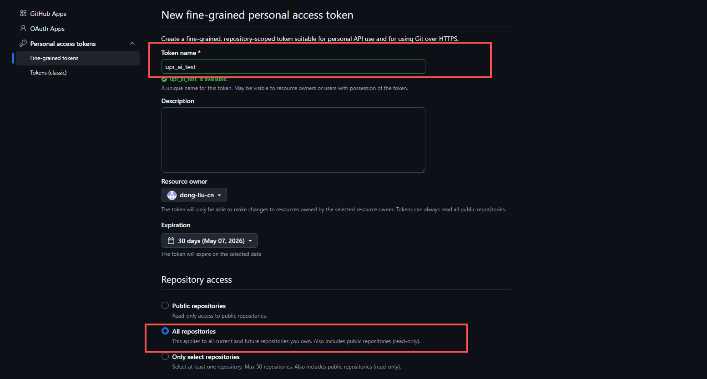
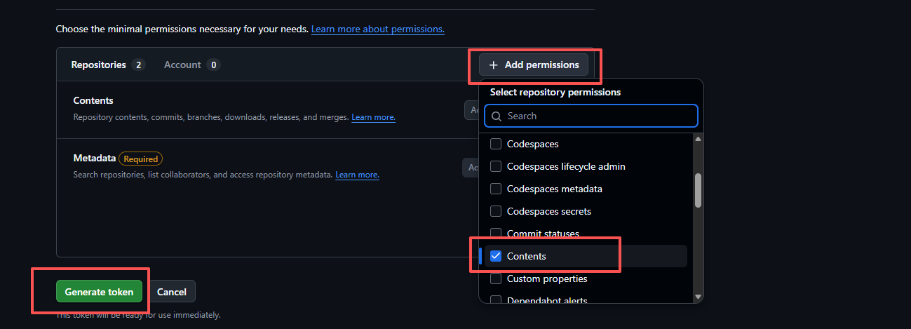
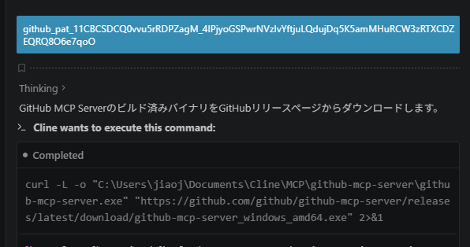
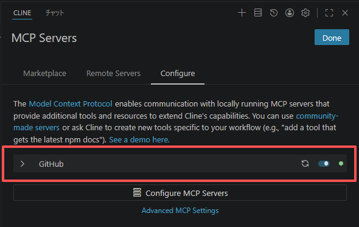

# GitHub MCPの設定

## ①MCP Serversをクリックします。

---

## ②インストールをクリック後、チャットウィンドウに入り、AIがMCPのインストールを案内します。

---

## ③GitHubでtokenの作成

GitHub上でトークンを作成し、以下の権限の読み書き権限を付与します：

- **Administration**（リポジトリの作成・削除・設定、チームと協力者の管理）
- **Codespaces**（Codespacesの作成・編集・削除・一覧表示）
- **Contents**（リポジトリのコンテンツ、コミット、ブランチ、ダウンロード、リリース、マージ）

---

## ④トークンをcline対話にコピーします。

