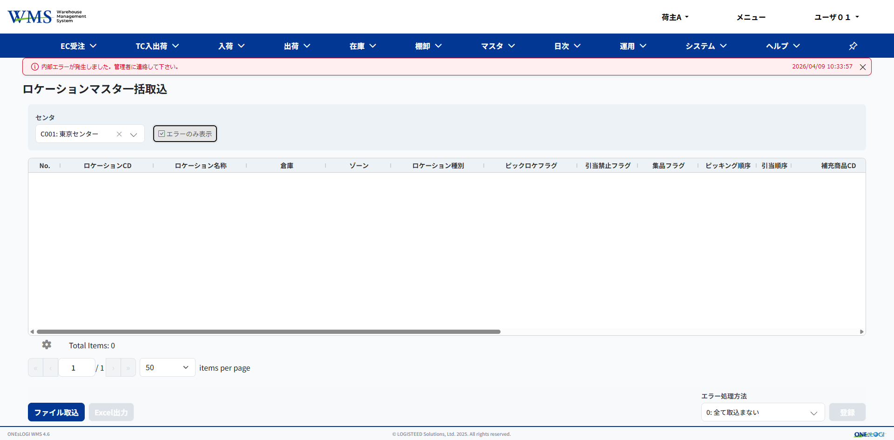
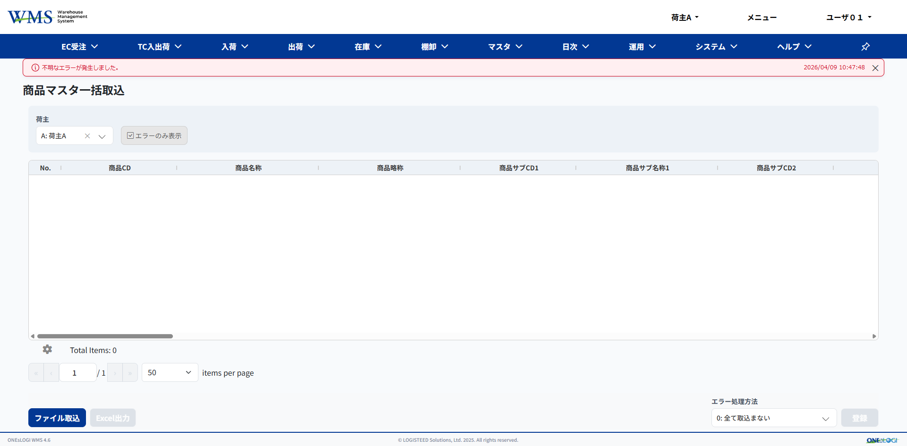
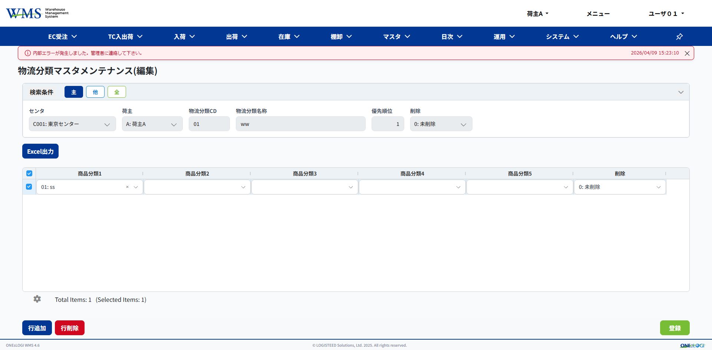
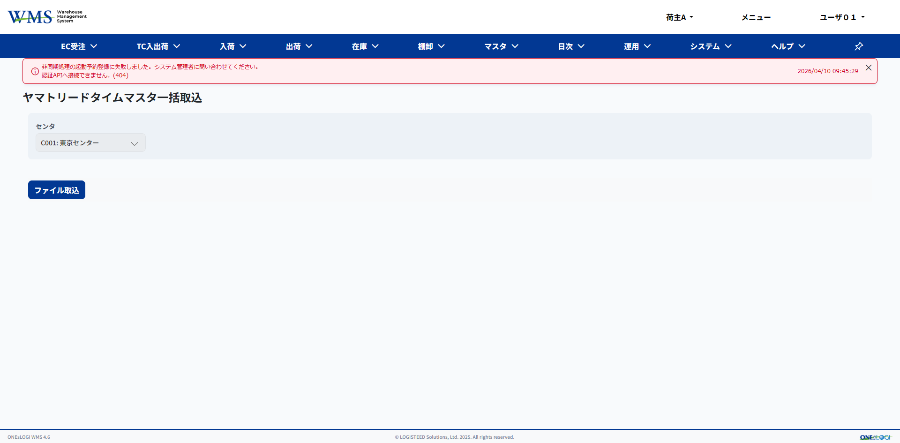
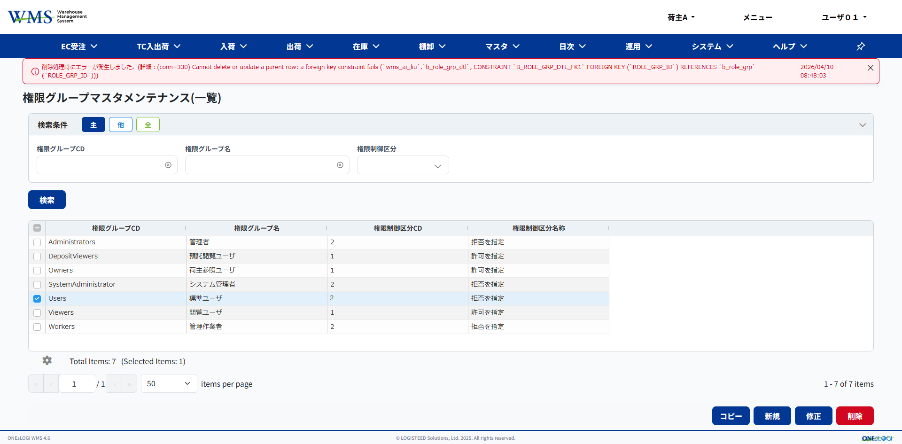
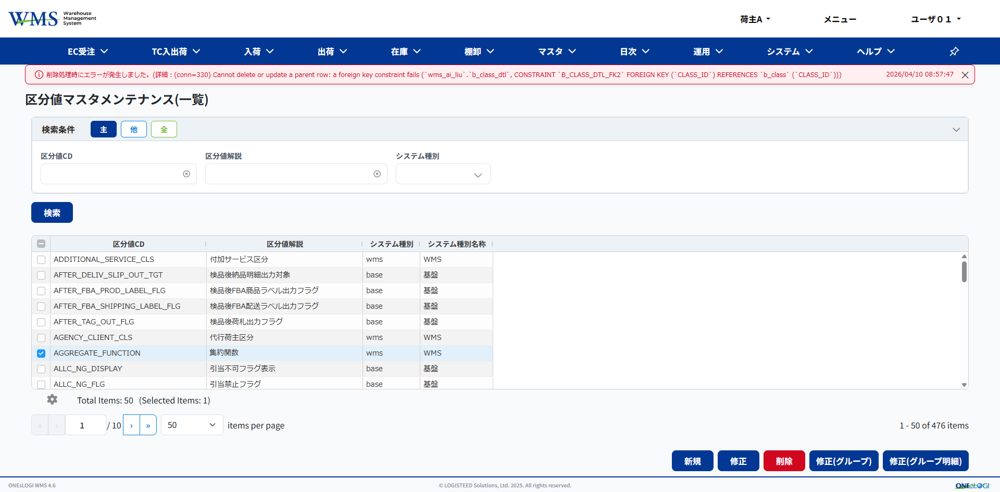
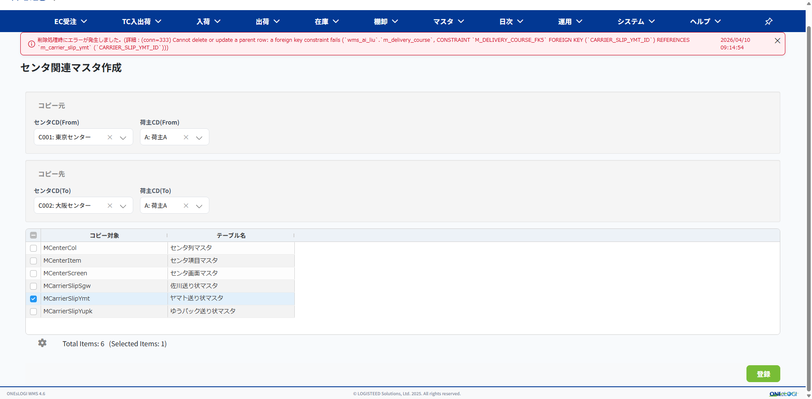
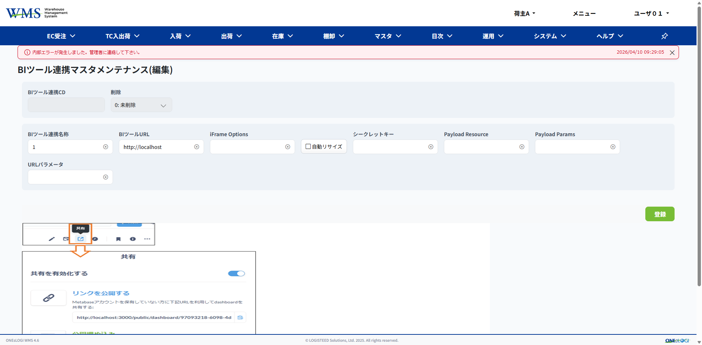

# WMS50 Eclipse でまず動作確認

## ① 在庫調整 → 出荷指示入力 → 出庫指示

- ✅ OK

---

## ② マスタ画面動作確認

### ゾーンマスタメンテナンス
- 検索、更新、行削除、行追加、登録、ファイル取込
- ✅ OK

### 倉庫マスタメンテナンス
- 行削除、行追加、登録
- ✅ OK

### ロケーションマスタメンテナンス（一覧）／（編集）
- ✅ OK

### ロケーションマスタ一括取込
- ❌ NG（初期化エラーのみ表示の場合）

```
log:
2026/04/10 13:39:50.078	http-nio-8080-exec-8	DEBUG	org.dbflute.system.XLog	 
2026/04/10 13:39:50.081	http-nio-8080-exec-8	ERROR	com.oneslogi.base.cdi.interceptor.ErrorControlInterceptor	Fatal error.
java.lang.IllegalArgumentException: The argument 'entityList' should not be null.
	at com.oneslogi.base.dbflute.dtomapper.bs.customize.BsSqlELocationListDtoMapper.mappingToDtoList(BsSqlELocationListDtoMapper.java:186)
	at com.oneslogi.wms.resources.master.LocationMasterBulkInputResource.search(LocationMasterBulkInputResource.java:210)
	at com.oneslogi.base.cdi.interceptor.CheckBaseInterceptor.invoke(CheckBaseInterceptor.java:48)
	at com.oneslogi.base.cdi.interceptor.TransactionControl.execute(TransactionControl.java:139)
	at com.oneslogi.base.cdi.interceptor.BeginTransactionInterceptor.invoke(BeginTransactionInterceptor.java:34)
	at com.oneslogi.base.cdi.interceptor.TraceInterceptor.invoke(TraceInterceptor.java:62)
	at com.oneslogi.base.cdi.interceptor.ErrorControlInterceptor.invoke(ErrorControlInterceptor.java:82)
	at com.oneslogi.base.cdi.interceptor.AccessInterceptor.invoke(AccessInterceptor.java:102)
	at com.oneslogi.base.cdi.interceptor.DBFluteAccessContextInterceptor.invoke(DBFluteAccessContextInterceptor.java:108)
	at com.oneslogi.base.cdi.interceptor.AuthenticationBaseInterceptor.proceed(AuthenticationBaseInterceptor.java:379)
	at com.oneslogi.base.cdi.interceptor.AuthenticationInterceptor.invoke(AuthenticationInterceptor.java:51)
	at java.base/jdk.internal.reflect.DirectMethodHandleAccessor.invoke(DirectMethodHandleAccessor.java:103)
	at java.base/java.lang.reflect.Method.invoke(Method.java:580)
	at org.jboss.resteasy.core.MethodInjectorImpl.invoke(MethodInjectorImpl.java:154)
	at org.jboss.resteasy.core.MethodInjectorImpl.invoke(MethodInjectorImpl.java:118)
	at org.jboss.resteasy.core.ResourceMethodInvoker.internalInvokeOnTarget(ResourceMethodInvoker.java:560)
	at org.jboss.resteasy.core.ResourceMethodInvoker.invokeOnTargetAfterFilter(ResourceMethodInvoker.java:452)
	at org.jboss.resteasy.core.ResourceMethodInvoker.lambda$invokeOnTarget$2(ResourceMethodInvoker.java:413)
	at org.jboss.resteasy.core.interception.jaxrs.PreMatchContainerRequestContext.filter(PreMatchContainerRequestContext.java:321)
	at org.jboss.resteasy.core.ResourceMethodInvoker.invokeOnTarget(ResourceMethodInvoker.java:415)
	at org.jboss.resteasy.core.ResourceMethodInvoker.invoke(ResourceMethodInvoker.java:378)
	at org.jboss.resteasy.core.ResourceMethodInvoker.invoke(ResourceMethodInvoker.java:356)
	at org.jboss.resteasy.core.ResourceMethodInvoker.invoke(ResourceMethodInvoker.java:70)
	at org.jboss.resteasy.core.SynchronousDispatcher.invoke(SynchronousDispatcher.java:429)
	at org.jboss.resteasy.core.SynchronousDispatcher.lambda$invoke$4(SynchronousDispatcher.java:240)
	at org.jboss.resteasy.core.SynchronousDispatcher.lambda$preprocess$0(SynchronousDispatcher.java:154)
	at org.jboss.resteasy.core.interception.jaxrs.PreMatchContainerRequestContext.filter(PreMatchContainerRequestContext.java:321)
	at org.jboss.resteasy.core.SynchronousDispatcher.preprocess(SynchronousDispatcher.java:157)
	at org.jboss.resteasy.core.SynchronousDispatcher.invoke(SynchronousDispatcher.java:229)
	at org.jboss.resteasy.plugins.server.servlet.ServletContainerDispatcher.service(ServletContainerDispatcher.java:222)
	at org.jboss.resteasy.plugins.server.servlet.HttpServletDispatcher.service(HttpServletDispatcher.java:55)
	at org.jboss.resteasy.plugins.server.servlet.HttpServletDispatcher.service(HttpServletDispatcher.java:51)
	at jakarta.servlet.http.HttpServlet.service(HttpServlet.java:658)
	at org.apache.catalina.core.ApplicationFilterChain.internalDoFilter(ApplicationFilterChain.java:205)
	at org.apache.catalina.core.ApplicationFilterChain.doFilter(ApplicationFilterChain.java:149)
	at org.apache.tomcat.websocket.server.WsFilter.doFilter(WsFilter.java:51)
	at org.apache.catalina.core.ApplicationFilterChain.internalDoFilter(ApplicationFilterChain.java:174)
	at org.apache.catalina.core.ApplicationFilterChain.doFilter(ApplicationFilterChain.java:149)
	at org.apache.catalina.core.StandardWrapperValve.invoke(StandardWrapperValve.java:167)
	at org.apache.catalina.core.StandardContextValve.invoke(StandardContextValve.java:90)
	at org.apache.catalina.authenticator.AuthenticatorBase.invoke(AuthenticatorBase.java:482)
	at org.apache.catalina.core.StandardHostValve.invoke(StandardHostValve.java:115)
	at org.apache.catalina.valves.ErrorReportValve.invoke(ErrorReportValve.java:93)
	at org.apache.catalina.valves.AbstractAccessLogValve.invoke(AbstractAccessLogValve.java:673)
	at org.apache.catalina.core.StandardEngineValve.invoke(StandardEngineValve.java:74)
	at org.apache.catalina.connector.CoyoteAdapter.service(CoyoteAdapter.java:340)
	at org.apache.coyote.http11.Http11Processor.service(Http11Processor.java:391)
	at org.apache.coyote.AbstractProcessorLight.process(AbstractProcessorLight.java:63)
	at org.apache.coyote.AbstractProtocol$ConnectionHandler.process(AbstractProtocol.java:896)
	at org.apache.tomcat.util.net.NioEndpoint$SocketProcessor.doRun(NioEndpoint.java:1744)
	at org.apache.tomcat.util.net.SocketProcessorBase.run(SocketProcessorBase.java:52)
	at org.apache.tomcat.util.threads.ThreadPoolExecutor.runWorker(ThreadPoolExecutor.java:1191)
	at org.apache.tomcat.util.threads.ThreadPoolExecutor$Worker.run(ThreadPoolExecutor.java:659)
	at org.apache.tomcat.util.threads.TaskThread$WrappingRunnable.run(TaskThread.java:61)
	at java.base/java.lang.Thread.run(Thread.java:1583)
2026/04/10 13:39:50.085	http-nio-8080-exec-8	DEBUG	org.dbflute.system.XLog	/=====================================================================================
```
```
		// 引数チェック
		if (CU.isNullOrEmpty(receiveCd)) {
			return null;
		}

		
		// 検索実行
		List<SqlELocationList> sqlELocationList = locationMasterBulkInputLogic.getELocationListForDisp(dto.data.receiveCd, dto.paging, cls);
		// EntityToDtoマッピング
		SqlELocationListDtoMapper sqlLocationMapper = new SqlELocationListDtoMapper();
		dto.data.body = sqlLocationMapper.mappingToDtoList(sqlELocationList);
```
- null判断なし、bug

### ロケーションバーコードリスト発行
- ✅ OK

### 取引先マスタメンテナンス（一覧）／（編集）
- ✅ OK

### 取引先マスタ一括取込
- ✅ OK

### 商品マスタメンテナンス（一覧）／（編集）
- ✅ OK

### 商品マスタ一括取込
- ❌ NG（初期化エラーのみ表示の場合）

```
log:
2026/04/10 13:29:16.280	http-nio-8080-exec-4	DEBUG	org.dbflute.system.XLog	 
2026/04/10 13:29:17.630	http-nio-8080-exec-2	ERROR	org.jboss.resteasy.plugins.providers.jackson	RESTEASY-JACKSON000100: Not able to deserialize data provided
com.fasterxml.jackson.databind.exc.UnrecognizedPropertyException: Unrecognized field "mcenter" (class com.oneslogi.base.dbflute.dto.MProductDto), not marked as ignorable (176 known properties: "pieceProductShape", "inventoryManagementUnitNm", "updProcess", "bclassDtlByVerticallyCls", "limitDtManagFlg", "bclassDtlByLimitDtReverseFlg", "whtShippingPickingList", "counntryOfOrigin", "newProductFlgNm", "productUnit", "bclassDtlByShippingStopFlg", "errorProcessMet", "sku2ManagFlg", "sku3ManagFlg", "bclassDtlBySampleInspFlg", "mproductCat1", "mproductCat2", "chkErrorShow", "mproductCat4", "mproductCat5", "eveInventoryCls", "fixedLocationType", "calcProductShapeList", "productCat2Id", "limitDtReverseFlg", "mergeClsNm", "msetParentAsOne", "mixBanClsNm", "cushionAutoAddClsNm", "bclassDtlByLotTraceCls", "shapeCautionCls", "hrecvShipPackingBList", "fixedLocationTypeNm", "clientId", "treceivePlanBList", "janExistClsNm", "trecvShipPackingBList", "lotManagNm", "wsglRowShipInspHList", "centerId", "bclassDtlBySku1ManagFlg", "bclassDtlByDelFlg", "bclassDtlBySku3ManagFlg", "delFlg", "serialTraceClsNm", "whtTotalPickingList", "whtReceiveStoreList", "productSubCd2", "productSubCd3" [truncated]])
 at [Source: REDACTED (`StreamReadFeature.INCLUDE_SOURCE_IN_LOCATION` disabled); line: 1, column: 6525] (through reference chain: com.oneslogi.wms.dto.master.ProductMasterBulkInputDto["data"]->com.oneslogi.wms.dto.master.ProductMasterBulkInputDto$ProductMasterEditData["head"]->com.oneslogi.base.dbflute.dto.MProductDto["mcenter"])
	at com.fasterxml.jackson.databind.exc.UnrecognizedPropertyException.from(UnrecognizedPropertyException.java:61)
	at com.fasterxml.jackson.databind.DeserializationContext.handleUnknownProperty(DeserializationContext.java:1180)
	at com.fasterxml.jackson.databind.deser.std.StdDeserializer.handleUnknownProperty(StdDeserializer.java:2244)
	at com.fasterxml.jackson.databind.deser.BeanDeserializerBase.handleUnknownProperty(BeanDeserializerBase.java:1823)
	at com.fasterxml.jackson.databind.deser.BeanDeserializerBase.handleUnknownVanilla(BeanDeserializerBase.java:1801)
	at com.fasterxml.jackson.databind.deser.BeanDeserializer.vanillaDeserialize(BeanDeserializer.java:308)
	at com.fasterxml.jackson.databind.deser.BeanDeserializer.deserialize(BeanDeserializer.java:169)
	at com.fasterxml.jackson.databind.deser.impl.FieldProperty.deserializeAndSet(FieldProperty.java:137)
	at com.fasterxml.jackson.databind.deser.BeanDeserializer.vanillaDeserialize(BeanDeserializer.java:302)
	at com.fasterxml.jackson.databind.deser.BeanDeserializer.deserialize(BeanDeserializer.java:169)
	at com.fasterxml.jackson.databind.deser.impl.FieldProperty.deserializeAndSet(FieldProperty.java:137)
	at com.fasterxml.jackson.databind.deser.BeanDeserializer.vanillaDeserialize(BeanDeserializer.java:302)
	at com.fasterxml.jackson.databind.deser.BeanDeserializer.deserialize(BeanDeserializer.java:169)
	at com.fasterxml.jackson.databind.deser.DefaultDeserializationContext.readRootValue(DefaultDeserializationContext.java:342)
	at com.fasterxml.jackson.databind.ObjectReader._bind(ObjectReader.java:2101)
	at com.fasterxml.jackson.databind.ObjectReader.readValue(ObjectReader.java:1248)
	at org.jboss.resteasy.plugins.providers.jackson.ResteasyJackson2Provider.readFrom(ResteasyJackson2Provider.java:184)
	at org.jboss.resteasy.core.interception.jaxrs.AbstractReaderInterceptorContext.readFrom(AbstractReaderInterceptorContext.java:99)
	at org.jboss.resteasy.core.interception.jaxrs.ServerReaderInterceptorContext.readFrom(ServerReaderInterceptorContext.java:60)
	at org.jboss.resteasy.core.interception.jaxrs.AbstractReaderInterceptorContext.proceed(AbstractReaderInterceptorContext.java:81)
	at com.oneslogi.base.jaxrs.interceptor.GeneralInterceptor.aroundReadFrom(GeneralInterceptor.java:42)
	at org.jboss.resteasy.core.interception.jaxrs.AbstractReaderInterceptorContext.proceed(AbstractReaderInterceptorContext.java:89)
	at org.jboss.resteasy.security.doseta.DigitalVerificationInterceptor.aroundReadFrom(DigitalVerificationInterceptor.java:32)
	at org.jboss.resteasy.core.interception.jaxrs.AbstractReaderInterceptorContext.proceed(AbstractReaderInterceptorContext.java:89)
	at org.jboss.resteasy.core.MessageBodyParameterInjector.inject(MessageBodyParameterInjector.java:192)
	at org.jboss.resteasy.core.MethodInjectorImpl.injectArguments(MethodInjectorImpl.java:87)
	at org.jboss.resteasy.core.MethodInjectorImpl.invoke(MethodInjectorImpl.java:116)
	at org.jboss.resteasy.core.ResourceMethodInvoker.internalInvokeOnTarget(ResourceMethodInvoker.java:560)
	at org.jboss.resteasy.core.ResourceMethodInvoker.invokeOnTargetAfterFilter(ResourceMethodInvoker.java:452)
	at org.jboss.resteasy.core.ResourceMethodInvoker.lambda$invokeOnTarget$2(ResourceMethodInvoker.java:413)
	at org.jboss.resteasy.core.interception.jaxrs.PreMatchContainerRequestContext.filter(PreMatchContainerRequestContext.java:321)
	at org.jboss.resteasy.core.ResourceMethodInvoker.invokeOnTarget(ResourceMethodInvoker.java:415)
	at org.jboss.resteasy.core.ResourceMethodInvoker.invoke(ResourceMethodInvoker.java:378)
	at org.jboss.resteasy.core.ResourceMethodInvoker.invoke(ResourceMethodInvoker.java:356)
	at org.jboss.resteasy.core.ResourceMethodInvoker.invoke(ResourceMethodInvoker.java:70)
	at org.jboss.resteasy.core.SynchronousDispatcher.invoke(SynchronousDispatcher.java:429)
	at org.jboss.resteasy.core.SynchronousDispatcher.lambda$invoke$4(SynchronousDispatcher.java:240)
	at org.jboss.resteasy.core.SynchronousDispatcher.lambda$preprocess$0(SynchronousDispatcher.java:154)
	at org.jboss.resteasy.core.interception.jaxrs.PreMatchContainerRequestContext.filter(PreMatchContainerRequestContext.java:321)
	at org.jboss.resteasy.core.SynchronousDispatcher.preprocess(SynchronousDispatcher.java:157)
	at org.jboss.resteasy.core.SynchronousDispatcher.invoke(SynchronousDispatcher.java:229)
	at org.jboss.resteasy.plugins.server.servlet.ServletContainerDispatcher.service(ServletContainerDispatcher.java:222)
	at org.jboss.resteasy.plugins.server.servlet.HttpServletDispatcher.service(HttpServletDispatcher.java:55)
	at org.jboss.resteasy.plugins.server.servlet.HttpServletDispatcher.service(HttpServletDispatcher.java:51)
	at jakarta.servlet.http.HttpServlet.service(HttpServlet.java:658)
	at org.apache.catalina.core.ApplicationFilterChain.internalDoFilter(ApplicationFilterChain.java:205)
	at org.apache.catalina.core.ApplicationFilterChain.doFilter(ApplicationFilterChain.java:149)
	at org.apache.tomcat.websocket.server.WsFilter.doFilter(WsFilter.java:51)
	at org.apache.catalina.core.ApplicationFilterChain.internalDoFilter(ApplicationFilterChain.java:174)
	at org.apache.catalina.core.ApplicationFilterChain.doFilter(ApplicationFilterChain.java:149)
	at org.apache.catalina.core.StandardWrapperValve.invoke(StandardWrapperValve.java:167)
	at org.apache.catalina.core.StandardContextValve.invoke(StandardContextValve.java:90)
	at org.apache.catalina.authenticator.AuthenticatorBase.invoke(AuthenticatorBase.java:482)
	at org.apache.catalina.core.StandardHostValve.invoke(StandardHostValve.java:115)
	at org.apache.catalina.valves.ErrorReportValve.invoke(ErrorReportValve.java:93)
	at org.apache.catalina.valves.AbstractAccessLogValve.invoke(AbstractAccessLogValve.java:673)
	at org.apache.catalina.core.StandardEngineValve.invoke(StandardEngineValve.java:74)
	at org.apache.catalina.connector.CoyoteAdapter.service(CoyoteAdapter.java:340)
	at org.apache.coyote.http11.Http11Processor.service(Http11Processor.java:391)
	at org.apache.coyote.AbstractProcessorLight.process(AbstractProcessorLight.java:63)
	at org.apache.coyote.AbstractProtocol$ConnectionHandler.process(AbstractProtocol.java:896)
	at org.apache.tomcat.util.net.NioEndpoint$SocketProcessor.doRun(NioEndpoint.java:1744)
	at org.apache.tomcat.util.net.SocketProcessorBase.run(SocketProcessorBase.java:52)
	at org.apache.tomcat.util.threads.ThreadPoolExecutor.runWorker(ThreadPoolExecutor.java:1191)
	at org.apache.tomcat.util.threads.ThreadPoolExecutor$Worker.run(ThreadPoolExecutor.java:659)
	at org.apache.tomcat.util.threads.TaskThread$WrappingRunnable.run(TaskThread.java:61)
	at java.base/java.lang.Thread.run(Thread.java:1583)
2026/04/10 13:29:17.637	http-nio-8080-exec-2	ERROR	com.oneslogi.base.jaxrs.interceptor.GeneralFilter	Not able to deserialize data provided.
```
- 原因？？

### 商品荷姿マスタ一括取込
- ✅ OK

### 運送業者マスタメンテナンス(一覧)／（編集）
- ✅ OK

### 配送コースマスタメンテナンス(一覧)／（編集）
- ✅ OK

### センタ商品マスタ一括取込
- ✅ OK

### セット品構成マスタメンテナンス(一覧)／（編集）
- ✅ OK

### 荷材マスタメンテナンス
- ✅ OK

### 荷材グループマスタメンテナンス(一覧)／（編集）
- ✅ OK

### 在庫区分マスタメンテナンス
- ✅ OK

### 荷姿マスタメンテナンス
- ✅ OK

### 郵便番号マスタメンテナンス(一覧)／（編集）
- ✅ OK

### 郵便番号マスタ一括取込
- ✅ OK

### センタ採番マスタメンテナンス
- ✅ OK

### カレンダマスタメンテナンス
- ✅ OK

### ユーザマスタメンテナンス(一覧)／（編集）
- ✅ OK

### 投入指示作成マスタメンテナンス(一覧)／（編集）
- ✅ OK

### 在庫区分引当優先マスタメンテナンス
- ✅ OK

### 市町村配送コースマスタメンテナンス(一覧)／（編集）
- ✅ OK

### 市町村配送コースマスタ一括取込
- ✅ OK

### バッチグループマスタメンテナンス(一覧)／（編集）
- ✅ OK

### 店舗仕分ラインマスタメンテナンス(一覧)／（編集）
- ✅ OK

### 店舗仕分ラインマスタメンテナンス(一覧)／（納品先登録）／（カテゴリー登録）
- ✅ OK

### 混載マスタメンテナンス(一覧)／（カテゴリー登録）
- ✅ OK

### 商品分類マスタ一括取込
- ✅ OK

### 商品分類マスタメンテナンス(一覧)
- ✅ OK

### 物流分類マスタメンテナンス(一覧)
- ✅ OK

### 物流分類マスタメンテナンス(編集)
- ❌ NG（登録の場合）

```
log:
2026/04/10 13:27:23.830	http-nio-8080-exec-8	DEBUG	org.dbflute.system.XLog	/===================================================================================
2026/04/10 13:27:23.830	http-nio-8080-exec-8	DEBUG	org.dbflute.system.XLog	                                                      MProductCat2Bhv.selectEntity()
2026/04/10 13:27:23.830	http-nio-8080-exec-8	DEBUG	org.dbflute.system.XLog	                                                      =============================/
2026/04/10 13:27:23.830	http-nio-8080-exec-8	DEBUG	org.dbflute.system.QLog	
select dfloc.PRODUCT_CAT2_ID as PRODUCT_CAT2_ID, dfloc.CLIENT_ID as CLIENT_ID, dfloc.PRODUCT_CAT_CD as PRODUCT_CAT_CD, dfloc.PRODUCT_CAT_NM as PRODUCT_CAT_NM, dfloc.PRODUCT_CAT_ABBR as PRODUCT_CAT_ABBR, dfloc.DEL_FLG as DEL_FLG, dfloc.VERSION_NO as VERSION_NO, dfloc.CONTROL_NO as CONTROL_NO, dfloc.ADD_DT as ADD_DT, dfloc.ADD_USER as ADD_USER, dfloc.ADD_PROCESS as ADD_PROCESS, dfloc.UPD_DT as UPD_DT, dfloc.UPD_USER as UPD_USER, dfloc.UPD_PROCESS as UPD_PROCESS
  from wms_ai_liu.m_product_cat2 dfloc
 where dfloc.CLIENT_ID = 11
   and dfloc.DEL_FLG = '0'
2026/04/10 13:27:23.832	http-nio-8080-exec-8	DEBUG	org.dbflute.system.XLog	===========/ [00m00s002ms (null)]
2026/04/10 13:27:23.832	http-nio-8080-exec-8	DEBUG	org.dbflute.system.XLog	 
2026/04/10 13:27:23.836	http-nio-8080-exec-8	ERROR	com.oneslogi.base.cdi.interceptor.ErrorControlInterceptor	Fatal error.
java.lang.NullPointerException: Cannot invoke "com.oneslogi.base.dbflute.exentity.MProductCat2.getProductCat2Id()" because the return value of "com.oneslogi.base.dbflute.exbhv.MProductCat2Bhv.selectEntity(com.oneslogi.base.dbflute.cbean.MProductCat2CB)" is null
	at com.oneslogi.wms.resources.master.LogisticsCategoryMasterEditResource.inputCheck(LogisticsCategoryMasterEditResource.java:251)
	at com.oneslogi.base.cdi.interceptor.CheckBaseInterceptor.invoke(CheckBaseInterceptor.java:48)
	at com.oneslogi.base.cdi.interceptor.TransactionControl.execute(TransactionControl.java:139)
	at com.oneslogi.base.cdi.interceptor.BeginTransactionInterceptor.invoke(BeginTransactionInterceptor.java:34)
	at com.oneslogi.base.cdi.interceptor.TraceInterceptor.invoke(TraceInterceptor.java:62)
	at com.oneslogi.base.cdi.interceptor.ErrorControlInterceptor.invoke(ErrorControlInterceptor.java:82)
	at com.oneslogi.base.cdi.interceptor.AccessInterceptor.invoke(AccessInterceptor.java:102)
	at com.oneslogi.base.cdi.interceptor.DBFluteAccessContextInterceptor.invoke(DBFluteAccessContextInterceptor.java:108)
	at com.oneslogi.base.cdi.interceptor.AuthenticationBaseInterceptor.proceed(AuthenticationBaseInterceptor.java:379)
	at com.oneslogi.base.cdi.interceptor.AuthenticationInterceptor.invoke(AuthenticationInterceptor.java:51)
	at java.base/jdk.internal.reflect.DirectMethodHandleAccessor.invoke(DirectMethodHandleAccessor.java:103)
	at java.base/java.lang.reflect.Method.invoke(Method.java:580)
	at org.jboss.resteasy.core.MethodInjectorImpl.invoke(MethodInjectorImpl.java:154)
	at org.jboss.resteasy.core.MethodInjectorImpl.invoke(MethodInjectorImpl.java:118)
	at org.jboss.resteasy.core.ResourceMethodInvoker.internalInvokeOnTarget(ResourceMethodInvoker.java:560)
	at org.jboss.resteasy.core.ResourceMethodInvoker.invokeOnTargetAfterFilter(ResourceMethodInvoker.java:452)
	at org.jboss.resteasy.core.ResourceMethodInvoker.lambda$invokeOnTarget$2(ResourceMethodInvoker.java:413)
	at org.jboss.resteasy.core.interception.jaxrs.PreMatchContainerRequestContext.filter(PreMatchContainerRequestContext.java:321)
	at org.jboss.resteasy.core.ResourceMethodInvoker.invokeOnTarget(ResourceMethodInvoker.java:415)
	at org.jboss.resteasy.core.ResourceMethodInvoker.invoke(ResourceMethodInvoker.java:378)
	at org.jboss.resteasy.core.ResourceMethodInvoker.invoke(ResourceMethodInvoker.java:356)
	at org.jboss.resteasy.core.ResourceMethodInvoker.invoke(ResourceMethodInvoker.java:70)
	at org.jboss.resteasy.core.SynchronousDispatcher.invoke(SynchronousDispatcher.java:429)
	at org.jboss.resteasy.core.SynchronousDispatcher.lambda$invoke$4(SynchronousDispatcher.java:240)
	at org.jboss.resteasy.core.SynchronousDispatcher.lambda$preprocess$0(SynchronousDispatcher.java:154)
	at org.jboss.resteasy.core.interception.jaxrs.PreMatchContainerRequestContext.filter(PreMatchContainerRequestContext.java:321)
	at org.jboss.resteasy.core.SynchronousDispatcher.preprocess(SynchronousDispatcher.java:157)
	at org.jboss.resteasy.core.SynchronousDispatcher.invoke(SynchronousDispatcher.java:229)
	at org.jboss.resteasy.plugins.server.servlet.ServletContainerDispatcher.service(ServletContainerDispatcher.java:222)
	at org.jboss.resteasy.plugins.server.servlet.HttpServletDispatcher.service(HttpServletDispatcher.java:55)
	at org.jboss.resteasy.plugins.server.servlet.HttpServletDispatcher.service(HttpServletDispatcher.java:51)
	at jakarta.servlet.http.HttpServlet.service(HttpServlet.java:658)
	at org.apache.catalina.core.ApplicationFilterChain.internalDoFilter(ApplicationFilterChain.java:205)
	at org.apache.catalina.core.ApplicationFilterChain.doFilter(ApplicationFilterChain.java:149)
	at org.apache.tomcat.websocket.server.WsFilter.doFilter(WsFilter.java:51)
	at org.apache.catalina.core.ApplicationFilterChain.internalDoFilter(ApplicationFilterChain.java:174)
	at org.apache.catalina.core.ApplicationFilterChain.doFilter(ApplicationFilterChain.java:149)
	at org.apache.catalina.core.StandardWrapperValve.invoke(StandardWrapperValve.java:167)
	at org.apache.catalina.core.StandardContextValve.invoke(StandardContextValve.java:90)
	at org.apache.catalina.authenticator.AuthenticatorBase.invoke(AuthenticatorBase.java:482)
	at org.apache.catalina.core.StandardHostValve.invoke(StandardHostValve.java:115)
	at org.apache.catalina.valves.ErrorReportValve.invoke(ErrorReportValve.java:93)
	at org.apache.catalina.valves.AbstractAccessLogValve.invoke(AbstractAccessLogValve.java:673)
	at org.apache.catalina.core.StandardEngineValve.invoke(StandardEngineValve.java:74)
	at org.apache.catalina.connector.CoyoteAdapter.service(CoyoteAdapter.java:340)
	at org.apache.coyote.http11.Http11Processor.service(Http11Processor.java:391)
	at org.apache.coyote.AbstractProcessorLight.process(AbstractProcessorLight.java:63)
	at org.apache.coyote.AbstractProtocol$ConnectionHandler.process(AbstractProtocol.java:896)
	at org.apache.tomcat.util.net.NioEndpoint$SocketProcessor.doRun(NioEndpoint.java:1744)
	at org.apache.tomcat.util.net.SocketProcessorBase.run(SocketProcessorBase.java:52)
	at org.apache.tomcat.util.threads.ThreadPoolExecutor.runWorker(ThreadPoolExecutor.java:1191)
	at org.apache.tomcat.util.threads.ThreadPoolExecutor$Worker.run(ThreadPoolExecutor.java:659)
	at org.apache.tomcat.util.threads.TaskThread$WrappingRunnable.run(TaskThread.java:61)
	at java.base/java.lang.Thread.run(Thread.java:1583)
2026/04/10 13:27:23.843	http-nio-8080-exec-8	DEBUG	org.dbflute.system.XLog	/=====================================================================================
```
- null判断なし、bug

### 配送グループマスタメンテナンス(一覧)／（編集）
- ✅ OK

### 変更理由マスタメンテナンス
- ✅ OK

### 出荷作業グループマスタメンテナンス(一覧)／（編集）
- ✅ OK

### テスト不可（ジョブ機能のだめ）
- ヤマトリードタイムマスタ一括取込
- ヤマト着店マスタ一括取込
- 日本郵便着店マスタ一括取込
- 日本郵便コ一ドマスタ一括取込
- 福山通運着店マス夕一括取込
- 西濃運輸着店マス夕一括取込


---

## ③ システム画面動作確認

### 辞書マスタメンテナンス
- ✅ OK

### 辞書カルチャマスタメンテナンス
- ✅ OK

### 権限マスタメンテナンス(一覧)／（編集）
- ✅ OK

### 権限グループマスタメンテナンス(一覧)
- ❌ NG（既存行削除の場合）

```
log:
2026/04/10 11:11:28.830	http-nio-8080-exec-8	DEBUG	org.dbflute.system.XLog	/=========================================================================
2026/04/10 11:11:28.831	http-nio-8080-exec-8	DEBUG	org.dbflute.system.XLog	                                                      BRoleGrpBhv.delete()
2026/04/10 11:11:28.831	http-nio-8080-exec-8	DEBUG	org.dbflute.system.XLog	                                                      ===================/
2026/04/10 11:11:28.831	http-nio-8080-exec-8	DEBUG	org.dbflute.system.XLog	RoleGrpListDeleteLogic.delete():39 -> ...
2026/04/10 11:11:28.831	http-nio-8080-exec-8	DEBUG	org.dbflute.system.QLog	delete from wms_ai_liu.b_role_grp where ROLE_GRP_ID = 5 and VERSION_NO = 1
2026/04/10 11:11:28.874	http-nio-8080-exec-8	WARN	org.mariadb.jdbc.message.server.ErrorPacket	Error: 1451-23000: Cannot delete or update a parent row: a foreign key constraint fails (`wms_ai_liu`.`b_role_grp_dtl`, CONSTRAINT `B_ROLE_GRP_DTL_FK1` FOREIGN KEY (`ROLE_GRP_ID`) REFERENCES `b_role_grp` (`ROLE_GRP_ID`))
2026/04/10 11:11:28.884	http-nio-8080-exec-8	DEBUG	org.dbflute.system.XLog	/=====================================================================================
```
- 既存行削除チックなし、bug

### 権限グループマスタメンテナンス(編集)
- ✅ OK

### ユーザマスタメンテナンス(一覧)／（編集）
- ✅ OK

### 区分値マスタメンテナンス(一覧)
- ❌ NG（既存行削除の場合）

```
log:
2026/04/10 11:27:39.846	http-nio-8080-exec-13	DEBUG	org.dbflute.system.XLog	/=======================================================================
2026/04/10 11:27:39.846	http-nio-8080-exec-13	DEBUG	org.dbflute.system.XLog	                                                      BClassBhv.delete()
2026/04/10 11:27:39.846	http-nio-8080-exec-13	DEBUG	org.dbflute.system.XLog	                                                      =================/
2026/04/10 11:27:39.846	http-nio-8080-exec-13	DEBUG	org.dbflute.system.XLog	ClassMasterDeleteLogic.delete():38 -> ...
2026/04/10 11:27:39.846	http-nio-8080-exec-13	DEBUG	org.dbflute.system.QLog	delete from wms_ai_liu.b_class where CLASS_ID = 316 and VERSION_NO = 1
2026/04/10 11:27:39.850	http-nio-8080-exec-13	WARN	org.mariadb.jdbc.message.server.ErrorPacket	Error: 1451-23000: Cannot delete or update a parent row: a foreign key constraint fails (`wms_ai_liu`.`b_class_dtl`, CONSTRAINT `B_CLASS_DTL_FK2` FOREIGN KEY (`CLASS_ID`) REFERENCES `b_class` (`CLASS_ID`))
2026/04/10 11:27:39.860	http-nio-8080-exec-13	DEBUG	org.dbflute.system.XLog	/=====================================================================================
2026/04/10 11:27:39.860	http-nio-8080-exec-13	DEBUG	org.dbflute.system.XLog	                                                      BOperationLogBhv.varyingUpdate()
2026/04/10 11:27:39.860	http-nio-8080-exec-13	DEBUG	org.dbflute.system.XLog	                                                      ===============================/
```
- 既存行削除チックなし、bug

### 区分値マスタメンテナンス(編集)
- ✅ OK

### センタ別区分値マスタメンテナンス(一覧)／（編集）
- ❌ NG（既存行削除の場合）
- 既存行削除チックなし、bug

### 機能マスタメンテナンス(一覧)
- ❌ NG（既存行削除の場合）
- 既存行削除チックなし、bug

### センタ・荷主別画面項目マスタメンテナンス
- ✅ OK

### センタ・荷主別画面マスタメンテナンス
- ✅ OK

### センタ・荷主別画面グリッドマスタメンテナンス
- ✅ OK

### メニューマスタメンテナンス(一覧)／（編集）
- ❌ NG（既存行削除の場合）
- 既存行削除チックなし、bug

### 帳票マスタメンテナンス
- ✅ OK

### 帳票レイアウトマスタメンテナンス(一覧)／（編集）
- ❌ NG（既存行削除の場合）
- 既存行削除チックなし、bug

### 処理区分マスタメンテナンス
- ✅ OK

### 送り状マスタメンテナンス(一覧)／（編集）
- ✅ OK

### 佐川送り状マスタメンテナンス(編集)
- ✅ OK

### ゆうパック送り状マスタメンテナンス(編集)
- ✅ OK

### 汎用送り状マスタメンテナンス(編集)
- ✅ OK

### ヤマト送り状マスタメンテナンス(編集)
- ✅ OK

### 初期データ取込
- ✅ OK

### メッセージマスタメンテナンス
- ✅ OK

### 画面マスタメンテナンス(一覧)／（編集）
- ✅ OK

### EDIマスタメンテナンス(一覧)／（編集）
- ❌ NG（既存行削除の場合）
- 既存行削除チックなし、bug

### 取込種別マスタメンテナンス(一覧)／（編集）
- ✅ OK

### マッチングマスタメンテナンス
- ✅ OK

### グリッドヘッダ設定(基本)
- ✅ OK

### プリンタグループマスタメンテナンス
- ✅ OK

### 印刷サービス情報メンテナンス(一覧)
- ✅ OK

### プリンタマスタメンテナンス
- ✅ OK

### システム管理マスタメンテナンス
- ✅ OK

### 自動印刷プリンタ一括変更(一覧)
- ✅ OK

### センタ関連マスタ作成
- ❌ NG（登録の場合）

```
log:
2026/04/10 11:31:01.775	http-nio-8080-exec-15	DEBUG	org.dbflute.system.XLog	===========/ [00m00s046ms (6) first={5, 2, 01, 飛脚宅配便, MS932, 000000000001, null, null, null, 営業販売部, 05012345678, 05012345678, 5300001, 大阪府大阪市, 北区, 大阪センター, 営業販売部, 008, 家電品123456789012, ファッション品12345678, 生活雑貨12345678901, 423456789012345, 523456789012345, 000, 001, 0, 005, 011, 013, 1, null, 久喜営業所, 123456789012345, 923456789012345, null, null, null, null, null, null, null, null, null, null, null, null, null, null, null, null, null, null, null, null, 000, 0, 0, 80, null, null, 0, 0, null, 2026-04-08 13:46:53.24, init, init, 2026-04-08 13:46:53.24, init, init}@7cc4bb59]
2026/04/10 11:31:01.775	http-nio-8080-exec-15	DEBUG	org.dbflute.system.XLog	 
2026/04/10 11:31:01.776	http-nio-8080-exec-15	DEBUG	org.dbflute.system.XLog	...Initializing sqlExecution for the key 'm_carrier_slip_sgw:delete(MCarrierSlipSgw)'
2026/04/10 11:31:01.777	http-nio-8080-exec-15	DEBUG	org.dbflute.system.XLog	SqlExecution Initialization Cost: [00m00s001ms]
2026/04/10 11:31:01.777	http-nio-8080-exec-15	DEBUG	org.dbflute.system.XLog	/================================================================================
2026/04/10 11:31:01.777	http-nio-8080-exec-15	DEBUG	org.dbflute.system.XLog	                                                      MCarrierSlipSgwBhv.delete()
2026/04/10 11:31:01.777	http-nio-8080-exec-15	DEBUG	org.dbflute.system.XLog	                                                      ==========================/
2026/04/10 11:31:01.777	http-nio-8080-exec-15	DEBUG	org.dbflute.system.XLog	CarrierSlipSgwMasterDeleteLogic.delete():35 -> ...
2026/04/10 11:31:01.777	http-nio-8080-exec-15	DEBUG	org.dbflute.system.QLog	delete from wms_ai_liu.m_carrier_slip_sgw where CARRIER_SLIP_SGW_ID = 5 and VERSION_NO = 0
2026/04/10 11:31:01.787	http-nio-8080-exec-15	WARN	org.mariadb.jdbc.message.server.ErrorPacket	Error: 1451-23000: Cannot delete or update a parent row: a foreign key constraint fails (`wms_ai_liu`.`m_delivery_course`, CONSTRAINT `M_DELIVERY_COURSE_FK4` FOREIGN KEY (`CARRIER_SLIP_SGW_ID`) REFERENCES `m_carrier_slip_sgw` (`CARRIER_SLIP_SGW_ID`))
2026/04/10 11:31:01.827	http-nio-8080-exec-15	DEBUG	org.dbflute.system.XLog	/=====================================================================================
2026/04/10 11:31:01.827	http-nio-8080-exec-15	DEBUG	org.dbflute.system.XLog	                                                      BOperationLogBhv.varyingUpdate()
2026/04/10 11:31:01.827	http-nio-8080-exec-15	DEBUG	org.dbflute.system.XLog	                                                      ===============================/
```
- 既存ソース処理、try catch
```
		// ===== 佐川送り状マスタ削除実行 =====
		// [Ver3.0][#4569] 外部キー制約エラーの制御 2018.05.16 shimizu Start
		try {
			mCarrierSlipSgwBhv.delete(mCarrierSlipSgw);
		} catch(SQLFailureException e) {
			if (e.getSQLException() != null) {
				// データベースから削除したときのエラーがFK違反の場合
				getErrorManager().add(errSts, BaseMessageConst.DELETE_EXCEPTION_ERROR, e.getSQLException().getMessage());
			} else {
				throw e;
			}
		}
		// [Ver3.0][#4569] 外部キー制約エラーの制御 2018.05.16 shimizu End
```

### HT辞書マスタメンテナンス
- ✅ OK

### HT辞書カルチャマスタメンテナンス
- ✅ OK

### HTメッセージマスタメンテナンス
- ✅ OK

### HT管理マスタメンテナンス
- ✅ OK

### プロパティマスタメンテナンス
- ✅ OK

### 受信I/F定義マスタメンテナンス(一覧)／（編集）
- ❌ NG（既存行削除の場合）
- 既存行削除チックなし、bug

### 取込定義マスタメンテナンス(一覧)／（編集）
- ✅ OK

### 送信I/F定義マスタメンテナンス(一覧)／（編集）
- ✅ OK

### バーコード定義マスタメンテナンス（一覧）／（編集）
- ✅ OK

### GS1項目マッピングマスタメンテナンス
- ✅ OK

### ロゴマスタメンテナンス
- ✅ OK

### BIツール連携マスタメンテナンス(一覧)
- ✅ OK

### BIツール連携マスタメンテナンス(編集)
- ❌ NG（登録の場合）

```
log:
[Display SQL]
insert into wms_ai_liu.m_bitool_linkage (BITOOL_LINKAGE_CD, DICT_ID, BITOOL_URL, IFRAME_OPTIONS, IFRAME_AUTORESIZE, SECRET_KEY, PAYLOAD_RESOURCE, PAYLOAD_PARAMS, URL_PARAMS, DEL_FLG, VERSION_NO, CONTROL_NO, ADD_DT, ADD_USER, ADD_PROCESS, UPD_DT, UPD_USER, UPD_PROCESS)
 values ('b928866a-91e3-4145-8ac2-32cd8cac3e20', 3606, '2', null, null, null, null, null, null, '0', 0, null, '2026-04-10 13:15:15.724', 'USER01', 'c.o.w.r.m.BitoolLinkageMasterEditResource#register', '2026-04-10 13:15:15.724', 'USER01', 'c.o.w.r.m.BitoolLinkageMasterEditResource#register')
* * * * * * * * * */
	at org.dbflute.bhv.exception.SQLExceptionHandler.throwSQLFailureException(SQLExceptionHandler.java:108)
	at org.dbflute.bhv.exception.SQLExceptionHandler.handleSQLException(SQLExceptionHandler.java:65)
	at org.dbflute.s2dao.sqlhandler.TnAbstractBasicSqlHandler.handleSQLException(TnAbstractBasicSqlHandler.java:378)
	at org.dbflute.s2dao.sqlhandler.TnAbstractBasicSqlHandler.executeUpdate(TnAbstractBasicSqlHandler.java:526)
	at org.dbflute.s2dao.sqlhandler.TnAbstractEntityHandler.execute(TnAbstractEntityHandler.java:101)
	at org.dbflute.s2dao.sqlhandler.TnAbstractEntityHandler.execute(TnAbstractEntityHandler.java:86)
	at org.dbflute.s2dao.sqlcommand.TnInsertEntityDynamicCommand.doExecute(TnInsertEntityDynamicCommand.java:83)
	at org.dbflute.s2dao.sqlcommand.TnInsertEntityDynamicCommand.execute(TnInsertEntityDynamicCommand.java:60)
	at org.dbflute.bhv.core.BehaviorCommandInvoker.executeSql(BehaviorCommandInvoker.java:424)
	at org.dbflute.bhv.core.BehaviorCommandInvoker.dispatchInvoking(BehaviorCommandInvoker.java:240)
	at org.dbflute.bhv.core.BehaviorCommandInvoker.invoke(BehaviorCommandInvoker.java:166)
	at org.dbflute.bhv.AbstractBehaviorReadable.invoke(AbstractBehaviorReadable.java:1588)
	at org.dbflute.bhv.AbstractBehaviorWritable.delegateInsert(AbstractBehaviorWritable.java:843)
	at org.dbflute.bhv.AbstractBehaviorWritable.doInsert(AbstractBehaviorWritable.java:88)
	at com.oneslogi.base.dbflute.bsbhv.BsMBitoolLinkageBhv.insert(BsMBitoolLinkageBhv.java:456)
	at com.oneslogi.wms.logic.master.BitoolLinkageMasterInsertLogic.insert(BitoolLinkageMasterInsertLogic.java:78)
	at com.oneslogi.wms.resources.master.BitoolLinkageMasterEditResource.register(BitoolLinkageMasterEditResource.java:219)
	at com.oneslogi.base.cdi.interceptor.CheckBaseInterceptor.invoke(CheckBaseInterceptor.java:48)
	at com.oneslogi.base.cdi.interceptor.TransactionControl.execute(TransactionControl.java:139)
	at com.oneslogi.base.cdi.interceptor.BeginTransactionInterceptor.invoke(BeginTransactionInterceptor.java:34)
	at com.oneslogi.base.cdi.interceptor.TraceInterceptor.invoke(TraceInterceptor.java:62)
	at com.oneslogi.base.cdi.interceptor.ErrorControlInterceptor.invoke(ErrorControlInterceptor.java:82)
	at com.oneslogi.base.cdi.interceptor.AccessInterceptor.invoke(AccessInterceptor.java:102)
	at com.oneslogi.base.cdi.interceptor.DBFluteAccessContextInterceptor.invoke(DBFluteAccessContextInterceptor.java:108)
	at com.oneslogi.base.cdi.interceptor.AuthenticationBaseInterceptor.proceed(AuthenticationBaseInterceptor.java:379)
	at com.oneslogi.base.cdi.interceptor.AuthenticationInterceptor.invoke(AuthenticationInterceptor.java:51)
	at java.base/jdk.internal.reflect.DirectMethodHandleAccessor.invoke(DirectMethodHandleAccessor.java:103)
	at java.base/java.lang.reflect.Method.invoke(Method.java:580)
	at org.jboss.resteasy.core.MethodInjectorImpl.invoke(MethodInjectorImpl.java:154)
	at org.jboss.resteasy.core.MethodInjectorImpl.invoke(MethodInjectorImpl.java:118)
	at org.jboss.resteasy.core.ResourceMethodInvoker.internalInvokeOnTarget(ResourceMethodInvoker.java:560)
	at org.jboss.resteasy.core.ResourceMethodInvoker.invokeOnTargetAfterFilter(ResourceMethodInvoker.java:452)
	at org.jboss.resteasy.core.ResourceMethodInvoker.lambda$invokeOnTarget$2(ResourceMethodInvoker.java:413)
	at org.jboss.resteasy.core.interception.jaxrs.PreMatchContainerRequestContext.filter(PreMatchContainerRequestContext.java:321)
	at org.jboss.resteasy.core.ResourceMethodInvoker.invokeOnTarget(ResourceMethodInvoker.java:415)
	at org.jboss.resteasy.core.ResourceMethodInvoker.invoke(ResourceMethodInvoker.java:378)
	at org.jboss.resteasy.core.ResourceMethodInvoker.invoke(ResourceMethodInvoker.java:356)
	at org.jboss.resteasy.core.ResourceMethodInvoker.invoke(ResourceMethodInvoker.java:70)
	at org.jboss.resteasy.core.SynchronousDispatcher.invoke(SynchronousDispatcher.java:429)
	at org.jboss.resteasy.core.SynchronousDispatcher.lambda$invoke$4(SynchronousDispatcher.java:240)
	at org.jboss.resteasy.core.SynchronousDispatcher.lambda$preprocess$0(SynchronousDispatcher.java:154)
	at org.jboss.resteasy.core.interception.jaxrs.PreMatchContainerRequestContext.filter(PreMatchContainerRequestContext.java:321)
	at org.jboss.resteasy.core.SynchronousDispatcher.preprocess(SynchronousDispatcher.java:157)
	at org.jboss.resteasy.core.SynchronousDispatcher.invoke(SynchronousDispatcher.java:229)
	at org.jboss.resteasy.plugins.server.servlet.ServletContainerDispatcher.service(ServletContainerDispatcher.java:222)
	at org.jboss.resteasy.plugins.server.servlet.HttpServletDispatcher.service(HttpServletDispatcher.java:55)
	at org.jboss.resteasy.plugins.server.servlet.HttpServletDispatcher.service(HttpServletDispatcher.java:51)
	at jakarta.servlet.http.HttpServlet.service(HttpServlet.java:658)
	at org.apache.catalina.core.ApplicationFilterChain.internalDoFilter(ApplicationFilterChain.java:205)
	at org.apache.catalina.core.ApplicationFilterChain.doFilter(ApplicationFilterChain.java:149)
	at org.apache.tomcat.websocket.server.WsFilter.doFilter(WsFilter.java:51)
	at org.apache.catalina.core.ApplicationFilterChain.internalDoFilter(ApplicationFilterChain.java:174)
	at org.apache.catalina.core.ApplicationFilterChain.doFilter(ApplicationFilterChain.java:149)
	at org.apache.catalina.core.StandardWrapperValve.invoke(StandardWrapperValve.java:167)
	at org.apache.catalina.core.StandardContextValve.invoke(StandardContextValve.java:90)
	at org.apache.catalina.authenticator.AuthenticatorBase.invoke(AuthenticatorBase.java:482)
	at org.apache.catalina.core.StandardHostValve.invoke(StandardHostValve.java:115)
	at org.apache.catalina.valves.ErrorReportValve.invoke(ErrorReportValve.java:93)
	at org.apache.catalina.valves.AbstractAccessLogValve.invoke(AbstractAccessLogValve.java:673)
	at org.apache.catalina.core.StandardEngineValve.invoke(StandardEngineValve.java:74)
	at org.apache.catalina.connector.CoyoteAdapter.service(CoyoteAdapter.java:340)
	at org.apache.coyote.http11.Http11Processor.service(Http11Processor.java:391)
	at org.apache.coyote.AbstractProcessorLight.process(AbstractProcessorLight.java:63)
	at org.apache.coyote.AbstractProtocol$ConnectionHandler.process(AbstractProtocol.java:896)
	at org.apache.tomcat.util.net.NioEndpoint$SocketProcessor.doRun(NioEndpoint.java:1744)
	at org.apache.tomcat.util.net.SocketProcessorBase.run(SocketProcessorBase.java:52)
	at org.apache.tomcat.util.threads.ThreadPoolExecutor.runWorker(ThreadPoolExecutor.java:1191)
	at org.apache.tomcat.util.threads.ThreadPoolExecutor$Worker.run(ThreadPoolExecutor.java:659)
	at org.apache.tomcat.util.threads.TaskThread$WrappingRunnable.run(TaskThread.java:61)
	at java.base/java.lang.Thread.run(Thread.java:1583)
Caused by: java.sql.SQLIntegrityConstraintViolationException: (conn=362) Column 'IFRAME_AUTORESIZE' cannot be null
	at org.mariadb.jdbc.export.ExceptionFactory.createException(ExceptionFactory.java:297)
	at org.mariadb.jdbc.export.ExceptionFactory.create(ExceptionFactory.java:378)
	at org.mariadb.jdbc.message.ClientMessage.readPacket(ClientMessage.java:187)
	at org.mariadb.jdbc.client.impl.StandardClient.readPacket(StandardClient.java:1364)
	at org.mariadb.jdbc.client.impl.StandardClient.readResults(StandardClient.java:1303)
	at org.mariadb.jdbc.client.impl.StandardClient.readResponse(StandardClient.java:1222)
	at org.mariadb.jdbc.client.impl.StandardClient.execute(StandardClient.java:1146)
	at org.mariadb.jdbc.ClientPreparedStatement.executeInternal(ClientPreparedStatement.java:87)
	at org.mariadb.jdbc.ClientPreparedStatement.executeLargeUpdate(ClientPreparedStatement.java:307)
	at org.mariadb.jdbc.ClientPreparedStatement.executeUpdate(ClientPreparedStatement.java:284)
	at org.apache.commons.dbcp.DelegatingPreparedStatement.executeUpdate(DelegatingPreparedStatement.java:105)
	at org.apache.commons.dbcp.DelegatingPreparedStatement.executeUpdate(DelegatingPreparedStatement.java:105)
	at org.dbflute.s2dao.sqlhandler.TnAbstractBasicSqlHandler.executeUpdate(TnAbstractBasicSqlHandler.java:515)
	... 66 common frames omitted
2026/04/10 13:15:15.731	http-nio-8080-exec-3	DEBUG	org.dbflute.system.XLog	/=====================================================================================
```
- 必須チックなし、bug、入力の場合エラーなし

---

## ④ 帳票出力

### オーダーピッキングリスト
- ✅ OK