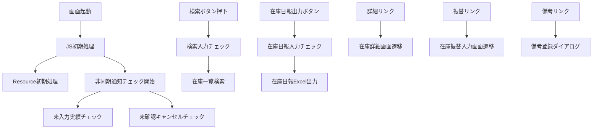

# 設計分析レポート: 在庫一覧（Webデポ）

## 1. ソースコード構成サマリ

### クラス一覧

| No | 分類 | クラスID | 役割 |
|----|------|---------|------|
| 1 | JavaScript | `InventoryListWebDepot.js` | 画面制御（初期表示、検索、ボタンイベント、非同期通知） |
| 2 | Resource | `InventoryListWebDepotResource.java` | REST API エンドポイント（検索、在庫日報出力、Excel/CSV出力） |
| 3 | 検索Logic | `InventoryListWebDepotSelectLogic.java` | 在庫一覧検索処理（実績済在庫・予定在庫の取得） |
| 4 | 帳票Logic | `InventoryListWebDepotReportLogic.java` | 在庫日報Excel出力処理 |
| 5 | 入力チェックLogic | `InventoryListWebDepotCheckLogic.java` | 検索条件の入力チェック処理 |
| 6 | DWRチェックLogic | `InventoryListWebDepotDwrLogic.java` | 非同期通知チェック（未出力/未入力/キャンセル確認） |
| 7 | 画面DTO | `InventoryListWebDepotDto` | 画面データ受け渡し用（ヘッダ＋明細リスト） |
| 8 | 検索条件DTO | `InventoryListWebDepotSearchDto` | 検索条件用（品目コード、基準日、在庫状況等） |
| 9 | 明細DTO | `InventoryListWebDepotDetailDto` | 明細行データ用 |
| 10 | 帳票DTO | `InventoryDailyReportDto` | 在庫日報出力データ用 |
| 11 | 通知DTO | `AsyncNotificationResultDto` | 非同期通知結果用 |
| 12 | HTML | `inventoryListWebDepot.html` | 画面テンプレート |
| 13 | CSS | `inventoryListWebDepot.css` | 画面スタイル |

### ファイル構成サマリ

| 分類 | ファイル数 |
|------|----------|
| JavaScript（フロントエンド） | 1 |
| Resource（API層） | 1 |
| Logic（ビジネスロジック層） | 4 |
| DTO（データ転送オブジェクト） | 5 |
| HTML/CSS（画面テンプレート） | 2 |
| **合計** | **13** |

---

## 2. 処理フロー構成

### 主要処理一覧

| 処理No | 処理名 | クラス | メソッド | 層 | トリガー |
|--------|-------|--------|---------|-----|---------|
| 1 | JS初期処理 | `InventoryListWebDepot.js` | `initScreen()` | Frontend | 画面起動 |
| 2 | Resource初期処理 | `InventoryListWebDepotResource.java` | `init()` | Backend | 処理1から呼出 |
| 3 | 非同期通知チェック（クライアント） | `InventoryListWebDepot.js` | `checkAsyncNotification()` | Frontend | 1分間隔タイマー |
| 4 | DWR経由-未入力実績チェック | `InventoryListWebDepotDwrLogic.java` | `checkUnenteredResults()` | Backend | 処理3から呼出 |
| 5 | DWR経由-未確認オーダーキャンセルチェック | `InventoryListWebDepotDwrLogic.java` | `checkUncancelledOrders()` | Backend | 処理3から呼出 |
| 6 | 検索ボタン押下 | `InventoryListWebDepot.js` | `onSearch()` | Frontend | 検索ボタン押下 |
| 7 | 検索入力チェック | `InventoryListWebDepotCheckLogic.java` | `validateSearchCondition()` | Backend | 処理6から呼出 |
| 8 | 在庫一覧検索 | `InventoryListWebDepotSelectLogic.java` | `selectInventoryList()` | Backend | 処理7通過後 |
| 9 | 在庫日報出力ボタン押下 | `InventoryListWebDepot.js` | `onReportOutput()` | Frontend | 在庫日報出力ボタン押下 |
| 10 | 在庫日報入力チェック | `InventoryListWebDepotCheckLogic.java` | `validateReportCondition()` | Backend | 処理9から呼出 |
| 11 | 在庫日報Excel出力 | `InventoryListWebDepotReportLogic.java` | `outputDailyReport()` | Backend | 処理10通過後 |
| 12 | Excel出力ボタン押下 | `InventoryListWebDepot.js` | `onExcelOutput()` | Frontend | Excel出力ボタン押下 |
| 13 | CSV出力ボタン押下 | `InventoryListWebDepot.js` | `onCsvOutput()` | Frontend | CSV出力ボタン押下 |
| 14 | 詳細リンク押下 | `InventoryListWebDepot.js` | `onDetailLink()` | Frontend | 明細「詳細」リンク押下 |
| 15 | 振替リンク押下 | `InventoryListWebDepot.js` | `onTransferLink()` | Frontend | 明細「振替」リンク押下 |
| 16 | 備考リンク押下 | `InventoryListWebDepot.js` | `onRemarkLink()` | Frontend | 明細「備考」リンク押下 |
| 17 | 品目検索ボタン押下 | `InventoryListWebDepot.js` | `onItemSearch()` | Frontend | 品目検索ボタン押下 |
| 18 | 品目コードロストフォーカス | `InventoryListWebDepot.js` | `onItemCodeBlur()` | Frontend | 品目コードロストフォーカス |

### 処理間依存関係

---

## 3. 画面項目構成分析

### ヘッダ部（タイトル・メッセージ）

| No | 項目名 | 種別 | 備考 |
|----|-------|------|------|
| 1 | 画面名 | テキスト出力 | 固定文言 |
| 2 | デポ名 | テキスト出力 | ログインユーザの所属デポ |
| 3 | ヘッダメッセージ | テキスト出力 | 非同期メッセージ表示用 |

### 検索条件部（入力エリア）

| No | 項目名 | 種別 | ドメイン | 必須 | 初期値 |
|----|-------|------|---------|------|--------|
| 4-15 | 品目コード×4 + 品目検索×4 + 品目名×4 | テキストボックス/ボタン/テキスト出力 | 品目コード | - | - |
| 16 | 在庫状況 | コンボボックス | 区分 | - | ブランク |
| 17 | 未承認の実績を含む | チェックボックス | - | - | ONチェックあり |
| 18 | 実績済在庫基準日 | テキストボックス | 年月日 | ○ | 営業日付 |
| 19 | 予定在庫基準日 | テキストボックス | 年月日 | ○ | 2999-12-31 |
| 20 | 品目種別 | リストボックス | - | - | ブランク |
| 21 | 選別数集計単位 | ラジオボタン | - | ○ | 月初～指定年月日集計 |
| 22 | 選別数集計基準日 | テキストボックス | - | - | 営業日付-1 |

### コントロール部（ボタンエリア）

| No | 項目名 | 種別 |
|----|-------|------|
| 23 | 検索 | ボタン |
| 24 | 在庫日報出力 | ボタン |
| 25 | Excel出力 | ボタン |
| 26 | CSV出力 | ボタン |

### 集計部

| No | 項目名 | 種別 |
|----|-------|------|
| 27 | 総数 | テキスト出力（固定文言） |
| 28 | 現在庫数 | テキスト出力 |
| 29 | 出荷可能数 | テキスト出力 |
| 30 | 予定在庫数 | テキスト出力 |

### 明細部（データグリッド）

| No | 項目名 | 種別 | 初期表示 | 検索後 |
|----|-------|------|---------|--------|
| 47 | No | テキスト出力 | 非表示 | 表示 |
| 48 | 詳細 | リンクボタン | 非表示 | 表示 |
| 49 | 振替 | リンクボタン | 非表示 | 表示 |
| 50 | 品目コード | テキスト出力 | 非表示 | 表示 |
| 51 | 品目名 | テキスト出力 | 非表示 | 表示 |
| 52 | 品目種別 | テキスト出力 | 非表示 | 表示 |
| 53 | 実績済在庫数 | テキスト出力 | 非表示 | 表示 |
| 54-56 | 未選別/一般品/限定品 | テキスト出力 | 非表示 | 表示 |
| 57 | 予定在庫数 | テキスト出力 | 非表示 | 表示 |
| 58-62 | メンテ待ち/乾燥待ち/その他/保留/基準外 | テキスト出力 | 非表示 | 表示 |
| 63 | 備考 | テキスト出力 | 非表示 | 表示 |
| 64 | 備考ボタン | リンクボタン | 非表示 | 表示 |

### 隠しフィールド

| No | 項目名 | 用途 |
|----|-------|------|
| 65 | 組織コード | 内部データ保持 |
| 66 | 出庫可能数 | 内部データ保持 |
| 67-68 | デポコード/デポ名 | 内部データ保持 |
| 69 | 初期表示フラグ | 検索上限用 |
| 70-71 | 品目コード/品目名 | 内部データ保持 |
| 72 | レイアウト保存最終日 | 内部データ保持 |
| 73 | token | CSRF対策 |
| 74-80 | 在庫詳細フォーム用 | 別画面遷移用パラメータ |
| 81-83 | 在庫振替入力フォーム用 | 別画面遷移用パラメータ |
| 84 | 備考ダイアログフォーム用 | 別画面遷移用パラメータ |

---

## 4. テーブル設計分析

### 使用テーブル（推定）

| No | テーブル名（推定） | 用途 | 根拠 |
|----|------------------|------|------|
| 1 | 在庫テーブル | 実績済在庫数の取得 | 検索処理で在庫ランク別在庫数を取得 |
| 2 | オーダーテーブル | 予定在庫数の算出 | レンタル/返却オーダーから予定在庫を計算 |
| 3 | オーダー明細テーブル | 入出庫予定の取得 | オーダー明細のキャンセル確認フラグ参照 |
| 4 | 入出庫依頼テーブル | 入出庫実績の取得 | 本登録のみ入出庫依頼情報を作成 |
| 5 | 入出庫実績テーブル | 選別数集計 | 選別数の日別/累計集計 |
| 6 | 在庫振替伝票テーブル | 未承認振替データ | 未承認の在庫振替伝票の数量取得 |
| 7 | 品目マスタ | 品目情報の取得 | 品目コード→品目名、品目カテゴリコード |
| 8 | 品目カテゴリマスタ | カテゴリ名称の取得 | 品目カテゴリコード→名称 |
| 9 | 取引先_共通テーブル | デポ名の取得 | 取引先名略称 |
| 10 | 参照権限マスタ | 予定在庫基準日の表示制御 | 権限を持つユーザのみ表示 |
| 11 | 支払調整テーブル | その他作業一覧出力 | デポから入力した支払調整データ |

### マッピング整合性チェック

| チェック項目 | 結果 | 詳細 |
|------------|------|------|
| 画面項目→DBカラム対応 | ⚠ 不完全 | テーブル物理名・カラム物理名が設計書に明記されていない |
| 在庫ランク区分の網羅性 | ✅ OK | 未選別/一般品/限定品/メンテ待ち/乾燥待ち/その他/保留/基準外 の8区分が網羅 |
| 集計部と明細部の整合性 | ✅ OK | 総数/現在庫数/出荷可能数/予定在庫数が集計部に対応 |
| Excel移送表との整合性 | ✅ OK | 在庫表/作業在庫報告/その他作業一覧の3シート構成が一致 |

---

## 5. 潜在的な問題

| No | 重大度 | 対象 | 問題説明 | 提案 |
|----|--------|------|---------|------|
| 1 | 高 | 変更履歴 | 変更履歴データが空（抽出不可） | 元Excelファイルの変更履歴シートを手動確認し、データ形式を確認すること |
| 2 | 高 | 設計概要①/② | 設計概要の記述に矛盾あり：「検索基準日実績済在庫基準日が未入力の場合、営業日付で検索する」と「エラーとする」が混在 | 正しい仕様を設計者に確認すること |
| 3 | 高 | 設計概要① | 未出力/未入力フラグのON/OFF記述が矛盾：「0件の場合ONOFFにする」「1件以上の場合OFFONにする」 | フラグのON/OFF条件を正確に確認すること |
| 4 | 中 | テーブル設計 | テーブル物理名・カラム物理名が基本設計書に記載されていない | 別途「画面定義書_在庫管理_在庫一覧.xls / U-IM-020-P_業務機能設計書_在庫一覧.xlsx」を参照する必要あり |
| 5 | 中 | 機能遷移図(2) | 機能遷移図のシートから図形テキストを抽出できなかった | 画像貼り付けの可能性あり。手動でMermaid記法を作成すること |
| 6 | 中 | 予定在庫基準日 | 初期値が「2999-12-31 00:00:00」と極端な未来日 | デフォルト非表示＋マスタ制御で表示可能とあるが、表示時の初期値設計を確認すること |
| 7 | 低 | 画面項目定義 | 品目コード入力欄が4つあるが、項目Noが連番でない箇所あり（No.23欠番→コントロール部のNo表記が曖昧） | 項目番号の整合性を確認すること |
| 8 | 低 | 在庫の見え方 | レンタルシステムとWebデポの予定在庫の差異（仮オーダーのデポ通知ON/OFF）が複雑 | テストケース設計時に全パターンを網羅すること |
| 9 | 低 | Excel移送表 | No.11「作業待ち在庫数」、No.12「その他在庫数」が全レコード種別で「-」（未使用） | 廃止項目の可能性があるか確認すること |

---

## 6. DTO構造

### InventoryListWebDepotSearchDto（検索条件DTO）

| フィールド | 型 | 必須 | 説明 |
|-----------|---|------|------|
| itemCode1 | String | - | 品目コード1 |
| itemCode2 | String | - | 品目コード2 |
| itemCode3 | String | - | 品目コード3 |
| itemCode4 | String | - | 品目コード4 |
| stockStatus | String | - | 在庫状況（在庫有り/在庫無し） |
| includeUnapproved | Boolean | - | 未承認の実績を含むフラグ |
| actualStockBaseDate | String | ○ | 実績済在庫基準日（YYYYMMDD） |
| plannedStockBaseDate | String | ○ | 予定在庫基準日（YYYYMMDD） |
| itemCategory | String | - | 品目種別（木/プラ/鉄/その他） |
| sortingUnit | String | ○ | 選別数集計単位（年/月/月初～指定年月日） |
| sortingBaseDate | String | - | 選別数集計基準日 |
| depotCode | String | ○ | デポコード（ログインユーザから取得） |
| organizationCode | String | - | 組織コード |

### InventoryListWebDepotDto（画面DTO）

| フィールド | 型 | 必須 | 説明 |
|-----------|---|------|------|
| screenName | String | ○ | 画面名 |
| depotName | String | ○ | デポ名 |
| headerMessage | String | - | ヘッダメッセージ（非同期通知用） |
| searchCondition | InventoryListWebDepotSearchDto | ○ | 検索条件 |
| totalCount | Integer | - | 総数 |
| currentStockCount | Integer | - | 現在庫数 |
| shippableCount | Integer | - | 出荷可能数 |
| plannedStockCount | Integer | - | 予定在庫数 |
| detailList | List&lt;InventoryListWebDepotDetailDto&gt; | - | 明細リスト |

### InventoryListWebDepotDetailDto（明細DTO）

| フィールド | 型 | 必須 | 説明 |
|-----------|---|------|------|
| rowNo | Integer | ○ | No |
| itemCode | String | ○ | 品目コード |
| itemName | String | ○ | 品目名 |
| itemCategory | String | - | 品目種別 |
| actualStockCount | Integer | - | 実績済在庫数 |
| unsortedCount | Integer | - | 未選別 |
| generalCount | Integer | - | 一般品 |
| limitedCount | Integer | - | 限定品 |
| plannedStockCount | Integer | - | 予定在庫数 |
| maintenanceWaitCount | Integer | - | メンテ待ち |
| dryingWaitCount | Integer | - | 乾燥待ち |
| otherCount | Integer | - | その他 |
| holdCount | Integer | - | 保留 |
| outOfStandardCount | Integer | - | 基準外 |
| remarks | String | - | 備考 |
| depotCode | String | - | デポコード（隠しフィールド） |
| depotName | String | - | デポ名（隠しフィールド） |
| organizationCode | String | - | 組織コード（隠しフィールド） |
| shippableCount | Integer | - | 出庫可能数（隠しフィールド） |

### InventoryDailyReportDto（帳票DTO）

| フィールド | 型 | 必須 | 説明 |
|-----------|---|------|------|
| targetDate | String | ○ | 対象日 |
| depotCode | String | ○ | デポコード |
| depotName | String | ○ | デポ名 |
| categoryName | String | - | 種類名 |
| itemCode | String | - | 品目コード |
| itemName | String | - | 品目名 |
| generalStockCount | Integer | - | 一般品在庫数 |
| limitedStockCount | Integer | - | 限定品在庫数 |
| unsortedStockCount | Integer | - | 未選別在庫数 |
| maintenanceWaitCount | Integer | - | メンテ待ち在庫数 |
| holdCount | Integer | - | 保留在庫数 |
| outOfStandardCount | Integer | - | 基準外在庫数 |
| dryingWaitCount | Integer | - | 乾燥待ち在庫数 |
| stockTotal | Integer | - | 在庫数合計 |
| remarks | String | - | 備考 |
| sortingBaseDate | String | - | 選別数対象日 |
| generalSortDaily | Integer | - | 一般品選別数(日別) |
| limitedSortDaily | Integer | - | 限定品選別数(日別) |
| maintenanceSortDaily | Integer | - | メンテ待ち選別数(日別) |
| holdSortDaily | Integer | - | 保留選別数(日別) |
| outOfStandardSortDaily | Integer | - | 基準外選別数(日別) |
| sortTotalDaily | Integer | - | 選別数合計(日別) |
| generalSortCumulative | Integer | - | 一般品選別数(累計) |
| limitedSortCumulative | Integer | - | 限定品選別数(累計) |
| maintenanceSortCumulative | Integer | - | メンテ待ち選別数(累計) |
| holdSortCumulative | Integer | - | 保留選別数(累計) |
| outOfStandardSortCumulative | Integer | - | 基準外選別数(累計) |
| dryingWaitSortCumulative | Integer | - | 乾燥待ち選別数(累計) |
| sortTotalCumulative | Integer | - | 選別数合計(累計) |

### AsyncNotificationResultDto（非同期通知結果DTO）

| フィールド | 型 | 必須 | 説明 |
|-----------|---|------|------|
| unOutputFlag | Boolean | ○ | 未出力フラグ（未出力依頼書あり） |
| unEnteredFlag | Boolean | ○ | 未入力フラグ（未入力実績あり） |
| unConfirmedCancelFlag | Boolean | ○ | 未確認オーダーキャンセルフラグ |

---

## 7. 共通機能利用一覧

| No | 共通機能名 | 利用箇所 | 用途 |
|----|-----------|---------|------|
| 1 | 営業日付取得 | 処理1（初期表示）、処理7（検索チェック） | 実績済在庫基準日の初期値・検証に使用 |
| 2 | 検索上限件数チェック | 処理8（検索処理） | `app-config.properties`のlimitRows（1001件）でチェック |
| 3 | DWR（Direct Web Remoting） | 処理3-5（非同期通知） | 1分間隔でサーバに非同期通知チェックを実行 |
| 4 | 品目検索共通 | 処理17（品目検索ボタン） | 品目コードから品目名を自動表示 |
| 5 | 品目コードロストフォーカス | 処理18 | 品目コード入力後に品目名を自動表示 |
| 6 | カレンダー共通 | 実績済在庫基準日/予定在庫基準日/選別数集計基準日 | カレンダーアイコン押下時の日付選択 |
| 7 | 参照権限マスタ | 処理2（初期表示） | 予定在庫基準日の表示/非表示を制御 |
| 8 | メッセージ共通 | 全チェック処理 | エラーメッセージID管理（upr.error.xxxx） |
| 9 | Excel出力共通 | 処理11/12 | 在庫日報Excel・Excel出力処理 |
| 10 | CSV出力共通 | 処理13 | CSV出力処理 |

---

## 8. 画面遷移分析

### 遷移定義

| No | 遷移元画面 | トリガー | 遷移先画面 | 遷移タイプ | パラメータ |
|----|-----------|---------|-----------|-----------|-----------|
| 1 | パレットメニュー | メニューボタン押下 | 在庫一覧（Webデポ） | 画面遷移 | - |
| 2 | 在庫一覧（Webデポ） | 「在庫日報出力」ボタン押下 | 在庫日報Excel | 帳票出力 | 検索条件+選別数集計条件 |
| 3 | 在庫一覧（Webデポ） | 「詳細」ボタン押下 | 在庫詳細（Webデポ） | 画面遷移 | デポコード/デポ名/品目コード/品目名/組織コード/未承認フラグ/検索基準日 |
| 4 | 在庫一覧（Webデポ） | 「振替」ボタン押下 | 在庫振替入力（Webデポ） | 画面遷移 | 品目コード/品目名/画面表示区分 |
| 5 | 在庫一覧（Webデポ） | 「備考」ボタン押下 | 備考登録ダイアログ（Webデポ） | ダイアログ | 品目コード |

### Excel出力シート構成

| シート名 | 内容 | レコード種別 |
|---------|------|------------|
| 在庫表 | 品目別在庫数（ランク別） | ①品目別/②種類別合計/③全商品合計 |
| 作業在庫報告 | 選別数（日別＋累計） | ①品目別/②種類別合計/③全商品合計 |
| その他作業一覧 | 支払調整データ | 期間内の支払調整明細 |

---

## 9. 入力チェック分析

### チェック一覧

| No | トリガー | 対象項目 | チェック内容 | メッセージID | 重大度 |
|----|---------|---------|------------|------------|--------|
| 1 | 検索/在庫日報出力 | 実績済在庫基準日 | 業務日付の2か月前以前はエラー | upr.error.0065 | エラー |
| 2 | 検索/在庫日報出力 | 実績済在庫基準日 | 業務日付より未来日はエラー | upr.error.0066 / E.P20REN.CR.00989 | エラー |
| 3 | 検索 | 検索結果 | 1001件以上はエラー | upr.error.0048 | エラー |
| 4 | 検索/在庫日報出力 | 検索結果 | 0件は情報メッセージ | upr.info.0010 / E.P20REN.CR.00034 | 情報 |
| 5 | 在庫日報出力 | 選別数集計単位 | 必須チェック | upr.error.0001 | エラー |
| 6 | 在庫日報出力 | 選別数集計基準日 | 年集計→YYYY形式チェック | upr.error.0067 | エラー |
| 7 | 在庫日報出力 | 選別数集計基準日 | 月集計→YYYYMM形式チェック | upr.error.0068 | エラー |
| 8 | 在庫日報出力 | 選別数集計基準日 | 月初～指定年月日→YYYYMMDD形式チェック | upr.error.0005 | エラー |
| 9 | 在庫日報出力 | 選別数集計基準日 | 業務日付より未来日はエラー | upr.error.0066 / E.P20REN.CR.00989 | エラー |
| 10 | 検索/在庫日報出力 | 予定在庫基準日 | 営業日付より過去日はエラー | E.P20REN.CR.00987（新規） | エラー |
| 11 | 在庫日報出力 | - | 完了メッセージ | 新規 | 情報 |

---

## 10. 在庫計算ロジック分析

### 予定在庫の算出ルール

| 条件 | レンタルシステム表示 | Webデポ表示 |
|------|-------------------|------------|
| 本登録オーダー | 反映する | 反映する |
| 仮オーダー（デポ通知ON） | 反映する | 反映する |
| 仮オーダー（デポ通知OFF） | 反映する | **反映しない** |

### 実績済在庫の算出ルール

| 基準日パターン | 実績済在庫 | 予定在庫 |
|--------------|-----------|---------|
| 当日（実績なし） | 現在庫数 | 現在庫数 ± 未実績オーダー |
| 過去日（未実績） | 現在庫数（実績前） | 現在庫数 ± 未実績オーダー |
| 過去日（実績済） | 実績反映後在庫数 | 実績反映後在庫数 ± 未実績オーダー |

---

## 11. 設計判断記録

| No | 判断ポイント | 判断 | 理由 |
|----|------------|------|------|
| 1 | 非同期通知方式 | DWR（Direct Web Remoting） | フレームワーク標準の非同期通信方式 |
| 2 | 通知チェック間隔 | 1分間隔 | サーバ負荷とリアルタイム性のバランス |
| 3 | 検索上限 | 1001件 | `app-config.properties`での共通制御 |
| 4 | 予定在庫基準日の表示制御 | 参照権限マスタで制御 | 特定ユーザのみ利用可能な機能 |
| 5 | 仮オーダーの在庫反映 | デポ通知ON/OFFで切替 | レンタルシステムとWebデポの在庫表示差異を管理 |
| 6 | 在庫日報の出力形式 | Excel（3シート構成） | 在庫表/作業在庫報告/その他作業一覧の標準帳票 |
| 7 | 選別数集計方式 | 年/月/月初～指定年月日の3パターン | 運用ニーズに応じた柔軟な集計期間指定 |
| 8 | 実績済在庫基準日の範囲 | 営業日付の2ヶ月前～営業日付 | 過去の在庫状況を参照可能な期間の制限 |
| 9 | 別機能の参照 | U-IM-020-P_業務機能設計書_在庫一覧.xlsx | 検索内容の詳細は新レンタルの在庫一覧と同一 |