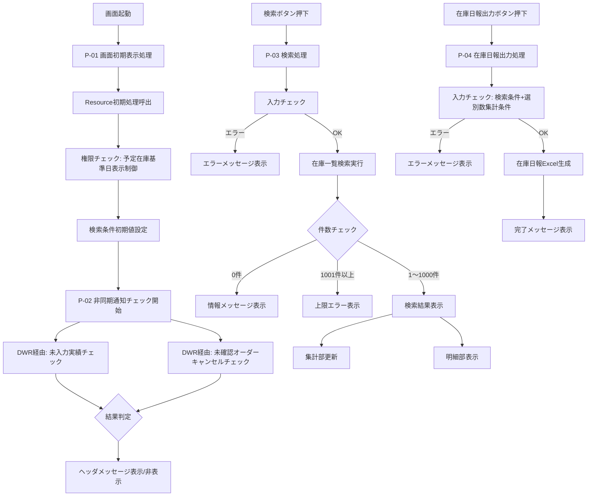

# D-IM-010-P 在庫一覧（Webデポ） 詳細設計書

| 項目 | 内容 |
|------|------|
| 機能ID | D-IM-010-P |
| 機能名 | 在庫一覧（Webデポ） |
| 作成日 | 2026/04/16 |
| 生成元 | excel-parse → design-analyzer → md-design-generator ワークフロー |

---

## 目次

1. [処理詳細設計](#1-処理詳細設計)
2. [Javaクラス設計（Resource/Logic/DTO）](#2-javaクラス設計resourcelogicdto)
3. [JavaScript設計（画面制御・イベントハンドラ）](#3-javascript設計画面制御イベントハンドラ)
4. [HTML/CSS設計](#4-htmlcss設計)
5. [DTO設計](#5-dto設計)
6. [テーブル項目マッピング](#6-テーブル項目マッピング)
7. [共通機能参照](#7-共通機能参照)

---

## 1. 処理詳細設計

### 1.1 処理一覧

| 処理No | 処理名 | トリガー | 層 | 概要 |
|--------|--------|---------|-----|------|
| P-01 | 画面初期表示処理 | 画面起動 | Frontend→Backend | 画面項目の初期値設定、権限チェック |
| P-02 | 非同期通知チェック処理 | 1分間隔タイマー | Frontend→Backend | 未出力/未入力/未確認キャンセルの通知 |
| P-03 | 検索処理 | 検索ボタン押下 | Frontend→Backend | 在庫一覧検索、結果表示 |
| P-04 | 在庫日報出力処理 | 在庫日報出力ボタン押下 | Frontend→Backend | 在庫日報Excel（3シート）生成 |
| P-05 | Excel出力処理 | Excel出力ボタン押下 | Frontend→Backend | 検索結果のExcel出力 |
| P-06 | CSV出力処理 | CSV出力ボタン押下 | Frontend→Backend | 検索結果のCSV出力 |
| P-07 | 画面遷移処理（詳細） | 明細「詳細」リンク押下 | Frontend | 在庫詳細画面への遷移 |
| P-08 | 画面遷移処理（振替） | 明細「振替」リンク押下 | Frontend | 在庫振替入力画面への遷移 |
| P-09 | 備考登録ダイアログ表示 | 明細「備考」リンク押下 | Frontend | 備考登録ダイアログの表示 |
| P-10 | 品目検索処理 | 品目検索ボタン押下 | Frontend | 品目検索共通の呼出 |
| P-11 | 品目コードロストフォーカス | 品目コードフォーカスアウト | Frontend | 品目名自動表示 |

### 1.2 処理フロー図



### 1.3 処理詳細

#### P-01: 画面初期表示処理

| 項目 | 内容 |
|------|------|
| クラス（JS） | `InventoryListWebDepot.js` |
| メソッド（JS） | `initScreen()` |
| クラス（Java） | `InventoryListWebDepotResource.java` |
| メソッド（Java） | `init()` |

**処理ステップ:**

1. `InventoryListWebDepotResource.init()` を呼び出し、以下を取得する
   - ログインユーザのデポコード、デポ名
   - 営業日付
   - 参照権限マスタから予定在庫基準日の表示権限
2. 画面項目に初期値を設定する
   - 画面名: 固定文言「在庫一覧（Webデポ）」
   - デポ名: ログインユーザの所属デポの取引先名略称
   - 実績済在庫基準日: 営業日付
   - 予定在庫基準日: `2999-12-31`（デフォルト非表示、権限ありの場合のみ表示）
   - 未承認の実績を含む: チェックあり（ON）
   - 選別数集計単位: 月初～指定年月日集計
   - 選別数集計基準日: 営業日付 - 1日
3. 明細部を非表示にする（初期表示フラグ設定）
4. 非同期通知チェック（P-02）をタイマー開始する

#### P-02: 非同期通知チェック処理

| 項目 | 内容 |
|------|------|
| クラス（JS） | `InventoryListWebDepot.js` |
| メソッド（JS） | `checkAsyncNotification()` |
| クラス（Java） | `InventoryListWebDepotDwrLogic.java` |
| メソッド（Java） | `checkUnenteredResults()`, `checkUncancelledOrders()` |
| 実行間隔 | 1分間隔 |

**処理ステップ:**

1. **クライアント処理**: DWR経由で以下2つのサーバ処理を呼び出す
2. **DWR経由-未入力実績チェック処理** (`checkUnenteredResults()`)
   - 未出力依頼書の件数を取得
     - 0件: 未出力フラグ = OFF
     - 1件以上: 未出力フラグ = ON
   - 未入力実績の件数を取得
     - 0件: 未入力フラグ = OFF
     - 1件以上: 未入力フラグ = ON
3. **DWR経由-未確認オーダーキャンセルチェック処理** (`checkUncancelledOrders()`)
   - 条件: オーダーが「1：削除済」かつオーダー明細のキャンセル確認フラグが「0：未確認」かつログインユーザのデポコードがオーダー明細の取引先コードと一致
   - 該当データ件数を取得
     - 0件: 未確認オーダーキャンセルフラグ = OFF
     - 1件以上: 未確認オーダーキャンセルフラグ = ON
4. **メッセージ表示制御**

| メッセージ | 対象 | 条件 | 表示 |
|-----------|------|------|------|
| ※未出力の実績依頼書があります | 未出力依頼書 | 1件以上 | 画面タイトル右端に表示 |
| ※未入力の実績があります | 未入力実績 | 1件以上 | 画面タイトル右端に表示 |
| ※未確認のオーダーキャンセルがあります | 未確認キャンセル | 1件以上 | 画面タイトル右端に表示 |

#### P-03: 検索処理

| 項目 | 内容 |
|------|------|
| クラス（JS） | `InventoryListWebDepot.js` |
| メソッド（JS） | `onSearch()` |
| クラス（Java入力チェック） | `InventoryListWebDepotCheckLogic.java` |
| メソッド（Java入力チェック） | `validateSearchCondition()` |
| クラス（Java検索） | `InventoryListWebDepotSelectLogic.java` |
| メソッド（Java検索） | `selectInventoryList()` |

**入力チェック:**

| No | 対象項目 | チェック内容 | メッセージID | メッセージ |
|----|---------|------------|------------|---------|
| 1 | 実績済在庫基準日 | 業務日付の2か月前より前の場合エラー | upr.error.0065 | {0}は前々月以前の指定はできません。 |
| 2 | 実績済在庫基準日 | 業務日付より未来の場合エラー | upr.error.0066 / E.P20REN.CR.00989 | {0}は{1}以前の日付を入力してください。 |
| 3 | 予定在庫基準日 | 営業日付より過去日の場合エラー | E.P20REN.CR.00987 | {0}は{1}以降の日付を入力してください。 |
| 4 | 検索結果 | 1001件以上の場合エラー | upr.error.0048 | （共通メッセージ） |
| 5 | 検索結果 | 0件の場合 | upr.info.0010 / E.P20REN.CR.00034 | 該当するデータが見つかりません。条件を見直して再検索して下さい。 |

**検索処理ステップ:**

1. 画面の検索条件を `InventoryListWebDepotSearchDto` に格納
2. `validateSearchCondition()` で入力チェック実行
3. チェックOKの場合、`selectInventoryList()` で在庫一覧データを取得
4. 検索結果件数チェック（0件/1001件以上）
5. 検索結果を画面DTOに格納し、集計部・明細部を更新

**在庫計算ロジック（予定在庫数の算出）:**

| 条件 | レンタルシステム表示 | Webデポ表示 |
|------|-------------------|------------|
| 本登録オーダー | 反映する | 反映する |
| 仮オーダー（デポ通知ON） | 反映する | 反映する |
| 仮オーダー（デポ通知OFF） | 反映する | **反映しない** |

※ 検索内容の詳細は「U-IM-020-P_業務機能設計書_在庫一覧.xlsx」を参照

#### P-04: 在庫日報出力処理

| 項目 | 内容 |
|------|------|
| クラス（JS） | `InventoryListWebDepot.js` |
| メソッド（JS） | `onReportOutput()` |
| クラス（Java入力チェック） | `InventoryListWebDepotCheckLogic.java` |
| メソッド（Java入力チェック） | `validateReportCondition()` |
| クラス（Java帳票） | `InventoryListWebDepotReportLogic.java` |
| メソッド（Java帳票） | `outputDailyReport()` |

**追加入力チェック（検索チェックに加えて）:**

| No | 対象項目 | チェック内容 | メッセージID | メッセージ |
|----|---------|------------|------------|---------|
| 1 | 選別数集計単位 | 必須チェック | upr.error.0001 | （必須エラー） |
| 2 | 選別数集計基準日（年集計時） | YYYY形式チェック | upr.error.0067 | {0}はYYYY形式で入力してください。 |
| 3 | 選別数集計基準日（月集計時） | YYYYMM形式チェック | upr.error.0068 | {0}はYYYYMM形式で入力してください。 |
| 4 | 選別数集計基準日（月初～指定年月日集計時） | YYYYMMDD形式チェック | upr.error.0005 | {0}はYYYYMMDD形式で入力してください。 |
| 5 | 選別数集計基準日 | 業務日付より未来日はエラー | upr.error.0066 / E.P20REN.CR.00989 | {0}は{1}以前の日付を入力してください。 |

**在庫日報Excel出力（3シート構成）:**

| シート名 | 内容 | レコード種別 |
|---------|------|------------|
| 在庫表 | 品目別在庫数（ランク別：一般/限定/未選別/メンテ待ち/乾燥待ち/その他/保留/基準外） | ①品目別 ②種類別合計 ③全商品合計 |
| 作業在庫報告 | 選別数（日別＋累計） | ①品目別 ②種類別合計 ③全商品合計 |
| その他作業一覧 | 支払調整データ（実績済在庫基準日の月初～基準日） | 期間内の支払調整明細 |

**出力完了後:** 完了メッセージ「在庫日報の発行が完了しました。」を表示

#### P-05: Excel出力処理

| 項目 | 内容 |
|------|------|
| クラス（JS） | `InventoryListWebDepot.js` |
| メソッド（JS） | `onExcelOutput()` |
| 利用共通機能 | Excel出力共通 |

**処理ステップ:** 検索結果の明細データをExcel形式で出力する。

#### P-06: CSV出力処理

| 項目 | 内容 |
|------|------|
| クラス（JS） | `InventoryListWebDepot.js` |
| メソッド（JS） | `onCsvOutput()` |
| 利用共通機能 | CSV出力共通 |

**処理ステップ:** 検索結果の明細データをCSV形式で出力する。

#### P-07: 画面遷移処理（在庫詳細）

| 項目 | 内容 |
|------|------|
| クラス（JS） | `InventoryListWebDepot.js` |
| メソッド（JS） | `onDetailLink()` |
| 遷移先 | 在庫詳細（Webデポ） |

**渡しパラメータ:**

| パラメータ | 取得元 |
|-----------|--------|
| デポコード | 隠しフィールド（在庫詳細フォーム） |
| デポ名 | 隠しフィールド（在庫詳細フォーム） |
| 品目コード | 選択行の品目コード |
| 品目名 | 選択行の品目名 |
| 組織コード | 隠しフィールド（在庫詳細フォーム） |
| 未承認の実績を含む | 隠しフィールド（在庫詳細フォーム） |
| 検索基準日 | 隠しフィールド（在庫詳細フォーム） |

#### P-08: 画面遷移処理（在庫振替入力）

| 項目 | 内容 |
|------|------|
| クラス（JS） | `InventoryListWebDepot.js` |
| メソッド（JS） | `onTransferLink()` |
| 遷移先 | 在庫振替入力（Webデポ） |

**渡しパラメータ:**

| パラメータ | 取得元 |
|-----------|--------|
| 品目コード | 選択行の品目コード |
| 品目名 | 選択行の品目名 |
| 画面表示区分 | 隠しフィールド（在庫振替入力フォーム） |

#### P-09: 備考登録ダイアログ表示

| 項目 | 内容 |
|------|------|
| クラス（JS） | `InventoryListWebDepot.js` |
| メソッド（JS） | `onRemarkLink()` |
| 遷移先 | 備考登録ダイアログ（Webデポ） |

**渡しパラメータ:**

| パラメータ | 取得元 |
|-----------|--------|
| 品目コード | 選択行の品目コード |

---

## 2. Javaクラス設計（Resource/Logic/DTO）

### 2.1 クラス一覧

| No | 分類 | クラスID | 役割 |
|----|------|---------|------|
| 1 | Resource | `InventoryListWebDepotResource.java` | REST APIエンドポイント |
| 2 | Logic | `InventoryListWebDepotSelectLogic.java` | 在庫一覧検索処理 |
| 3 | Logic | `InventoryListWebDepotReportLogic.java` | 在庫日報Excel出力処理 |
| 4 | Logic | `InventoryListWebDepotCheckLogic.java` | 入力チェック処理 |
| 5 | Logic | `InventoryListWebDepotDwrLogic.java` | 非同期通知チェック処理 |
| 6 | DTO | `InventoryListWebDepotDto` | 画面データ受け渡し用 |
| 7 | DTO | `InventoryListWebDepotSearchDto` | 検索条件用 |
| 8 | DTO | `InventoryListWebDepotDetailDto` | 明細行データ用 |
| 9 | DTO | `InventoryDailyReportDto` | 在庫日報出力データ用 |
| 10 | DTO | `AsyncNotificationResultDto` | 非同期通知結果用 |

### 2.2 InventoryListWebDepotResource（Resourceクラス）

**責務:** 画面からのHTTPリクエストを受け付け、各Logicクラスを呼び出す

| メソッド | HTTPメソッド | パス | 入力 | 出力 | 処理概要 |
|---------|------------|------|------|------|---------|
| `init()` | GET | `/inventoryListWebDepot/init` | - | `InventoryListWebDepotDto` | 画面初期表示処理。営業日付取得、権限チェック、初期値設定 |
| `search()` | POST | `/inventoryListWebDepot/search` | `InventoryListWebDepotSearchDto` | `InventoryListWebDepotDto` | 入力チェック→在庫一覧検索→結果返却 |
| `outputDailyReport()` | POST | `/inventoryListWebDepot/dailyReport` | `InventoryListWebDepotSearchDto` | ファイルダウンロード | 入力チェック→在庫日報Excel生成→ダウンロード |
| `outputExcel()` | POST | `/inventoryListWebDepot/excel` | `InventoryListWebDepotSearchDto` | ファイルダウンロード | Excel出力共通呼出 |
| `outputCsv()` | POST | `/inventoryListWebDepot/csv` | `InventoryListWebDepotSearchDto` | ファイルダウンロード | CSV出力共通呼出 |

### 2.3 InventoryListWebDepotSelectLogic（検索Logic）

**責務:** 在庫一覧の検索処理を実行する

| メソッド | 入力 | 出力 | 処理概要 |
|---------|------|------|---------|
| `selectInventoryList()` | `InventoryListWebDepotSearchDto` | `InventoryListWebDepotDto` | 実績済在庫・予定在庫を取得し、品目別明細リストを構築。集計値（総数/現在庫数/出荷可能数/予定在庫数）を算出 |

**検索ロジック詳細:**

1. 実績済在庫基準日に基づいて在庫テーブルからランク別在庫数を取得
2. 予定在庫基準日までのオーダー情報から予定在庫数を算出
   - Webデポ表示の場合：仮オーダー（デポ通知OFF）は除外
3. 備考は実績済在庫基準日以前で最も近い日の内容を取得
4. 品目ごとに明細DTOを構築し、リストに格納
5. 集計値を算出して画面DTOに設定

### 2.4 InventoryListWebDepotReportLogic（帳票Logic）

**責務:** 在庫日報Excelファイルを生成する

| メソッド | 入力 | 出力 | 処理概要 |
|---------|------|------|---------|
| `outputDailyReport()` | `InventoryListWebDepotSearchDto` | `byte[]`（Excelバイナリ） | テンプレートに基づいて3シート構成のExcelを生成 |

**シート別処理:**

| シート | 処理内容 |
|--------|---------|
| 在庫表 | 品目別レコード→種類別合計→全商品合計の順に出力。ランク別在庫数（一般/限定/未選別/メンテ待ち/乾燥待ち/その他/保留/基準外）と在庫合計。対象日・デポコード・デポ名をヘッダに出力 |
| 作業在庫報告 | 選別数を日別と累計で出力。選別数集計単位（年/月/月初～指定年月日）に応じて累計期間を変動。データソースは入出庫実績＋未承認の在庫振替伝票 |
| その他作業一覧 | 実績済在庫基準日の月初～基準日までの支払調整データ（デポから入力した分）を出力 |

### 2.5 InventoryListWebDepotCheckLogic（入力チェックLogic）

**責務:** 検索条件・帳票出力条件の入力チェック

| メソッド | 入力 | 出力 | 処理概要 |
|---------|------|------|---------|
| `validateSearchCondition()` | `InventoryListWebDepotSearchDto` | `List<ErrorMessage>` | 検索条件の入力チェック |
| `validateReportCondition()` | `InventoryListWebDepotSearchDto` | `List<ErrorMessage>` | 在庫日報出力条件の入力チェック（検索チェック＋選別数集計条件チェック） |

**入力チェック一覧:**

| No | メソッド | 対象項目 | チェック内容 | メッセージID |
|----|---------|---------|------------|------------|
| 1 | 共通 | 実績済在庫基準日 | 業務日付の2か月前より前はエラー | upr.error.0065 |
| 2 | 共通 | 実績済在庫基準日 | 業務日付より未来日はエラー | upr.error.0066 / E.P20REN.CR.00989 |
| 3 | 共通 | 予定在庫基準日 | 営業日付より過去日はエラー | E.P20REN.CR.00987 |
| 4 | 検索のみ | 検索結果 | 1001件以上はエラー | upr.error.0048 |
| 5 | 共通 | 検索結果 | 0件は情報メッセージ | upr.info.0010 / E.P20REN.CR.00034 |
| 6 | 帳票のみ | 選別数集計単位 | 必須チェック | upr.error.0001 |
| 7 | 帳票のみ | 選別数集計基準日 | 集計単位に応じた形式チェック（YYYY/YYYYMM/YYYYMMDD） | upr.error.0067/0068/0005 |
| 8 | 帳票のみ | 選別数集計基準日 | 業務日付より未来日はエラー | upr.error.0066 / E.P20REN.CR.00989 |

### 2.6 InventoryListWebDepotDwrLogic（非同期通知Logic）

**責務:** DWR経由で呼び出される非同期通知チェック処理

| メソッド | 入力 | 出力 | 処理概要 |
|---------|------|------|---------|
| `checkUnenteredResults()` | デポコード | `AsyncNotificationResultDto` | 未出力依頼書件数＋未入力実績件数を取得し、フラグを設定 |
| `checkUncancelledOrders()` | デポコード | `AsyncNotificationResultDto` | 削除済オーダー＋未確認キャンセルのデータ件数を取得し、フラグを設定 |

---

## 3. JavaScript設計（画面制御・イベントハンドラ）

### 3.1 ファイル構成

| ファイル名 | 役割 |
|-----------|------|
| `InventoryListWebDepot.js` | 画面制御（初期表示、イベントハンドラ、非同期通知、画面遷移） |

### 3.2 関数一覧

| No | 関数名 | トリガー | 処理概要 |
|----|--------|---------|---------|
| 1 | `initScreen()` | 画面起動（onload） | Resource初期処理呼出、初期値設定、タイマー開始 |
| 2 | `checkAsyncNotification()` | 1分間隔タイマー | DWR経由で未出力/未入力/未確認キャンセルチェック実行、ヘッダメッセージ更新 |
| 3 | `onSearch()` | 検索ボタンclick | 検索条件収集→Resource.search()呼出→結果表示 |
| 4 | `onReportOutput()` | 在庫日報出力ボタンclick | 検索条件+選別数条件収集→Resource.outputDailyReport()呼出→完了メッセージ |
| 5 | `onExcelOutput()` | Excel出力ボタンclick | Resource.outputExcel()呼出→ファイルダウンロード |
| 6 | `onCsvOutput()` | CSV出力ボタンclick | Resource.outputCsv()呼出→ファイルダウンロード |
| 7 | `onDetailLink()` | 明細「詳細」リンクclick | 隠しフィールドにパラメータ設定→在庫詳細画面へサブミット |
| 8 | `onTransferLink()` | 明細「振替」リンクclick | 隠しフィールドにパラメータ設定→在庫振替入力画面へサブミット |
| 9 | `onRemarkLink()` | 明細「備考」リンクclick | 隠しフィールドにパラメータ設定→備考登録ダイアログ表示 |
| 10 | `onItemSearch()` | 品目検索ボタンclick | 品目検索共通ダイアログ呼出 |
| 11 | `onItemCodeBlur()` | 品目コードフォーカスアウト | 品目コードから品目名を自動取得・表示 |
| 12 | `updateHeaderMessage()` | 非同期通知結果受信 | フラグに基づきヘッダメッセージの表示/非表示を制御 |
| 13 | `displaySearchResult()` | 検索結果受信 | 集計部更新、明細部テーブル描画、明細部を表示に切替 |

### 3.3 イベント定義

| イベント | 対象要素 | ハンドラ | 備考 |
|---------|---------|---------|------|
| click | 検索ボタン | `onSearch()` | |
| click | 在庫日報出力ボタン | `onReportOutput()` | |
| click | Excel出力ボタン | `onExcelOutput()` | |
| click | CSV出力ボタン | `onCsvOutput()` | |
| click | 品目検索ボタン×4 | `onItemSearch()` | 4つの品目コードそれぞれに対応 |
| blur | 品目コード×4 | `onItemCodeBlur()` | ロストフォーカスで品目名自動表示 |
| click | 明細「詳細」リンク | `onDetailLink()` | 行ごとに品目コードを特定 |
| click | 明細「振替」リンク | `onTransferLink()` | 行ごとに品目コードを特定 |
| click | 明細「備考」リンク | `onRemarkLink()` | 行ごとに品目コードを特定 |
| timer(60000ms) | - | `checkAsyncNotification()` | setIntervalで1分間隔実行 |

### 3.4 非同期通知チェック詳細

```javascript
// 疑似コード
function checkAsyncNotification() {
    // DWR経由-未入力実績チェック処理
    DwrService.checkUnenteredResults(depotCode, function(result) {
        if (result.unOutputFlag) {
            showMessage("※未出力の実績依頼書があります");
        }
        if (result.unEnteredFlag) {
            showMessage("※未入力の実績があります");
        }
    });

    // DWR経由-未確認オーダーキャンセルチェック処理
    DwrService.checkUncancelledOrders(depotCode, function(result) {
        if (result.unConfirmedCancelFlag) {
            showMessage("※未確認のオーダーキャンセルがあります");
        }
    });
}
```

---

## 4. HTML/CSS設計

### 4.1 ファイル構成

| ファイル名 | 役割 |
|-----------|------|
| `inventoryListWebDepot.html` | 画面テンプレート |
| `inventoryListWebDepot.css` | 画面スタイル |

### 4.2 画面レイアウト構成

```
┌──────────────────────────────────────────────┐
│ タイトル部: 画面名 + デポ名                       │
├──────────────────────────────────────────────┤
│ ヘッダ部: ヘッダメッセージ（非同期通知表示用）        │
├──────────────────────────────────────────────┤
│ 検索条件部                                      │
│  品目コード(1)〜(4) + 品目検索ボタン + 品目名      │
│  在庫状況 | 未承認の実績を含む                      │
│  実績済在庫基準日 | 予定在庫基準日[権限制御]          │
│  品目種別 | 選別数集計単位 | 選別数集計基準日         │
├──────────────────────────────────────────────┤
│ コントロール部: [検索][在庫日報出力][Excel出力][CSV出力] │
├──────────────────────────────────────────────┤
│ 集計部: 総数 | 現在庫数 | 出荷可能数 | 予定在庫数     │
├──────────────────────────────────────────────┤
│ 明細部（データグリッド）                           │
│  No|詳細|振替|品目コード|品目名|品目種別|実績済在庫数  │
│  |未選別|一般品|限定品|予定在庫数|メンテ待ち|乾燥待ち  │
│  |その他|保留|基準外|備考|備考ボタン                 │
├──────────────────────────────────────────────┤
│ 隠しフィールド群                                  │
│  在庫詳細フォーム / 在庫振替入力フォーム / 備考フォーム │
└──────────────────────────────────────────────┘
```

### 4.3 画面項目定義（HTML要素マッピング）

| No | グループ | 論理項目名 | HTML要素 | ID/Name |
|----|---------|-----------|---------|---------|
| 1 | タイトル部 | 画面名 | `<span>` | `screenName` |
| 2 | タイトル部 | デポ名 | `<span>` | `depotName` |
| 3 | ヘッダ部 | ヘッダメッセージ | `<div>` | `headerMessage` |
| 4-15 | 検索条件部 | 品目コード×4 + 品目検索×4 + 品目名×4 | `<input type="text">` / `<button>` / `<span>` | `itemCode1`〜`itemCode4`, `btnItemSearch1`〜`btnItemSearch4`, `itemName1`〜`itemName4` |
| 16 | 検索条件部 | 在庫状況 | `<select>` | `stockStatus` |
| 17 | 検索条件部 | 未承認の実績を含む | `<input type="checkbox">` | `includeUnapproved` |
| 18 | 検索条件部 | 実績済在庫基準日 | `<input type="text">` | `actualStockBaseDate` |
| 19 | 検索条件部 | 予定在庫基準日 | `<input type="text">` | `plannedStockBaseDate` |
| 20 | 検索条件部 | 品目種別 | `<select multiple>` | `itemCategory` |
| 21 | 検索条件部 | 選別数集計単位 | `<input type="radio">` | `sortingUnit` |
| 22 | 検索条件部 | 選別数集計基準日 | `<input type="text">` | `sortingBaseDate` |
| 23 | コントロール部 | 検索 | `<button>` | `btnSearch` |
| 24 | コントロール部 | 在庫日報出力 | `<button>` | `btnDailyReport` |
| 25 | コントロール部 | Excel出力 | `<button>` | `btnExcel` |
| 26 | コントロール部 | CSV出力 | `<button>` | `btnCsv` |
| 27-30 | 集計部 | 総数/現在庫数/出荷可能数/予定在庫数 | `<span>` | `totalCount` / `currentStockCount` / `shippableCount` / `plannedStockCount` |

### 4.4 画面状態定義

| 状態 | 検索条件部 | コントロール部 | 集計部 | 明細部 |
|------|-----------|-------------|--------|--------|
| 初期表示 | 入力可能 | 押下可能 | 入力不可（空白） | **非表示** |
| 検索実行後 | 入力可能 | 押下可能 | 入力不可（値表示） | **表示** |

### 4.5 CSSスタイル方針

| 要素 | スタイル方針 |
|------|------------|
| ヘッダメッセージ | 赤字・太字で目立つよう表示。非同期通知メッセージ用 |
| 検索条件部 | フォームグリッドレイアウト。ラベルと入力欄を整列配置 |
| 明細部テーブル | ストライプ表示。ヘッダ固定。横スクロール対応 |
| リンクボタン（詳細/振替/備考） | テキストリンクスタイル。ホバー時に下線表示 |
| 予定在庫基準日エリア | デフォルト `display:none`、権限ありの場合 `display:block` |

---

## 5. DTO設計

### 5.1 InventoryListWebDepotSearchDto（検索条件DTO）

| No | フィールド名 | 型 | 必須 | 画面項目 | 説明 |
|----|------------|---|------|---------|------|
| 1 | `itemCode1` | String | - | 品目コード(1) | 品目コード1 |
| 2 | `itemCode2` | String | - | 品目コード(2) | 品目コード2 |
| 3 | `itemCode3` | String | - | 品目コード(3) | 品目コード3 |
| 4 | `itemCode4` | String | - | 品目コード(4) | 品目コード4 |
| 5 | `stockStatus` | String | - | 在庫状況 | 在庫有り/在庫無し |
| 6 | `includeUnapproved` | Boolean | - | 未承認の実績を含む | チェックボックス |
| 7 | `actualStockBaseDate` | String | ○ | 実績済在庫基準日 | YYYYMMDD形式 |
| 8 | `plannedStockBaseDate` | String | ○ | 予定在庫基準日 | YYYYMMDD形式 |
| 9 | `itemCategory` | String | - | 品目種別 | 木/プラ/鉄/その他 |
| 10 | `sortingUnit` | String | ○ | 選別数集計単位 | 年集計/月集計/月初～指定年月日集計 |
| 11 | `sortingBaseDate` | String | - | 選別数集計基準日 | 集計単位に応じた形式 |
| 12 | `depotCode` | String | ○ | -（隠し） | ログインユーザから取得 |
| 13 | `organizationCode` | String | - | -（隠し） | 組織コード |

### 5.2 InventoryListWebDepotDto（画面DTO）

| No | フィールド名 | 型 | 必須 | 説明 |
|----|------------|---|------|------|
| 1 | `screenName` | String | ○ | 画面名 |
| 2 | `depotName` | String | ○ | デポ名 |
| 3 | `headerMessage` | String | - | ヘッダメッセージ（非同期通知用） |
| 4 | `searchCondition` | `InventoryListWebDepotSearchDto` | ○ | 検索条件 |
| 5 | `totalCount` | Integer | - | 総数 |
| 6 | `currentStockCount` | Integer | - | 現在庫数 |
| 7 | `shippableCount` | Integer | - | 出荷可能数 |
| 8 | `plannedStockCount` | Integer | - | 予定在庫数 |
| 9 | `detailList` | `List<InventoryListWebDepotDetailDto>` | - | 明細リスト |

### 5.3 InventoryListWebDepotDetailDto（明細DTO）

| No | フィールド名 | 型 | 必須 | 画面項目 | 説明 |
|----|------------|---|------|---------|------|
| 1 | `rowNo` | Integer | ○ | No | 行番号 |
| 2 | `itemCode` | String | ○ | 品目コード | 品目コード |
| 3 | `itemName` | String | ○ | 品目名 | 品目名 |
| 4 | `itemCategory` | String | - | 品目種別 | 木/プラ/鉄/その他 |
| 5 | `actualStockCount` | Integer | - | 実績済在庫数 | ランク別合計 |
| 6 | `unsortedCount` | Integer | - | 未選別 | 未選別在庫数 |
| 7 | `generalCount` | Integer | - | 一般品 | 一般品在庫数 |
| 8 | `limitedCount` | Integer | - | 限定品 | 限定品在庫数 |
| 9 | `plannedStockCount` | Integer | - | 予定在庫数 | 予定在庫数 |
| 10 | `maintenanceWaitCount` | Integer | - | メンテ待ち | メンテ待ち在庫数 |
| 11 | `dryingWaitCount` | Integer | - | 乾燥待ち | 乾燥待ち在庫数 |
| 12 | `otherCount` | Integer | - | その他 | その他在庫数 |
| 13 | `holdCount` | Integer | - | 保留 | 保留在庫数 |
| 14 | `outOfStandardCount` | Integer | - | 基準外 | 基準外在庫数 |
| 15 | `remarks` | String | - | 備考 | 備考内容 |
| 16 | `depotCode` | String | - | -（隠し） | デポコード |
| 17 | `depotName` | String | - | -（隠し） | デポ名 |
| 18 | `organizationCode` | String | - | -（隠し） | 組織コード |
| 19 | `shippableCount` | Integer | - | -（隠し） | 出庫可能数 |

### 5.4 InventoryDailyReportDto（帳票DTO）

| No | フィールド名 | 型 | 必須 | Excel項目 | 説明 |
|----|------------|---|------|----------|------|
| 1 | `targetDate` | String | ○ | 対象日 | システム日付 |
| 2 | `depotCode` | String | ○ | デポコード | ログインユーザ所属 |
| 3 | `depotName` | String | ○ | デポ名 | 取引先_共通.取引先名略称 |
| 4 | `categoryName` | String | - | 種類名 | 品目カテゴリマスタ.名称 |
| 5 | `itemCode` | String | - | 品目コード | 検索処理と同じ |
| 6 | `itemName` | String | - | 品目名 | 検索処理と同じ |
| 7 | `generalStockCount` | Integer | - | 一般品在庫数 | |
| 8 | `limitedStockCount` | Integer | - | 限定品在庫数 | |
| 9 | `unsortedStockCount` | Integer | - | 未選別在庫数 | |
| 10 | `maintenanceWaitCount` | Integer | - | メンテ待ち在庫数 | |
| 11 | `holdCount` | Integer | - | 保留在庫数 | |
| 12 | `outOfStandardCount` | Integer | - | 基準外在庫数 | |
| 13 | `dryingWaitCount` | Integer | - | 乾燥待ち在庫数 | |
| 14 | `stockTotal` | Integer | - | 在庫数合計 | No.7〜10, 11〜13の総和 |
| 15 | `remarks` | String | - | 備考 | |
| 16 | `sortingBaseDate` | String | - | 選別数対象日 | 画面.選別数集計基準日 |
| 17 | `generalSortDaily` | Integer | - | 一般品選別数(日別) | |
| 18 | `limitedSortDaily` | Integer | - | 限定品選別数(日別) | |
| 19 | `maintenanceSortDaily` | Integer | - | メンテ待ち選別数(日別) | |
| 20 | `holdSortDaily` | Integer | - | 保留選別数(日別) | |
| 21 | `outOfStandardSortDaily` | Integer | - | 基準外選別数(日別) | |
| 22 | `sortTotalDaily` | Integer | - | 選別数合計(日別) | No.17〜21の総和 |
| 23 | `generalSortCumulative` | Integer | - | 一般品選別数(累計) | |
| 24 | `limitedSortCumulative` | Integer | - | 限定品選別数(累計) | |
| 25 | `maintenanceSortCumulative` | Integer | - | メンテ待ち選別数(累計) | |
| 26 | `holdSortCumulative` | Integer | - | 保留選別数(累計) | |
| 27 | `outOfStandardSortCumulative` | Integer | - | 基準外選別数(累計) | |
| 28 | `dryingWaitSortCumulative` | Integer | - | 乾燥待ち選別数(累計) | |
| 29 | `sortTotalCumulative` | Integer | - | 選別数合計(累計) | No.23〜28の総和 |

### 5.5 AsyncNotificationResultDto（非同期通知結果DTO）

| No | フィールド名 | 型 | 必須 | 説明 |
|----|------------|---|------|------|
| 1 | `unOutputFlag` | Boolean | ○ | 未出力フラグ（未出力依頼書あり：true） |
| 2 | `unEnteredFlag` | Boolean | ○ | 未入力フラグ（未入力実績あり：true） |
| 3 | `unConfirmedCancelFlag` | Boolean | ○ | 未確認オーダーキャンセルフラグ |

---

## 6. テーブル項目マッピング

### 6.1 使用テーブル一覧

| No | テーブル名（推定） | 用途 | 処理No |
|----|------------------|------|--------|
| 1 | 在庫テーブル | 実績済在庫数の取得（ランク別） | P-03, P-04 |
| 2 | オーダーテーブル | 予定在庫数の算出 | P-03, P-04 |
| 3 | オーダー明細テーブル | 入出庫予定の取得、キャンセル確認 | P-02, P-03 |
| 4 | 入出庫依頼テーブル | 入出庫実績の取得 | P-03 |
| 5 | 入出庫実績テーブル | 選別数集計（日別/累計） | P-04 |
| 6 | 在庫振替伝票テーブル | 未承認振替データの数量取得 | P-04 |
| 7 | 品目マスタ | 品目コード→品目名、品目カテゴリコード | P-03, P-04, P-10, P-11 |
| 8 | 品目カテゴリマスタ | カテゴリコード→名称 | P-04 |
| 9 | 取引先_共通テーブル | デポコード→取引先名略称（デポ名） | P-01, P-04 |
| 10 | 参照権限マスタ | 予定在庫基準日の表示/非表示制御 | P-01 |
| 11 | 支払調整テーブル | その他作業一覧出力（デポ入力分） | P-04 |

### 6.2 画面項目 → テーブルカラム マッピング

| 画面項目 | テーブル名（推定） | カラム名（推定） | 備考 |
|---------|-----------------|----------------|------|
| デポ名 | 取引先_共通 | 取引先名略称 | ログインユーザの所属デポ |
| 品目コード | 品目マスタ | 品目コード | |
| 品目名 | 品目マスタ | 品目名 | ロストフォーカス時に自動取得 |
| 品目種別 | 品目マスタ → 品目カテゴリマスタ | 品目カテゴリコード → 名称 | |
| 実績済在庫数 | 在庫テーブル | ランク別在庫数の合計 | |
| 未選別 | 在庫テーブル | 在庫数（ランク=未選別） | |
| 一般品 | 在庫テーブル | 在庫数（ランク=一般品） | |
| 限定品 | 在庫テーブル | 在庫数（ランク=限定品） | |
| メンテ待ち | 在庫テーブル | 在庫数（ランク=メンテ待ち） | |
| 乾燥待ち | 在庫テーブル | 在庫数（ランク=乾燥待ち） | |
| その他 | 在庫テーブル | 在庫数（ランク=その他） | |
| 保留 | 在庫テーブル | 在庫数（ランク=保留） | |
| 基準外 | 在庫テーブル | 在庫数（ランク=基準外） | 選別/資産/販売のサマリ |
| 予定在庫数 | オーダーテーブル | 算出値（実績済在庫 ± 未実績オーダー数量） | |
| 備考 | 備考テーブル（推定） | 備考内容 | 実績済在庫基準日以前で最も近い日の内容 |

### 6.3 Excel移送表 → テーブルカラム マッピング（在庫日報）

| Excel項目 | データソース | 品目別レコード | 種類別合計 | 全商品合計 |
|-----------|------------|-------------|-----------|----------|
| 対象日 | システム日付 | ○ | 同左 | 同左 |
| デポコード | ログインユーザ | ○ | 同左 | 同左 |
| デポ名 | 取引先_共通.取引先名略称 | ○ | 同左 | 同左 |
| 種類名 | 品目カテゴリマスタ.名称 | ○ | 同左 | - |
| 品目コード | 品目マスタ | ○ | - | - |
| 品目名 | 品目マスタ | ○ | - | - |
| 一般品在庫数 | 在庫テーブル | 検索と同じ | カテゴリ別合計 | 全商品合計 |
| 限定品在庫数 | 在庫テーブル | 検索と同じ | カテゴリ別合計 | 全商品合計 |
| 未選別在庫数 | 在庫テーブル | 検索と同じ | カテゴリ別合計 | 全商品合計 |
| メンテ待ち在庫数 | 在庫テーブル | 検索と同じ | カテゴリ別合計 | 全商品合計 |
| 保留在庫数 | 在庫テーブル | 検索と同じ | カテゴリ別合計 | 全商品合計 |
| 基準外在庫数 | 在庫テーブル | 選別/資産/販売サマリ | カテゴリ別合計 | 全商品合計 |
| 乾燥待ち在庫数 | 在庫テーブル | 検索と同じ | カテゴリ別合計 | 全商品合計 |
| 在庫数合計 | 算出 | 上記各在庫数の総和 | カテゴリ別合計 | 全商品合計 |
| 備考 | 備考テーブル（推定） | 検索と同じ | - | - |

### 6.4 選別数データソース

| 選別数項目 | データソース | 算出条件 |
|-----------|------------|---------|
| 選別数（日別） | 入出庫実績.数量 ＋ 未承認の在庫振替伝票.数量 | 在庫計上日 = 選別数集計基準日、各ランクへの振替入庫のみ |
| 選別数（累計） | 入出庫実績.数量 ＋ 未承認の在庫振替伝票.数量 | 選別数累計期間内の在庫計上日、各ランクへの振替入庫のみ |

**選別数累計期間の算出:**

| 選別数集計単位 | 累計期間 | 例 |
|-------------|---------|-----|
| 年集計 | YYYY/1/1 〜 YYYY/12/31 | 2018 → 2018/1/1〜2018/12/31 |
| 月集計 | YYYY/MM/1 〜 YYYY/MM/末日 | 201802 → 2018/2/1〜2018/2/28 |
| 月初～指定年月日 | YYYY/MM/1 〜 YYYY/MM/DD | 20180213 → 2018/2/1〜2018/2/13 |

---

## 7. 共通機能参照

### 7.1 共通機能利用一覧

| No | 共通機能名 | 利用箇所 | 用途 | 備考 |
|----|-----------|---------|------|------|
| 1 | 営業日付取得 | P-01（初期表示）、P-03（検索チェック） | 実績済在庫基準日の初期値設定、日付検証の基準値 | |
| 2 | 検索上限件数チェック | P-03（検索処理） | `app-config.properties` の `limitRows`（1001件）でチェック | |
| 3 | DWR（Direct Web Remoting） | P-02（非同期通知） | 1分間隔でサーバに非同期通知チェックを実行 | フレームワーク標準 |
| 4 | 品目検索共通 | P-10（品目検索ボタン） | 品目検索ダイアログから品目コードを選択 | |
| 5 | 品目コードロストフォーカス | P-11 | 品目コード入力後に品目名を自動表示 | |
| 6 | カレンダー共通 | 実績済在庫基準日/予定在庫基準日/選別数集計基準日 | カレンダーアイコン押下時の日付選択。入力値がある場合その月を、未入力の場合端末日付のカレンダーを表示 | |
| 7 | 参照権限マスタ | P-01（初期表示） | 予定在庫基準日の表示/非表示を制御。権限を持つユーザのみ利用可能 | |
| 8 | メッセージ共通 | 全チェック処理 | エラーメッセージID管理（upr.error.xxxx / E.P20REN.CR.xxxxx） | |
| 9 | Excel出力共通 | P-04（在庫日報）/ P-05（Excel出力） | テンプレートベースのExcel生成・ダウンロード | |
| 10 | CSV出力共通 | P-06（CSV出力） | 検索結果のCSVファイル生成・ダウンロード | |

### 7.2 メッセージID一覧

| No | メッセージID | メッセージ内容 | 用途 |
|----|------------|--------------|------|
| 1 | upr.error.0065 | {0}は前々月以前の指定はできません。 | 実績済在庫基準日の過去日制限 |
| 2 | upr.error.0066 / E.P20REN.CR.00989 | {0}は{1}以前の日付を入力してください。 | 実績済在庫基準日/選別数集計基準日の未来日制限 |
| 3 | upr.error.0048 | （共通上限エラー） | 検索結果1001件以上 |
| 4 | upr.info.0010 / E.P20REN.CR.00034 | 該当するデータが見つかりません。条件を見直して再検索して下さい。 | 検索結果0件 |
| 5 | upr.error.0001 | （必須エラー） | 選別数集計単位の必須チェック |
| 6 | upr.error.0067 | {0}はYYYY形式で入力してください。 | 年集計時の形式チェック |
| 7 | upr.error.0068 | {0}はYYYYMM形式で入力してください。 | 月集計時の形式チェック |
| 8 | upr.error.0005 | {0}はYYYYMMDD形式で入力してください。 | 月初～指定年月日集計時の形式チェック |
| 9 | E.P20REN.CR.00987（新規） | {0}は{1}以降の日付を入力してください。 | 予定在庫基準日の過去日制限 |
| 10 | （新規） | 在庫日報の発行が完了しました。 | 在庫日報出力完了メッセージ |

### 7.3 画面遷移パラメータ

| 遷移先 | パラメータ | 取得元 | 型 |
|--------|-----------|--------|-----|
| 在庫詳細（Webデポ） | デポコード | 隠しフィールド | String |
| | デポ名 | 隠しフィールド | String |
| | 品目コード | 選択行 | String |
| | 品目名 | 選択行 | String |
| | 組織コード | 隠しフィールド | String |
| | 未承認の実績を含む | 隠しフィールド | Boolean |
| | 検索基準日 | 隠しフィールド | String |
| 在庫振替入力（Webデポ） | 品目コード | 選択行 | String |
| | 品目名 | 選択行 | String |
| | 画面表示区分 | 隠しフィールド | String |
| 備考登録ダイアログ（Webデポ） | 品目コード | 選択行 | String |

### 7.4 設定ファイル参照

| 設定ファイル | キー | 値 | 用途 |
|------------|------|-----|------|
| `app-config.properties` | `limitRows` | 1001 | 検索上限件数 |

### 7.5 外部参照ドキュメント

| No | ドキュメント名 | 参照目的 |
|----|--------------|---------|
| 1 | U-IM-020-P_業務機能設計書_在庫一覧.xlsx | 検索内容の詳細（新レンタルの在庫一覧と同一仕様） |
| 2 | 画面定義書_在庫管理_在庫一覧.xls | 画面レイアウト詳細 |
| 3 | 共通仕様書 | ロストフォーカスによる入力タイプチェック |

---

## 付録: 潜在的な問題・確認事項

| No | 重大度 | 対象 | 問題説明 | 対応方針 |
|----|--------|------|---------|---------|
| 1 | 高 | 変更履歴 | 変更履歴データが空（元Excelから抽出不可） | 元Excelファイルの変更履歴シートを手動確認 |
| 2 | 高 | 設計概要① | 「検索基準日未入力時の挙動」に「営業日付で検索する」と「エラーとする」が混在 | 正しい仕様を設計者に確認 |
| 3 | 高 | 設計概要① | 未出力/未入力フラグのON/OFF条件記述に矛盾 | フラグの正確な条件を確認 |
| 4 | 中 | テーブル設計 | テーブル物理名・カラム物理名が基本設計書に未記載 | 別途「U-IM-020-P」を参照 |
| 5 | 中 | 機能遷移図(2) | シートからテキスト抽出不可（画像の可能性） | 手動でMermaid記法を作成 |
| 6 | 中 | 予定在庫基準日 | 初期値「2999-12-31」が極端な未来日 | デフォルト非表示＋マスタ制御の設計意図を確認 |
| 7 | 低 | 画面項目定義 | 項目Noに欠番あり（No.23付近） | 項目番号の整合性を確認 |
| 8 | 低 | Excel移送表 | No.11「作業待ち在庫数」、No.12「その他在庫数」が全レコードで「-」 | 廃止項目の可能性を確認 |

---

*本詳細設計書はワークフロー「Excel設計書 → 詳細設計書 自動生成」のStep3（md-design-generator）により自動生成されました。*