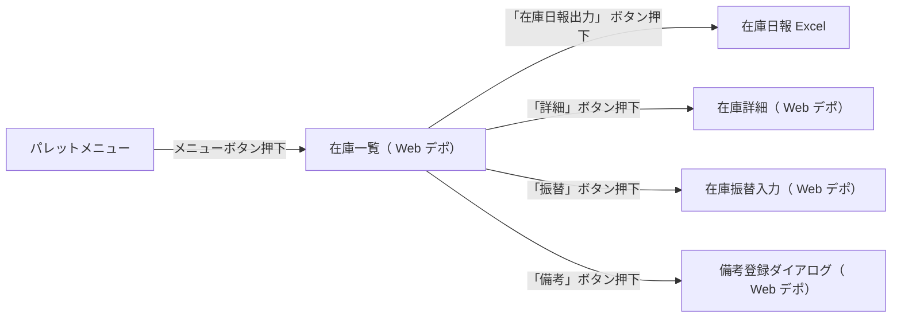

# 業務機能設計書: 在庫一覧（Webデポ）

## 目次

1. [変更履歴](#変更履歴)
2. [仕様概要](#仕様概要)
3. [設計概要①_概要補足](#設計概要①_概要補足)
4. [設計概要②_在庫の見え方](#設計概要②_在庫の見え方)
5. [画面項目定義](#画面項目定義)
6. [画面状態定義](#画面状態定義)
7. [画面項目チェック定義](#画面項目チェック定義)
8. [画面取得元定義](#画面取得元定義)
9. [画面遷移図](#画面遷移図)
10. [機能遷移図 (2)](#機能遷移図-(2))
11. [Excel移送表(在庫日報）](#Excel移送表(在庫日報）)
12. [在庫日報Excelレイアウト（在庫表）](#在庫日報Excelレイアウト（在庫表）)
13. [在庫日報Excelレイアウト（作業在庫報告）](#在庫日報Excelレイアウト（作業在庫報告）)
14. [在庫日報Excelレイアウト（その他作業一覧）](#在庫日報Excelレイアウト（その他作業一覧）)

---

## 変更履歴

> ※ 変更履歴データが見つかりませんでした。

---

## 仕様概要

---

## 設計概要① 概要補足

設計概要
①概要補足
＜１．検索処理について＞
・　検索基準日実績済在庫基準日は現在日付の2ヶ月前～現在日付までを検索可能とする。
・　検索基準日実績済在庫基準日が未入力の場合、営業日付で検索するエラーとする。
・　取得した品目数は1001件以上の場合、エラーとする。
※検索上限件数は共通にて制御する。
・　備考は検索基準日実績済在庫基準日以前で最も近い日の内容を取得する。
※検索内容は新レンタルの在庫一覧と同じであるため、詳細は「画面定義書_在庫管理_在庫一覧.xlsU-IM-020-P_業務機能設計書_在庫一覧.xlsx」参照
＜２．在庫日報出力処理について＞
・　出力用テンプレートに従い、取得情報を出力する。
・　検索基準日実績済在庫基準日は現在日付の2ヶ月前～現在日付までを出力可能とする。
・　検索基準日が未入力の場合、営業日付で検索する。
・　選別数集計基準日は過去日の出力制限はなく、営業日付より未来の年月日を指定した場合、エラーとする。
・　備考は検索基準日実績済在庫基準日以前で最も近い日の内容を出力する。
・　その他作業一覧は、検索基準日実績済在庫基準日の月初～検索基準日実績済在庫基準日までの支払調整データ（デポから入力した分）を出力する。
（例）検索基準日実績済在庫基準日：2019/02/21
→支払計上日が2019/02/01～2019/02/21の範囲にある支払調整データ
＜３．非同期通知処理について＞
・　クライアント処理
・　「DWR経由-未入力実績チェック処理」を呼び出す
処理結果の未出力フラグがONの場合、1分間隔で画面タイトルの右端に”※未出力の実績依頼書があります”とメッセージを表示する。
処理結果の未入力フラグがONの場合、1分間隔で画面タイトルの右端に”※未入力の実績があります”とメッセージを表示する。
上記以外の場合はメッセージは表示させない。
・　「DWR経由-未確認オーダーキャンセルチェック処理」を呼び出す
処理結果の未確認オーダーキャンセルフラグがONの場合、1分間隔で画面タイトルの右端に”※未確認のオーダーキャンセルがあります”とメッセージを表示する。
上記以外の場合はメッセージは表示させない。
・　サーバ処理
・　「DWR経由-未入力実績チェック処理」
・　未出力依頼書の件数を取得する
取得結果数が0件の場合、未出力フラグをONOFFにする
取得結果数が1件以上の場合、未出力フラグをOFFONにする
・　未入力実績の件数を取得
取得結果数が0件の場合、未入力フラグをONOFFにする
取得結果数が1件以上の場合、未力フラグをOFFONにする
・　「DWR経由-未確認オーダーキャンセルチェック処理」
・　オーダーが「1：削除済」、かつオーダーに紐付くオーダー明細のキャンセル確認フラグが「0：未確認」、
かつログインユーザのデポコードがオーダー明細の取引先コードと一致するデータ件数を取得する
取得結果数が1件以上の場合、未確認オーダーキャンセルフラグをONにする
取得結果数が0件の場合、未確認オーダーキャンセルフラグをOFFにする
・　メッセージ表示条件纏め
メッセージ　取得対象　取得件数　表示制御
未出力の依頼書があります　未出力依頼書　0件　非表示
1件以上　表示
未入力の実績があります　未入力実績　0件　非表示
1件以上　表示
未確認のオーダーキャンセルがあります　未確認オーダーキャンセル　0件　非表示
1件以上　表示

---

## 設計概要② 在庫の見え方

<在庫の見え方のイメージ>
①　本日から未来の在庫
現在庫数　100
<オーダー登録>
種別　オーダー番号　数量　入出庫日　区分　デポ通知
レンタル　オーダー①　50　2025/6/26　本登録
返却　オーダー②　20　2025/6/28　本登録
返却　オーダー③　10　2025/6/29　仮登録　OFF
レンタル　オーダー④　60　2025/7/1　仮登録　ON
<入出庫依頼>
入出庫区分　入出庫日　オーダー番号　数量　実績
出庫　2025/6/26　オーダー①　50　←本登録のみ入出庫依頼情報を作成する
入庫　2025/6/28　オーダー②　20　←本登録のみ入出庫依頼情報を作成する
<2025/6/24>
<在庫>　※仮オーダーのデポ通知は切替式とする
基準日　オーダー　実績　（レンタルシステム）デポ在庫　（Webデポ）デポ在庫　（レンタルシステム）得意先在庫
種別　数量　実績済在庫　予定在庫数　実績済在庫　予定在庫数　実績済在庫数　予定在庫数
当日★　2025/6/24　100　100　100　100　200　200
2025/6/25　100　100　200
2025/6/26　①レンタル　50　50　50　←レンタルによって予定在庫数が減算　250　←レンタルによって予定在庫数が加算
2025/6/27　50　50　250
2025/6/28　②返却　20　70　70　←返却によって予定在庫数が加算　230　←返却によって予定在庫数が減算
2025/6/29　③返却　10　80　80　←返却（仮オーダー）によって予定在庫数が加算　220　←返却（仮オーダー）によって予定在庫数が減算
2025/6/30　80　80　220
2025/7/1　④レンタル　60　20　20　←レンタル（仮オーダー）によって予定在庫数が減算　280　←レンタル（仮オーダー）によって予定在庫数が加算
<在庫一覧画面での見え方>
実績済在庫基準日
2025/6/24
・在庫一覧
予定在庫基準日　予定在庫基準日　予定在庫基準日　予定在庫基準日　予定在庫基準日　予定在庫基準日　予定在庫基準日
2025/6/24　2025/6/25　2025/6/26　2025/6/27　2025/6/28　2025/6/29　2025/6/30
レンタルシステム　レンタルシステム　レンタルシステム　レンタルシステム　レンタルシステム　レンタルシステム　レンタルシステム
実績済在庫　予定在庫数　実績済在庫　予定在庫数　実績済在庫　予定在庫数　実績済在庫　予定在庫数　実績済在庫　予定在庫数　実績済在庫　予定在庫数　実績済在庫　予定在庫数
100　100　100　100　100　50　100　50　100　70　100　80　100　80　←予定在庫数は実績済在庫基準日までの未実績オーダー（仮オーダー含む）を反映する。
Webデポ　Webデポ　Webデポ　Webデポ　Webデポ　Webデポ　Webデポ
実績済在庫　予定在庫数　実績済在庫　予定在庫数　実績済在庫　予定在庫数　実績済在庫　予定在庫数　実績済在庫　予定在庫数　実績済在庫　予定在庫数　実績済在庫　予定在庫数
100　100　100　100　100　50　100　50　100　70　100　80　100　80　←予定在庫数は実績済在庫基準日までの未実績オーダー（通知分の仮オーダー含む）を反映する。
予定在庫基準日
2025/7/1
レンタルシステム
実績済在庫　予定在庫数
100　20　←予定在庫数は実績済在庫基準日までの未実績オーダー（仮オーダー含む）を反映する。
Webデポ
実績済在庫　予定在庫数
100　20　←予定在庫数は実績済在庫基準日までの未実績オーダー（通知分の仮オーダー含む）を反映する。
・在庫詳細
予定在庫基準日　レンタルシステム　Webデポ
2025/6/24　現在庫情報　現在庫情報
実績済在庫　予定在庫数　実績済在庫　予定在庫数
100　100　100　100
予定在庫一覧　予定在庫一覧
オーダー番号　入出庫日　区分　入出庫数　仮区分　デポ通知　ランク　予定在庫数　オーダー番号　入出庫日　区分　入出庫数　仮区分　ランク　予定在庫数
（※該当データなし）　（※該当データなし）　←入出庫日が6/24までの未実績オーダーを表示（該当なし）
予定在庫基準日　レンタルシステム　Webデポ
2025/6/25　現在庫情報　現在庫情報
実績済在庫　予定在庫数　実績済在庫　予定在庫数
100　100　100　100
予定在庫一覧　予定在庫一覧
オーダー番号　入出庫日　区分　入出庫数　仮区分　デポ通知　ランク　予定在庫数　オーダー番号　入出庫日　区分　入出庫数　仮区分　ランク　予定在庫数
（※該当データなし）　（※該当データなし）　←入出庫日が6/25までの未実績オーダーを表示（該当なし）
予定在庫基準日　レンタルシステム　Webデポ
2025/6/26　現在庫情報　現在庫情報
実績済在庫　予定在庫数　実績済在庫　予定在庫数
100　50　100　50
予定在庫一覧　予定在庫一覧
オーダー番号　入出庫日　区分　入出庫数　仮区分　デポ通知　ランク　予定在庫数　オーダー番号　入出庫日　区分　入出庫数　仮区分　ランク　予定在庫数
オーダー①　2025/6/26　レンタル　50　一般品　50　オーダー①　2025/6/26　レンタル　50　一般品　50　←入出庫日が6/26までの未実績オーダーを表示
予定在庫基準日　レンタルシステム　Webデポ
2025/6/27　現在庫情報　現在庫情報
実績済在庫　予定在庫数　実績済在庫　予定在庫数
100　50　100　50
予定在庫一覧　予定在庫一覧
オーダー番号　入出庫日　区分　入出庫数　仮区分　デポ通知　ランク　予定在庫数　オーダー番号　入出庫日　区分　入出庫数　仮区分　ランク　予定在庫数
オーダー①　2025/6/26　レンタル　50　一般品　50　オーダー①　2025/6/26　レンタル　50　一般品　50　←入出庫日が6/27までの未実績オーダーを表示
予定在庫基準日　レンタルシステム　Webデポ
2025/6/28　現在庫情報　現在庫情報
実績済在庫　予定在庫数　実績済在庫　予定在庫数
100　70　100　70
予定在庫一覧　予定在庫一覧
オーダー番号　入出庫日　区分　入出庫数　仮区分　デポ通知　ランク　予定在庫数　オーダー番号　入出庫日　区分　入出庫数　仮区分　ランク　予定在庫数
オーダー①　2025/6/26　レンタル　50　一般品　50　オーダー①　2025/6/26　レンタル　50　一般品　50
オーダー②　2025/6/28　返却　20　一般品　70　オーダー②　2025/6/28　返却　20　一般品　70　←入出庫日が6/28までの未実績オーダーを表示
予定在庫基準日　レンタルシステム　Webデポ
2025/6/29　現在庫情報　現在庫情報
実績済在庫　予定在庫数　実績済在庫　予定在庫数
100　80　100　80　←Webデポに未通知の仮オーダー分は反映しない。
予定在庫一覧　予定在庫一覧
オーダー番号　入出庫日　区分　入出庫数　仮区分　デポ通知　ランク　予定在庫数　オーダー番号　入出庫日　区分　入出庫数　仮区分　ランク　予定在庫数
オーダー①　2025/6/26　レンタル　50　一般品　50　オーダー①　2025/6/26　レンタル　50　一般品　50
オーダー②　2025/6/28　返却　20　一般品　70　オーダー②　2025/6/28　返却　20　一般品　70
オーダー③　2025/6/29　返却　10　仮オーダー　OFF　一般品　80　オーダー③　2025/6/29　返却　10　仮オーダー　一般品　80　←入出庫日が6/29までの未実績オーダーを表示（Webデポに未通知の仮オーダーは反映しない）
予定在庫基準日　レンタルシステム　Webデポ
2025/6/30　現在庫情報　現在庫情報
実績済在庫　予定在庫数　実績済在庫　予定在庫数
100　80　100　80
予定在庫一覧　予定在庫一覧
オーダー番号　入出庫日　区分　入出庫数　仮区分　デポ通知　ランク　予定在庫数　オーダー番号　入出庫日　区分　入出庫数　仮区分　ランク　予定在庫数
オーダー①　2025/6/26　レンタル　50　一般品　50　オーダー①　2025/6/26　レンタル　50　一般品　50
オーダー②　2025/6/28　返却　20　一般品　70　オーダー②　2025/6/28　返却　20　一般品　70
オーダー③　2025/6/29　返却　10　仮オーダー　OFF　一般品　80　オーダー③　2025/6/29　返却　10　仮オーダー　一般品　80　←入出庫日が6/30までの未実績オーダーを表示
予定在庫基準日　レンタルシステム　Webデポ
2025/7/1　現在庫情報　現在庫情報
実績済在庫　予定在庫数　実績済在庫　予定在庫数
100　20　100　20　←Webデポに通知の仮オーダー分は反映する。
予定在庫一覧　予定在庫一覧
オーダー番号　入出庫日　区分　入出庫数　仮区分　デポ通知　ランク　予定在庫数　オーダー番号　入出庫日　区分　入出庫数　仮区分　ランク　予定在庫数
オーダー①　2025/6/26　レンタル　50　一般品　50　オーダー①　2025/6/26　レンタル　50　一般品　50
オーダー②　2025/6/28　返却　20　一般品　70　オーダー②　2025/6/28　返却　20　一般品　70
オーダー③　2025/6/29　返却　10　仮オーダー　OFF　一般品　80　オーダー③　2025/6/29　返却　10　仮オーダー　一般品　80　←Webデポに通知の仮オーダーは反映する
オーダー④　2025/7/1　レンタル　60　仮オーダー　ON　一般品　20　オーダー④　2025/7/1　レンタル　60　仮オーダー　一般品　20　←入出庫日が7/1までの未実績オーダーを表示
②　過去日（未実績）から未来の在庫
<2025/6/27>
<在庫>　26日分が未実績　※仮オーダーのデポ通知は切替式とする
基準日　オーダー　実績　（レンタルシステム）デポ在庫　（Webデポ）デポ在庫　（レンタルシステム）得意先在庫
種別　数量　実績済在庫　予定在庫数　実績済在庫　予定在庫数　実績済在庫数　予定在庫数
2025/6/24　100　100　100　100　200　200
2025/6/25　100　100　100　200　200
2025/6/26　①レンタル　50　50　50　←レンタルによって予定在庫数が減算　250　←レンタルによって予定在庫数が加算
当日★　2025/6/27　50　50　250
2025/6/28　②返却　20　70　70　←返却によって予定在庫数が加算　230　←返却によって予定在庫数が減算
2025/6/29　③返却　10　80　80　←返却（仮オーダー）によって予定在庫数が加算　220　←返却（仮オーダー）によって予定在庫数が減算
2025/6/30　80　80　220
2025/7/1　④レンタル　60　20　20　←レンタル（仮オーダー）によって予定在庫数が減算　280　←レンタル（仮オーダー）によって予定在庫数が加算
<在庫一覧画面での見え方>
実績済在庫基準日
2025/6/26　過去日
・在庫一覧
予定在庫基準日　予定在庫基準日　予定在庫基準日　予定在庫基準日　予定在庫基準日
2025/6/27　2025/6/28　2025/6/29　2025/6/30　2025/7/1
レンタルシステム　レンタルシステム　レンタルシステム　レンタルシステム　レンタルシステム
実績済在庫　予定在庫数　実績済在庫　予定在庫数　実績済在庫　予定在庫数　実績済在庫　予定在庫数　実績済在庫　予定在庫数
100　50　100　70　100　80　100　80　100　20
Webデポ　Webデポ　Webデポ　Webデポ　Webデポ
実績済在庫　予定在庫数　実績済在庫　予定在庫数　実績済在庫　予定在庫数　実績済在庫　予定在庫数　実績済在庫　予定在庫数
100　50　100　70　100　80　100　80　100　20
・在庫詳細
予定在庫基準日　レンタルシステム　Webデポ
2025/6/27　現在庫情報　現在庫情報
実績済在庫　予定在庫数　実績済在庫　予定在庫数
100　50　100　50
予定在庫一覧　予定在庫一覧
オーダー番号　入出庫日　区分　入出庫数　仮区分　デポ通知　ランク　予定在庫数　オーダー番号　入出庫日　区分　入出庫数　仮区分　ランク　予定在庫数
オーダー①　2025/6/26　レンタル　50　一般品　50　オーダー①　2025/6/26　レンタル　50　一般品　50　←入出庫日が6/27までの未実績オーダーを表示
予定在庫基準日　レンタルシステム　Webデポ
2025/6/28　現在庫情報　現在庫情報
実績済在庫　予定在庫数　実績済在庫　予定在庫数
100　70　100　70
予定在庫一覧　予定在庫一覧
オーダー番号　入出庫日　区分　入出庫数　仮区分　デポ通知　ランク　予定在庫数　オーダー番号　入出庫日　区分　入出庫数　仮区分　ランク　予定在庫数
オーダー①　2025/6/26　レンタル　50　一般品　50　オーダー①　2025/6/26　レンタル　50　一般品　50
オーダー②　2025/6/28　返却　20　一般品　70　オーダー②　2025/6/28　返却　20　一般品　70　←入出庫日が6/28までの未実績オーダーを表示
予定在庫基準日　レンタルシステム　Webデポ
2025/6/29　現在庫情報　現在庫情報
実績済在庫　予定在庫数　実績済在庫　予定在庫数
100　80　100　80　←Webデポに未通知の仮オーダー分は反映しない。
予定在庫一覧　予定在庫一覧
オーダー番号　入出庫日　区分　入出庫数　仮区分　デポ通知　ランク　予定在庫数　オーダー番号　入出庫日　区分　入出庫数　仮区分　ランク　予定在庫数
オーダー①　2025/6/26　レンタル　50　一般品　50　オーダー①　2025/6/26　レンタル　50　一般品　50
オーダー②　2025/6/28　返却　20　一般品　70　オーダー②　2025/6/28　返却　20　一般品　70
オーダー③　2025/6/29　返却　10　仮オーダー　OFF　一般品　80　オーダー③　2025/6/29　返却　10　仮オーダー　一般品　80　←入出庫日が6/29までの未実績オーダーを表示（Webデポに未通知の仮オーダーは反映しない）
予定在庫基準日　レンタルシステム　Webデポ
2025/6/30　現在庫情報　現在庫情報
実績済在庫　予定在庫数　実績済在庫　予定在庫数
100　80　100　80
予定在庫一覧　予定在庫一覧
オーダー番号　入出庫日　区分　入出庫数　仮区分　デポ通知　ランク　予定在庫数　オーダー番号　入出庫日　区分　入出庫数　仮区分　ランク　予定在庫数
オーダー①　2025/6/26　レンタル　50　一般品　50　オーダー①　2025/6/26　レンタル　50　一般品　50
オーダー②　2025/6/28　返却　20　一般品　70　オーダー②　2025/6/28　返却　20　一般品　70
オーダー③　2025/6/29　返却　10　仮オーダー　OFF　一般品　80　オーダー③　2025/6/29　返却　10　仮オーダー　一般品　80　←入出庫日が6/30までの未実績オーダーを表示
予定在庫基準日　レンタルシステム　Webデポ
2025/7/1　現在庫情報　現在庫情報
実績済在庫　予定在庫数　実績済在庫　予定在庫数
100　20　100　20　←Webデポに通知の仮オーダー分は反映する。
予定在庫一覧　予定在庫一覧
オーダー番号　入出庫日　区分　入出庫数　仮区分　デポ通知　ランク　予定在庫数　オーダー番号　入出庫日　区分　入出庫数　仮区分　ランク　予定在庫数
オーダー①　2025/6/26　レンタル　50　一般品　50　オーダー①　2025/6/26　レンタル　50　一般品　50
オーダー②　2025/6/28　返却　20　一般品　70　オーダー②　2025/6/28　返却　20　一般品　70
オーダー③　2025/6/29　返却　10　仮オーダー　OFF　一般品　80　オーダー③　2025/6/29　返却　10　仮オーダー　一般品　80　←Webデポに通知の仮オーダーは反映する
オーダー④　2025/7/1　レンタル　60　仮オーダー　ON　一般品　20　オーダー④　2025/7/1　レンタル　60　仮オーダー　一般品　20　←入出庫日が7/1までの未実績オーダーを表示
③　過去日（実績済）から未来の在庫
<2025/6/27>
<在庫>　26日分が実績済み　※仮オーダーのデポ通知は切替式とする
基準日　オーダー　実績　（レンタルシステム）デポ在庫　（Webデポ）デポ在庫　（レンタルシステム）得意先在庫
種別　数量　実績済在庫　予定在庫数　実績済在庫　予定在庫数　実績済在庫数　予定在庫数
2025/6/24　100　100　100　100　200　200
2025/6/25　100　100　100　200　200
2025/6/26　①レンタル　50　50　50　50　←レンタルによって予定在庫数が減算　250　250　←レンタルによって予定在庫数が加算
当日★　2025/6/27　50　50　250
2025/6/28　②返却　20　70　70　←返却によって予定在庫数が加算　230　←返却によって予定在庫数が減算
2025/6/29　③返却　10　80　80　←返却（仮オーダー）によって予定在庫数が加算　220　←返却（仮オーダー）によって予定在庫数が減算
2025/6/30　80　80　220
2025/7/1　④レンタル　60　20　20　←レンタル（仮オーダー）によって予定在庫数が減算　280　←レンタル（仮オーダー）によって予定在庫数が加算
<在庫一覧画面での見え方>
実績済在庫基準日
2025/6/26　過去日
・在庫一覧
予定在庫基準日　予定在庫基準日　予定在庫基準日　予定在庫基準日　予定在庫基準日
2025/6/27　2025/6/28　2025/6/29　2025/6/30　2025/7/1
レンタルシステム　レンタルシステム　レンタルシステム　レンタルシステム　レンタルシステム
実績済在庫　予定在庫数　実績済在庫　予定在庫数　実績済在庫　予定在庫数　実績済在庫　予定在庫数　実績済在庫　予定在庫数
50　50　50　70　50　80　50　80　50　20
Webデポ　Webデポ　Webデポ　Webデポ　Webデポ
実績済在庫　予定在庫数　実績済在庫　予定在庫数　実績済在庫　予定在庫数　実績済在庫　予定在庫数　実績済在庫　予定在庫数
50　50　50　70　50　80　50　80　50　20
・在庫詳細
予定在庫基準日　レンタルシステム　Webデポ
2025/6/27　現在庫情報　現在庫情報
実績済在庫　予定在庫数　実績済在庫　予定在庫数
50　50　50　50
予定在庫一覧　予定在庫一覧
オーダー番号　入出庫日　区分　入出庫数　仮区分　デポ通知　ランク　予定在庫数　オーダー番号　入出庫日　区分　入出庫数　仮区分　ランク　予定在庫数
オーダー①　2025/6/26　レンタル　50　一般品　50　オーダー①　2025/6/26　レンタル　50　一般品　50　←入出庫日が6/27までの未実績オーダーを表示
予定在庫基準日　レンタルシステム　Webデポ
2025/6/28　現在庫情報　現在庫情報
実績済在庫　予定在庫数　実績済在庫　予定在庫数
50　70　50　70
予定在庫一覧　予定在庫一覧
オーダー番号　入出庫日　区分　入出庫数　仮区分　デポ通知　ランク　予定在庫数　オーダー番号　入出庫日　区分　入出庫数　仮区分　ランク　予定在庫数
オーダー①　2025/6/26　レンタル　50　一般品　50　オーダー①　2025/6/26　レンタル　50　一般品　50
オーダー②　2025/6/28　返却　20　一般品　70　オーダー②　2025/6/28　返却　20　一般品　70　←入出庫日が6/28までの未実績オーダーを表示
予定在庫基準日　レンタルシステム　Webデポ
2025/6/29　現在庫情報　現在庫情報
実績済在庫　予定在庫数　実績済在庫　予定在庫数
50　80　50　80　←Webデポに未通知の仮オーダー分は反映しない。
予定在庫一覧　予定在庫一覧
オーダー番号　入出庫日　区分　入出庫数　仮区分　デポ通知　ランク　予定在庫数　オーダー番号　入出庫日　区分　入出庫数　仮区分　ランク　予定在庫数
オーダー①　2025/6/26　レンタル　50　一般品　50　オーダー①　2025/6/26　レンタル　50　一般品　50
オーダー②　2025/6/28　返却　20　一般品　70　オーダー②　2025/6/28　返却　20　一般品　70
オーダー③　2025/6/29　返却　10　仮オーダー　OFF　一般品　80　オーダー③　2025/6/29　返却　10　仮オーダー　一般品　80　←入出庫日が6/29までの未実績オーダーを表示（Webデポに未通知の仮オーダーは反映しない）
予定在庫基準日　レンタルシステム　Webデポ
2025/6/30　現在庫情報　現在庫情報
実績済在庫　予定在庫数　実績済在庫　予定在庫数
50　80　50　80
予定在庫一覧　予定在庫一覧
オーダー番号　入出庫日　区分　入出庫数　仮区分　デポ通知　ランク　予定在庫数　オーダー番号　入出庫日　区分　入出庫数　仮区分　ランク　予定在庫数
オーダー①　2025/6/26　レンタル　50　一般品　50　オーダー①　2025/6/26　レンタル　50　一般品　50
オーダー②　2025/6/28　返却　20　一般品　70　オーダー②　2025/6/28　返却　20　一般品　70
オーダー③　2025/6/29　返却　10　仮オーダー　OFF　一般品　80　オーダー③　2025/6/29　返却　10　仮オーダー　一般品　80　←入出庫日が6/30までの未実績オーダーを表示
予定在庫基準日　レンタルシステム　Webデポ
2025/7/1　現在庫情報　現在庫情報
実績済在庫　予定在庫数　実績済在庫　予定在庫数
50　20　50　20　←Webデポに通知の仮オーダー分は反映する。
予定在庫一覧　予定在庫一覧
オーダー番号　入出庫日　区分　入出庫数　仮区分　デポ通知　ランク　予定在庫数　オーダー番号　入出庫日　区分　入出庫数　仮区分　ランク　予定在庫数
オーダー①　2025/6/26　レンタル　50　一般品　50　オーダー①　2025/6/26　レンタル　50　一般品　50
オーダー②　2025/6/28　返却　20　一般品　70　オーダー②　2025/6/28　返却　20　一般品　70
オーダー③　2025/6/29　返却　10　仮オーダー　OFF　一般品　80　オーダー③　2025/6/29　返却　10　仮オーダー　一般品　80　←Webデポに通知の仮オーダーは反映する
オーダー④　2025/7/1　レンタル　60　仮オーダー　ON　一般品　20　オーダー④　2025/7/1　レンタル　60　仮オーダー　一般品　20　←入出庫日が7/1までの未実績オーダーを表示
④　過去日（実績済）から未来の在庫
<2025/6/27>
<在庫>　26日分が実績済み　※仮オーダーのデポ通知は切替式とする
基準日　オーダー　実績　（レンタルシステム）デポ在庫　（Webデポ）デポ在庫　（レンタルシステム）得意先在庫
種別　数量　実績済在庫　予定在庫数　実績済在庫　予定在庫数　実績済在庫数　予定在庫数
2025/6/24　100　100　100　100　200　200
2025/6/25　100　100　100　200　200
2025/6/26　①レンタル　50　50　50　50　←レンタルによって予定在庫数が減算　250　250　←レンタルによって予定在庫数が加算
当日★　2025/6/27　50　50　250
2025/6/28　②返却　20　70　70　←返却によって予定在庫数が加算　230　←返却によって予定在庫数が減算
2025/6/29　③返却　10　80　80　←返却（仮オーダー）によって予定在庫数が加算　220　←返却（仮オーダー）によって予定在庫数が減算
2025/6/30　80　80　220
2025/7/1　④レンタル　60　20　20　←レンタル（仮オーダー）によって予定在庫数が減算　280　←レンタル（仮オーダー）によって予定在庫数が加算
<在庫一覧画面での見え方>
実績済在庫基準日
2025/6/25　過去日
・在庫一覧
予定在庫基準日　予定在庫基準日　予定在庫基準日　予定在庫基準日　予定在庫基準日
2025/6/27　2025/6/28　2025/6/29　2025/6/30　2025/7/1
レンタルシステム　レンタルシステム　レンタルシステム　レンタルシステム　レンタルシステム
実績済在庫　予定在庫数　実績済在庫　予定在庫数　実績済在庫　予定在庫数　実績済在庫　予定在庫数　実績済在庫　予定在庫数
100　50　100　70　100　80　100　80　100　20
Webデポ　Webデポ　Webデポ　Webデポ　Webデポ
実績済在庫　予定在庫数　実績済在庫　予定在庫数　実績済在庫　予定在庫数　実績済在庫　予定在庫数　実績済在庫　予定在庫数
100　50　100　70　100　80　100　80　100　20
・在庫詳細
予定在庫基準日　レンタルシステム　Webデポ
2025/6/27　現在庫情報　現在庫情報
実績済在庫　予定在庫数　実績済在庫　予定在庫数
100　50　100　50
予定在庫一覧　予定在庫一覧
オーダー番号　入出庫日　区分　入出庫数　仮区分　デポ通知　ランク　予定在庫数　オーダー番号　入出庫日　区分　入出庫数　仮区分　ランク　予定在庫数
オーダー①　2025/6/26　レンタル　50　一般品　50　オーダー①　2025/6/26　レンタル　50　一般品　50　←実績済在庫基準日以降の実績済み在庫数が予定在庫一覧に表示
予定在庫基準日　レンタルシステム　Webデポ
2025/6/28　現在庫情報　現在庫情報
実績済在庫　予定在庫数　実績済在庫　予定在庫数
100　70　100　70
予定在庫一覧　予定在庫一覧
オーダー番号　入出庫日　区分　入出庫数　仮区分　デポ通知　ランク　予定在庫数　オーダー番号　入出庫日　区分　入出庫数　仮区分　ランク　予定在庫数
オーダー①　2025/6/26　レンタル　50　一般品　50　オーダー①　2025/6/26　レンタル　50　一般品　50
オーダー②　2025/6/28　返却　20　一般品　70　オーダー②　2025/6/28　返却　20　一般品　70　←入出庫日が6/28までの未実績オーダーを表示
予定在庫基準日　レンタルシステム　Webデポ
2025/6/29　現在庫情報　現在庫情報
実績済在庫　予定在庫数　実績済在庫　予定在庫数
100　80　100　80　←Webデポに未通知の仮オーダー分は反映しない。
予定在庫一覧　予定在庫一覧
オーダー番号　入出庫日　区分　入出庫数　仮区分　デポ通知　ランク　予定在庫数　オーダー番号　入出庫日　区分　入出庫数　仮区分　ランク　予定在庫数
オーダー①　2025/6/26　レンタル　50　一般品　50　オーダー①　2025/6/26　レンタル　50　一般品　50
オーダー②　2025/6/28　返却　20　一般品　70　オーダー②　2025/6/28　返却　20　一般品　70
オーダー③　2025/6/29　返却　10　仮オーダー　OFF　一般品　80　オーダー③　2025/6/29　返却　10　仮オーダー　一般品　80　←入出庫日が6/29までの未実績オーダーを表示（Webデポに未通知の仮オーダーは反映しない）
予定在庫基準日　レンタルシステム　Webデポ
2025/6/30　現在庫情報　現在庫情報
実績済在庫　予定在庫数　実績済在庫　予定在庫数
100　80　100　80
予定在庫一覧　予定在庫一覧
オーダー番号　入出庫日　区分　入出庫数　仮区分　デポ通知　ランク　予定在庫数　オーダー番号　入出庫日　区分　入出庫数　仮区分　ランク　予定在庫数
オーダー①　2025/6/26　レンタル　50　一般品　50　オーダー①　2025/6/26　レンタル　50　一般品　50
オーダー②　2025/6/28　返却　20　一般品　70　オーダー②　2025/6/28　返却　20　一般品　70
オーダー③　2025/6/29　返却　10　仮オーダー　OFF　一般品　80　オーダー③　2025/6/29　返却　10　仮オーダー　一般品　80　←入出庫日が6/30までの未実績オーダーを表示
予定在庫基準日　レンタルシステム　Webデポ
2025/7/1　現在庫情報　現在庫情報
実績済在庫　予定在庫数　実績済在庫　予定在庫数
100　20　100　20　←Webデポに通知の仮オーダー分は反映する。
予定在庫一覧　予定在庫一覧
オーダー番号　入出庫日　区分　入出庫数　仮区分　デポ通知　ランク　予定在庫数　オーダー番号　入出庫日　区分　入出庫数　仮区分　ランク　予定在庫数
オーダー①　2025/6/26　レンタル　50　一般品　50　オーダー①　2025/6/26　レンタル　50　一般品　50
オーダー②　2025/6/28　返却　20　一般品　70　オーダー②　2025/6/28　返却　20　一般品　70
オーダー③　2025/6/29　返却　10　仮オーダー　OFF　一般品　80　オーダー③　2025/6/29　返却　10　仮オーダー　一般品　80　←Webデポに通知の仮オーダーは反映する
オーダー④　2025/7/1　レンタル　60　仮オーダー　ON　一般品　20　オーダー④　2025/7/1　レンタル　60　仮オーダー　一般品　20　←入出庫日が7/1までの未実績オーダーを表示

---

## 画面項目定義

| No | グループ名 | 論理項目名 | 論理項目種別 | ドメイン | 必須 | 初期値 | 備考 |
|---|---|---|---|---|---|---|---|
| 1 | タイトル部 | 画面名 | テキスト出力 |  |  |  |  |
| 2 |  | デポ名 | テキスト出力 |  |  |  |  |
| 3 | ヘッダ部 | ヘッダメッセージ | テキスト出力 | - |  |  | 非同期メッセージ表示用 |
| 4 | 検索条件部 | 品目コード（複数） | テキストボックス | 品目コード |  |  |  |
| 5 |  | 品目検索 | ボタン | - |  |  |  |
| 6 |  | 品目名 | テキスト出力 | 品目名 |  |  |  |
| 7 |  | 品目コード（複数） | テキストボックス | 品目コード |  |  |  |
| 8 |  | 品目検索 | ボタン | - |  |  |  |
| 9 |  | 品目名 | テキスト出力 | 品目名 |  |  |  |
| 10 |  | 品目コード（複数） | テキストボックス | 品目コード |  |  |  |
| 11 |  | 品目検索 | ボタン | - |  |  |  |
| 12 |  | 品目名 | テキスト出力 | 品目名 |  |  |  |
| 13 |  | 品目コード（複数） | テキストボックス | 品目コード |  |  |  |
| 14 |  | 品目検索 | ボタン | - |  |  |  |
| 15 |  | 品目名 | テキスト出力 | 品目名 |  |  |  |
| 16 |  | 在庫状況 | コンボボックス | 区分 |  | （ブランク） | 在庫有り／在庫無し |
| 17 |  | 未承認の実績を含む | チェックボックス | - |  | ONチェックあり |  |
| 18 |  | 検索基準日 実績済在庫基準日 | テキストボックス | 年月日 | ○ | 営業日付 |  |
| 19 |  | 予定在庫基準日 | テキストボックス | 年月日 | ○ | 2999-12-31 00:00:00 | デフォルト：非表示 マスタ制御より表示も可能 |
| 20 |  | 区分（木・プラ・鉄）品目種別 | リストボックス | - |  | （ブランク） | 木パレ／プラパレ／鉄金属製品／その他 |
| 21 |  | 選別数集計単位 | ラジオボタン | - | ○ | 月初～指定年月日集計 | 年集計／月集計／月初～指定年月日集計 |
| 22 |  | 選別数集計基準日 | テキストボックス |  |  | 営業日付-1 |  |
| 23 | コントロール部 | 検索 | ボタン |  |  |  |  |
|  |  | 在庫日報出力 | ボタン |  |  |  |  |
|  |  | Excel出力 | ボタン |  |  |  |  |
| 26 |  | CSV出力 | ボタン |  |  |  |  |
| 27 | 集計部 | 総数 | テキスト出力 |  |  |  | 固定文言 |
| 28 |  | 現在庫数 | テキスト出力 |  |  |  |  |
| 29 |  | 出荷可能数 | テキスト出力 |  |  |  |  |
| 30 |  | 予定在庫数 | テキスト出力 |  |  |  |  |
| 31 | 明細部タイトル | 詳細 | テキスト出力 |  |  |  |  |
| 32 |  | 振替 | テキスト出力 |  |  |  |  |
| 33 |  | 品目コード | テキスト出力 |  |  |  |  |
| 34 |  | 品目名 | テキスト出力 |  |  |  |  |
| 35 |  | 実績済在庫数 | テキスト出力 |  |  |  |  |
| 36 |  | 未選別 | テキスト出力 |  |  |  |  |
| 37 |  | 一般品 | テキスト出力 |  |  |  |  |
| 38 |  | 限定品 | テキスト出力 |  |  |  |  |
| 39 |  | 予定在庫数 | テキスト出力 |  |  |  |  |
| 40 |  | メンテ待ち | テキスト出力 |  |  |  |  |
| 41 |  | 乾燥待ち | テキスト出力 |  |  |  |  |
| 42 |  | その他 | テキスト出力 |  |  |  |  |
| 43 |  | 保留 | テキスト出力 |  |  |  |  |
| 44 |  | 基準外 | テキスト出力 |  |  |  |  |
| 45 |  | 備考 | テキスト出力 |  |  |  |  |
| 46 |  | 空白 | テキスト出力 |  |  |  |  |
| 47 | 明細部データ部 | No | テキスト出力 |  |  |  |  |
| 48 |  | 詳細 | リンクボタン |  |  |  |  |
| 49 |  | 振替 | リンクボタン |  |  |  |  |
| 50 |  | 品目コード | テキスト出力 |  |  |  |  |
| 51 |  | 品目名 | テキスト出力 |  |  |  |  |
| 52 |  | 区分（木・プラ・鉄）品目種別 | テキスト出力 |  |  |  |  |
| 53 |  | 実績済在庫数 | テキスト出力 |  |  |  |  |
| 54 |  | 未選別 | テキスト出力 |  |  |  |  |
| 55 |  | 一般品 | テキスト出力 |  |  |  |  |
| 56 |  | 限定品 | テキスト出力 |  |  |  |  |
| 57 |  | 予定在庫数 | テキスト出力 |  |  |  |  |
| 58 |  | メンテ待ち | テキスト出力 |  |  |  |  |
| 59 |  | 乾燥待ち | テキスト出力 |  |  |  |  |
| 60 |  | その他 | テキスト出力 |  |  |  |  |
| 61 |  | 保留 | テキスト出力 |  |  |  |  |
| 62 |  | 基準外 | テキスト出力 |  |  |  |  |
| 63 |  | 備考 | テキスト出力 |  |  |  |  |
| 64 |  | 備考ボタン | リンクボタン |  |  |  |  |
| 65 |  | 組織コード | 隠しフィールド |  |  |  |  |
| 66 |  | 出庫可能数 | 隠しフィールド |  |  |  |  |
| 67 |  | デポコード | 隠しフィールド |  |  |  |  |
| 68 |  | デポ名 | 隠しフィールド |  |  |  |  |
| 69 |  | 初期表示フラグ | 隠しフィールド |  |  |  | 検索上限用 |
| 70 |  | 品目コード | 隠しフィールド |  |  |  |  |
| 71 |  | 品目名 | 隠しフィールド |  |  |  |  |
| 72 |  | レイアウト保存最終日 | 隠しフィールド |  |  |  |  |
| 73 |  | token | 隠しフィールド |  |  |  |  |
| 74 | 在庫詳細フォーム | デポコード | 隠しフィールド |  |  |  | 別画面遷移用 |
| 75 |  | デポ名 | 隠しフィールド |  |  |  |  |
| 76 |  | 明細品目コード | 隠しフィールド |  |  |  |  |
| 77 |  | 明細品目名 | 隠しフィールド |  |  |  |  |
| 78 |  | 組織コード | 隠しフィールド |  |  |  |  |
| 79 |  | 未承認の実績を含む | 隠しフィールド |  |  |  |  |
| 80 |  | 検索基準日 | 隠しフィールド |  |  |  |  |
| 81 | 在庫振替入力フォーム | 品目コード | 隠しフィールド |  |  |  | 別画面遷移用 |
| 82 |  | 品目名 | 隠しフィールド |  |  |  |  |
| 83 |  | 画面表示区分 | 隠しフィールド |  |  |  |  |
| 84 | 備考ダイアログフォーム | 品目コード | 隠しフィールド |  |  |  | 別画面遷移用 |
| 注1：カレンダーアイコン押下時、入力されている年月のカレンダーを表示し、該当の日付にフォーカスする。 |  |  |  |  |  |  |  |
| 未入力の場合は、利用端末の日付に基づきカレンダーを表示する。 |  |  |  |  |  |  |  |
| 注2：ロストフォーカスによる入力タイプチェックについては共通仕様書を参照。 |  |  |  |  |  |  |  |
| 利用可能な論理項目種別 |  |  |  |  | 半角 |  |  |
| テキスト出力 |  |  | LBL…ﾗﾍﾞﾙ |  | 数字 |  |  |
| 送信ボタン |  |  | CMD…ｺﾏﾝﾄﾞﾎﾞﾀﾝ | 半角数字 | ○ |  |  |
| ボタン |  |  |  | 半角英字 |  |  |  |
| リセットボタン |  |  |  | 半角英数字 | ○ |  |  |
| 画像リンク |  |  | LNK…ﾘﾝｸ | 半角 | ○ |  |  |
| テキストボックス |  |  | TXT…ﾃｷｽﾄﾌｨｰﾙﾄﾞ | 半角カナ | ○ |  |  |
| パスワード |  |  |  | 全角 | ○ |  |  |
| 隠しフィールド |  |  |  | 全角のみ |  |  |  |
| ファイルフィールド |  |  |  | 日付 | 「yyyymmdd」の形式 |  |  |
| テキストエリア |  |  | TAR…ﾃｷｽﾄｴﾘｱ | 日付時刻 | 「yyyy/mm/dd\|hh:mm:ss」の形式 |  |  |
| コンボボックス |  |  | CMB…ｺﾝﾎﾞﾎﾞｯｸｽ | 整数 | 小数点なし |  |  |
| リストボックス |  |  |  | 実数 | 小数点あり |  |  |
| ラジオボタン |  |  | RDO…ﾗｼﾞｵﾎﾞﾀﾝ | － |  |  |  |
| チェックボックス |  |  | CHB…ﾁｪｯｸﾎﾞｯｸｽ |  |  |  |  |
| ページリンク |  |  | LNK…ﾘﾝｸ |  |  |  |  |
| 画像 |  |  | IMG…ｲﾒｰｼﾞ領域 |  |  |  |  |
| その他 |  |  |  |  |  |  |  |
| オプショングループ |  |  | OPG…ｵﾌﾟｼｮﾝｸﾞﾙｰﾌﾟ |  |  |  |  |
| インクルード画面 |  |  |  |  |  |  |  |
| グリッド |  |  |  |  |  |  |  |
| タブ |  |  |  |  |  |  |  |
| リンクボタン |  |  |  |  |  |  |  |
| － |  |  |  |  |  |  |  |

---

## 画面状態定義

項番　グループ名　論理項目名　初期表示　検索

1　ヘッダ　ヘッダメッセージ　入力不可　入力不可

2　検索条件　品目コード（複数）　入力可能　入力可能

3　品目検索　押下可能　押下可能

4　品目名　入力不可　入力不可

5　品目コード（複数）　入力可能　入力可能

6　品目検索　押下可能　押下可能

7　品目名　入力不可　入力不可

8　品目コード（複数）　入力可能　入力可能

9　品目検索　押下可能　押下可能

10　品目名　入力不可　入力不可

11　品目コード（複数）　入力可能　入力可能

12　品目検索　押下可能　押下可能

13　品目名　入力不可　入力不可

14　在庫状況　選択可能　選択可能

15　未承認の実績を含む　入力可能　入力可能

16　実績済在庫基準日　入力可能　入力可能

17　予定在庫基準日　入力可能[注1]　入力可能[注1]

18　区分（木・プラ・鉄）品目種別　選択可能　選択可能

19　選別数集計単位　選択可能　選択可能

20　選別数集計基準日　入力可能　入力可能

21　検索　押下可能　押下可能

22　在庫日報出力　押下可能　押下可能

23　Excel出力　押下可能　押下可能

24　CSV出力　押下可能　押下可能

25　集計　総数　入力不可　入力不可

26　現在庫数　入力不可　入力不可

27　出荷可能数　入力不可　入力不可

28　予定在庫数　入力不可　入力不可

| 29 | 明細 | No | 非表示 | 表示 |
|---|---|---|---|---|
| 30 |  | 詳細 | 非表示 | 表示 |
| 31 |  | 振替 | 非表示 | 表示 |
| 32 |  | 品目コード | 非表示 | 表示 |
| 33 |  | 品目名 | 非表示 | 表示 |
| 34 |  | 区分（木・プラ・鉄）品目種別 | 非表示 | 表示 |
| 35 |  | 実績済在庫数 | 非表示 | 表示 |
| 36 |  | 未選別 | 非表示 | 表示 |
| 37 |  | 一般品 | 非表示 | 表示 |
| 38 |  | 限定品 | 非表示 | 表示 |
| 39 |  | 予定在庫数 | 非表示 | 表示 |
| 40 |  | メンテ待ち | 非表示 | 表示 |
| 41 |  | 乾燥待ち | 非表示 | 表示 |
| 42 |  | その他 | 非表示 | 表示 |
| 43 |  | 保留 | 非表示 | 表示 |
| 44 |  | 基準外 | 非表示 | 表示 |
| 45 |  | 備考 | 非表示 | 表示 |
| 46 |  | 備考ボタン | 非表示 | 表示 |
| 注1 | 非表示。権限を持っているユーザのみ、表示・利用ができる。 |  |  |  |
| 利用可能な論理項目種別 |  |  |  |  |
| テキスト出力 |  |  |  |  |
| 送信ボタン |  |  |  |  |
| ボタン |  |  |  |  |
| リセットボタン |  |  |  |  |
| 画像リンク |  |  |  |  |
| テキストボックス |  |  |  |  |
| パスワード |  |  |  |  |
| 隠しフィールド |  |  |  |  |
| ファイルフィールド |  |  |  |  |
| テキストエリア |  |  |  |  |
| リストボックス |  |  |  |  |
| ラジオボタン |  |  |  |  |
| チェックボックス |  |  |  |  |
| ページリンク |  |  |  |  |
| 画像 |  |  |  |  |
| その他 |  |  |  |  |
| リンクボタン |  |  |  |  |
| - |  |  |  |  |

---

## 画面項目チェック定義

| 画面項目チェック定義 |  |  |  |  |  |  |  |
|---|---|---|---|---|---|---|---|
|  | チェック対象 イベント | 項目名称 | エラータイトル | 制約(エラーケース) | メッセージID | 置換文字列 |  |
|  | 検索ボタン押下 在庫日報出力ボタン押下 | 検索基準日 実績済在庫基準日 業務日付 |  | 検索基準日実績済在庫基準日 < 業務日付の2か月前の場合エラー | upr.error.0065 | {0}=検索基準日 {0}=実績済在庫基準日 | {0}は前々月以前の指定はできません。 |
|  | 検索ボタン押下 在庫日報出力ボタン押下 | 検索基準日 実績済在庫基準日 業務日付 |  | 業務日付 < 検索基準日実績済在庫基準日の場合エラー | upr.error.0066 E.P20REN.CR.00989 | {0}=検索基準日 {0}=実績済在庫基準日 {1}=本日 | {0}は{1}以前の日付を入力してください。 |
|  | 検索ボタン押下 | データ |  | 検索結果が app-config.propertiesに定義したlimitRows以上の場合エラー ※1001件以上 | upr.error.0048 |  |  |
|  | 検索ボタン押下 在庫日報出力ボタン押下 | データ |  | 検索結果が0件の場合 | upr.info.0010 E.P20REN.CR.00034 |  | 該当するデータが見つかりません。条件を見直して再検索して下さい。 |
|  | 在庫日報出力ボタン押下 | 選別数集計単位 |  | 必須 | upr.error.0001 | {0}=選別数集計単位 |  |
|  | 在庫日報出力ボタン押下 | 選別数集計単位 選別数集計基準日 |  | 選別数集計単位＝年集計の場合 YYYY形式チェック | upr.error.0067 | {0}=選別数集計基準日 | {0}はYYYY形式で入力してください。 |
|  | 在庫日報出力ボタン押下 | 選別数集計単位 選別数集計基準日 |  | 選別数集計単位＝年月集計の場合 YYYYMM形式チェック | upr.error.0068 | {0}=選別数集計基準日 | {0}はYYYYMM形式で入力してください。 |
|  | 在庫日報出力ボタン押下 | 選別数集計単位 選別数集計基準日 |  | 選別数集計単位＝月初～指定年月日集計の場合 YYYYMMDD形式チェック | upr.error.0005 | {0}=選別数集計基準日 | {0}はYYYYMMDD形式で入力してください。 |
|  | 在庫日報出力ボタン押下 | 選別数集計基準日 業務日付 |  | 業務日付 < 選別数集計基準日の場合エラー | upr.error.0066 E.P20REN.CR.00989 | {0}=選別数集計基準日 {1}=本日 | {0}は{1}以前の日付を入力してください。 |
|  | 検索ボタン押下 在庫日報出力ボタン押下 | 予定在庫基準日 | 日付整合性チェック | 予定在庫基準日 < 営業日付の場合、エラー | （新規） E.P20REN.CR.00987 | {0}：予定在庫基準日 {1}：本日 | 予定在庫基準日は未来日ではありません。 {0}は{1}以降の日付を入力してください。 |
|  | 在庫日報出力ボタン押下 | － | 完了メッセージ | 在庫日報発行後に完了メッセージ | （新規） |  | 在庫日報の発行が完了しました。 |

---

## 画面取得元定義

レビュー対象外　レビュー対象外　レビュー対象外

項番　グループ名　論理項目名　初期表示　検索　ロストフォーカス　コンボボックス

1　ヘッダ　ヘッダメッセージ

2　検索条件　品目コード（複数）　○　品目名を自動表示

3　品目検索

4　品目名

5　品目コード（複数）　○　品目名を自動表示

6　品目検索

7　品目名

8　品目コード（複数）　○　品目名を自動表示

9　品目検索

10　品目名

11　品目コード（複数）　○　品目名を自動表示

12　品目検索

13　品目名

14　在庫状況　（ブランク）

15　未承認の実績を含む　チェックあり

16　実績済在庫基準日　営業日付

17　予定在庫基準日　2999-12-31 00:00:00

18　区分（木・プラ・鉄）品目種別　（ブランク）

19　選別数集計単位　月初～指定年月日集計

20　選別数集計基準日　営業日付-1

21　検索

22　在庫日報出力

23　Excel出力

24　CSV出力

25　集計　総数

26　現在庫数

27　出荷可能数

28　予定在庫数

| 29 | 明細 | No |
|---|---|---|
| 30 |  | 詳細 |
| 31 |  | 振替 |
| 32 |  | 品目コード |
| 33 |  | 品目名 |
| 34 |  | 区分（木・プラ・鉄） |
| 35 |  | 実績済在庫数 |
| 36 |  | 未選別 |
| 37 |  | 一般品 |
| 38 |  | 限定品 |
| 39 |  | 予定在庫数 |
| 40 |  | メンテ待ち |
| 41 |  | 乾燥待ち |
| 42 |  | その他 |
| 43 |  | 保留 |
| 44 |  | 基準外 |
| 45 |  | 備考 |
| 46 |  | 備考ボタン |
| 利用可能な論理項目種別 |  |  |
| テキスト出力 |  |  |
| 送信ボタン |  |  |
| ボタン |  |  |
| リセットボタン |  |  |
| 画像リンク |  |  |
| テキストボックス |  |  |
| パスワード |  |  |
| 隠しフィールド |  |  |
| ファイルフィールド |  |  |
| テキストエリア |  |  |
| リストボックス |  |  |
| ラジオボタン |  |  |
| チェックボックス |  |  |
| ページリンク |  |  |
| 画像 |  |  |
| その他 |  |  |
| リンクボタン |  |  |
| - |  |  |

---

## 画面遷移図（画面遷移図）

### 画面一覧（図形から抽出）

| No | 画面名 | 図形タイプ |
|---|---|---|
| 1 | 在庫一覧（ Web デポ） | rect |
| 2 | パレットメニュー | rect |
| 3 | 在庫日報 Excel | flowChartDocument |
| 4 | 在庫詳細（ Web デポ） | rect |
| 5 | 在庫振替入力（ Web デポ） | rect |
| 6 | 備考登録ダイアログ（ Web デポ） | rect |

### 遷移図

### 遷移定義テーブル

| No | 遷移元画面 | トリガー | 遷移先画面 | 遷移タイプ |
|----|-----------|---------|-----------|-----------|
| 1 | パレットメニュー | メニューボタン押下 | 在庫一覧（ Web デポ） | 画面遷移 |
| 2 | 在庫一覧（ Web デポ） | 「在庫日報出力」 ボタン押下 | 在庫日報 Excel | 帳票出力 |
| 3 | 在庫一覧（ Web デポ） | 「詳細」ボタン押下 | 在庫詳細（ Web デポ） | 画面遷移 |
| 4 | 在庫一覧（ Web デポ） | 「振替」ボタン押下 | 在庫振替入力（ Web デポ） | 画面遷移 |
| 5 | 在庫一覧（ Web デポ） | 「備考」ボタン押下 | 備考登録ダイアログ（ Web デポ） | ダイアログ |

---

## 画面遷移図（機能遷移図 (2)）

### 遷移図

> ※ 図形データからテキストを抽出できませんでした。手動でMermaid記法を作成してください。

### 遷移定義テーブル

> ※ 遷移情報を自動抽出できませんでした。

---

## Excel移送表: Excel移送表(在庫日報）

テーブル移送表

テーブル名　-

項番　項目名　①品目別レコード　②種類別合計レコード　③全商品合計レコード　出力先

1　対象日　システム日付　同左　同左　※「在庫表」シート右上の日付　在庫表シート

2　デポコード　ログインユーザの所属デポコード　同左　同左

3　デポ名　取引先_共通．取引先名略称　同左　同左

4　種類名　品目マスタ．品目カテゴリコードに紐づく
品目カテゴリマスタ．名称　同左　-

5　品目コード　検索処理と同じ　-　-

6　品目名　検索処理と同じ　-　-

7　一般品在庫数　検索処理と同じ　品目カテゴリコードが同じ①の総和　②の総和

8　限定品在庫数　検索処理と同じ　品目カテゴリコードが同じ①の総和　②の総和

9　未選別在庫数　検索処理と同じ　品目カテゴリコードが同じ①の総和　②の総和

10　メンテ待ち在庫数　検索処理と同じ　品目カテゴリコードが同じ①の総和　②の総和

11　作業待ち在庫数　-　-　-

12　その他在庫数　-　-　-

13　保留在庫数　検索処理と同じ　品目カテゴリコードが同じ①の総和　②の総和

| 14 | 基準外在庫数 | 検索処理の基準外(選別)・(資産)・(販売)在庫数のサマリ | 品目カテゴリコードが同じ①の総和 | ②の総和 |  |  | 2018/7/13要望No.3600デポ在庫ランクの見直しで修正 |
|---|---|---|---|---|---|---|---|
| 15 | 乾燥待ち在庫数 | 検索処理と同じ | 品目カテゴリコードが同じ①の総和 | ②の総和 |  |  | 2018/7/13要望No.3600デポ在庫ランクの見直しで追加 |
| 16 | 在庫数合計 | No.7～10、13～15各在庫数の総和 | 品目カテゴリコードが同じ①の総和 | ②の総和 |  |  | 2018/7/13要望No.3600デポ在庫ランクの見直しで修正 |
| 17 | 備考 | 検索処理と同じ | - | - |  |  |  |
| 18 | 選別数対象日 | 画面．選別数集計基準日 | 同左 | 同左 | ※「作業在庫報告」シート明細ヘッダ部の日付。 入力内容によって書式は変化する（年 or 年月 or 年月日） | 作業在庫報告シート |  |
| 19 | 一般品選別数(日別) | ※入出庫実績．数量＋未承認の在庫振替伝票．数量の総和 （在庫計上日＝画面．選別数集計基準日 一般品へのランク振替データの入庫のみ） | 品目カテゴリコードが同じ①の総和 | ②の総和 | ※選別数集計単位＝"月初～指定年月日"を指定した場合のみ。 それ以外は空白 |  |  |
| 20 | 限定品選別数(日別) | ※入出庫実績．数量＋未承認の在庫振替伝票．数量の総和 （在庫計上日＝画面．選別数集計基準日 限定品へのランク振替データの入庫のみ） | 品目カテゴリコードが同じ①の総和 | ②の総和 | 同上 |  |  |
| 21 | メンテ待ち選別数(日別) | ※入出庫実績．数量＋未承認の在庫振替伝票．数量の総和 （在庫計上日＝画面．選別数集計基準日 メンテ待ちへのランク振替データの入庫のみ） | 品目カテゴリコードが同じ①の総和 | ②の総和 | 同上 |  |  |
| 22 | 作業待ち選別数(日別) | - | - | - |  |  |  |
| 23 | その他選別数(日別) | - | - | - |  |  |  |
| 24 | 保留選別数(日別) | ※入出庫実績．数量＋未承認の在庫振替伝票．数量の総和 （在庫計上日＝画面．選別数集計基準日 保留へのランク振替データの入庫のみ） | 品目カテゴリコードが同じ①の総和 | ②の総和 | 同上 |  |  |
| 25 | 基準外選別数(日別) | ※入出庫実績．数量＋未承認の在庫振替伝票．数量の総和 （在庫計上日＝画面．選別数集計基準日 基準外（選別）へのランク振替・基準外振替データの入庫のみ） | 品目カテゴリコードが同じ①の総和 | ②の総和 | 同上 |  |  |
| 26 | 選別数合計(日別) | No.17～20、23、24各数量の総和 | 品目カテゴリコードが同じ①の総和 | ②の総和 |  |  |  |
| 27 | 一般品選別数(累計) | 入出庫実績．数量＋未承認の在庫振替伝票．数量の総和 （選別数累計期間contain在庫計上日 一般品へのランク振替データの入庫のみ） | 品目カテゴリコードが同じ①の総和 | ②の総和 | 選別数累計期間 選別数集計単位（ラジオボタン）で選択した集計単位に応じて変化  例） ・集計単位＝"年" 　選別数集計基準日＝"2018" 　→累計期間：2018/1/1～2018/12/31 ・集計単位＝"年月" 　選別数集計基準日＝"201802" 　→累計期間：2018/2/1～2018/2/28 ・集計単位＝"月初～指定年月日" 　選別数集計基準日＝"20180213" 　→累計期間：2018/2/1～2018/2/13 |  |  |
| 28 | 限定品選別数(累計) | 入出庫実績．数量＋未承認の在庫振替伝票．数量の総和 （選別数累計期間contain在庫計上日 限定品へのランク振替データの入庫のみ） | 品目カテゴリコードが同じ①の総和 | ②の総和 |  |  |  |
| 29 | メンテ待ち選別数(累計) | 入出庫実績．数量＋未承認の在庫振替伝票．数量の総和 （選別数累計期間contain在庫計上日 メンテ待ちへのランク振替データの入庫のみ） | 品目カテゴリコードが同じ①の総和 | ②の総和 |  |  |  |
| 30 | 作業待ち選別数(累計) | - | - | - |  |  |  |
| 31 | その他選別数(累計) | - | - | - |  |  |  |
| 32 | 保留選別数(累計) | 入出庫実績．数量＋未承認の在庫振替伝票．数量の総和 （選別数累計期間contain在庫計上日 保留へのランク振替データの入庫のみ） | 品目カテゴリコードが同じ①の総和 | ②の総和 |  |  |  |
| 33 | 基準外選別数(累計) | 入出庫実績．数量＋未承認の在庫振替伝票．数量の総和 （選別数累計期間contain在庫計上日 基準外（選別）へのランク振替・基準外振替データの入庫のみ） | 品目カテゴリコードが同じ①の総和 | ②の総和 |  |  | 2018/7/13要望No.3600デポ在庫ランクの見直しで修正 |
| 34 | 乾燥待ち選別数(累計) | 入出庫実績．数量＋未承認の在庫振替伝票．数量の総和 （選別数累計期間contain在庫計上日 基準外（選別）へのランク振替・基準外振替データの入庫のみ） | 品目カテゴリコードが同じ①の総和 | ②の総和 |  |  | 2018/7/13要望No.3600デポ在庫ランクの見直しで修正 |
| 35 | 選別数合計(累計) | No.27～29、32～34各数量の総和 | 品目カテゴリコードが同じ①の総和 | ②の総和 |  |  |  |

---

## 在庫日報Excelレイアウト（在庫表）

> ※ Excelレイアウトシートです。セルの配置・書式情報を含むため、テーブル形式で概要を出力します。

| ○○○○○(デポ名称)在庫表　（*********-D**）（デポコード） | 列2 | 列3 | 列4 | 列5 | 列6 | 列7 | 列8 | 列9 | 列10 | 列11 | yyyy年mm月dd日hh時mm分時点 |
|---|---|---|---|---|---|---|---|---|---|---|---|
| 品目コード | 品目名 | 在庫数 |  |  |  |  |  |  |  |  |  |
|  |  | 一般 | 限定 | 未選別 | メンテ待ち | 乾燥待ち | その他 | 保留 | 基準外 | 在庫合計 | 備考 |
| 木製合計 |  |  |  |  |  |  |  |  |  |  |  |
| プラパレ合計 |  |  |  |  |  |  |  |  |  |  |  |
| 鉄製品合計 |  |  |  |  |  |  |  |  |  |  |  |
| 全商品合計 |  |  |  |  |  |  |  |  |  |  |  |

---

## 在庫日報Excelレイアウト（作業在庫報告）

> ※ Excelレイアウトシートです。セルの配置・書式情報を含むため、テーブル形式で概要を出力します。

| ○○○○○(デポ名称)在庫表　（*********-D**）（デポコード） | 列2 | 列3 | 列4 | 列5 | 列6 | 列7 | 列8 | 列9 | 列10 | 列11 | 列12 | 列13 | 列14 | 列15 | 列16 | 列17 | 列18 |
|---|---|---|---|---|---|---|---|---|---|---|---|---|---|---|---|---|---|
| 品目コード | 品目名 | yyyy年mm月dd日　選別数（日別） |  |  |  |  |  |  |  | yyyy年mm月dd日　選別数（累計） |  |  |  |  |  |  |  |
|  |  | 一般 | 限定品 | メンテ待ち | 乾燥待ち | その他 | 保留 | 基準外 | 選別合計 | 一般 | 限定品 | メンテ待ち | 乾燥待ち | その他 | 保留 | 基準外 | 選別合計 |
| 木製合計 |  |  |  |  |  |  |  |  |  |  |  |  |  |  |  |  |  |
| プラパレ合計 |  |  |  |  |  |  |  |  |  |  |  |  |  |  |  |  |  |
| 鉄製品合計 |  |  |  |  |  |  |  |  |  |  |  |  |  |  |  |  |  |
| 全商品合計 |  |  |  |  |  |  |  |  |  |  |  |  |  |  |  |  |  |

---

## 在庫日報Excelレイアウト（その他作業一覧）

> ※ Excelレイアウトシートです。セルの配置・書式情報を含むため、テーブル形式で概要を出力します。

| ○○○○○(デポ名称)その他作業一覧　（*********-D**）（デポコード） | 列2 | 列3 | 列4 | 列5 | 列6 | 列7 | 2019年2月1日～2019年2月22日 | 列9 |
|---|---|---|---|---|---|---|---|---|
| 作業日 | 品目コード | 品目名 | 作業費目 | 費目名（支払確認書出力） | 数量 | 単位 | 単価（税抜） | 税抜額 |
| 2019-02-21 00:00:00 |  |  | その他作業料 | 木製パレット向け殺虫剤塗布 |  |  |  | 50000 |
| 2019-02-21 00:00:00 | 122003 | プラ11型片面(グリーン) | その他作業料 | シールはがし料 | 50 | 枚 | 50 | 2500 |
| 2019-02-22 00:00:00 | 122003 | プラ11型片面(グリーン) | その他作業料 | ○○様分シール貼り料 | 200 | 枚 | 100 | 20000 |
| 2019-02-22 00:00:00 | 122003 | プラ11型片面(グリーン) | その他作業料 | シールはがし料 | 600 | 枚 | 50 | 30000 |

---
