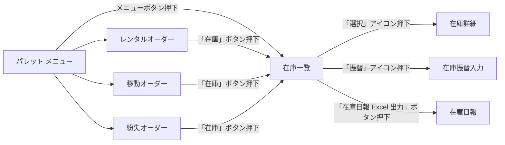

## 画面遷移図

### 画面一覧（図形から抽出）

| No | 画面名 | 図形タイプ |
|----|--------|-----------|
| 1 | 在庫一覧 | rect |
| 2 | パレット メニュー | rect |
| 3 | 在庫振替入力 | rect |
| 4 | 在庫詳細 | rect |
| 5 | 在庫日報 | flowChartDocument |
| 6 | レンタルオーダー | rect |
| 7 | 移動オーダー | rect |
| 8 | 紛失オーダー | rect |

### 遷移図

### 遷移定義テーブル

| No | 遷移元画面 | トリガー | 遷移先画面 | 遷移タイプ |
|----|-----------|---------|-----------|-----------|
| 1 | パレット メニュー | メニューボタン押下 | 在庫一覧 | 画面遷移 |
| 2 | 在庫一覧 | 「選択」アイコン押下 | 在庫詳細 | 画面遷移 |
| 3 | 在庫一覧 | 「振替」アイコン押下 | 在庫振替入力 | 画面遷移 |
| 4 | レンタルオーダー | 「在庫」ボタン押下 | 在庫一覧 | 画面遷移 |
| 5 | パレット メニュー |  | 移動オーダー | 画面遷移 |
| 6 | 移動オーダー | 「在庫」ボタン押下 | 在庫一覧 | 画面遷移 |
| 7 | パレット メニュー |  | 紛失オーダー | 画面遷移 |
| 8 | 紛失オーダー | 「在庫」ボタン押下 | 在庫一覧 | 画面遷移 |
| 9 | パレット メニュー |  | レンタルオーダー | 画面遷移 |
| 10 | 在庫一覧 | 「在庫日報 Excel 出力」ボタン押下 | 在庫日報 | 帳票出力 |

---
